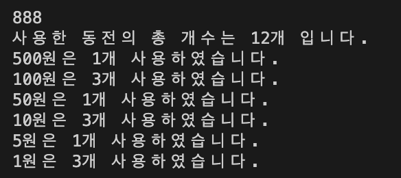

# 6주차 개념정리

목차

- [6주차 개념정리](#6주차-개념정리)
  - [그리디 알고리즘(Greedy Algorithm)](#그리디-알고리즘greedy-algorithm)
    - [Greedy 성립 조건](#greedy-성립-조건)
      - [1. 탐욕스러운 선택 조건(Greedy Choice property)](#1-탐욕스러운-선택-조건greedy-choice-property)
      - [2. 최적 부분 구조 조건(Optimal Substructure)](#2-최적-부분-구조-조건optimal-substructure)
    - [사용되는 예시](#사용되는-예시)
  - [참고자료](#참고자료)

6주차는 그리디 알고리즘을 공부하고 알고리즘 문제는 백준의 [13904: 내리막길](https://www.acmicpc.net/problem/13904), [4796: 캠핑](https://www.acmicpc.net/problem/4796), [1449: 수리공 항승](https://www.acmicpc.net/problem/1520), [1520: 내리막길](https://www.acmicpc.net/problem/1520)을 각자 풀기로 했다. 

먼저 그리디 알고리즘 개념부터 살펴보자.

## 그리디 알고리즘(Greedy Algorithm)

**개념 및 설명**

> 그리디 알고리즘은 탐욕 알고리즘 또는 욕심쟁이 알고리즘으로도 불린다.<br/>
> (Greedy: 탐욕스러운)<br/>
> **그리디 알고리즘**은 최적해를 구하는 데에 사용되는 근사적인 방법으로, 여러 경우 중 하나를 결정해야 할 때마다 그 순간에 최적이라고 생각되는 것을 선택해 나가는 방식으로 진행하여 최종적인 해답에 도달한다.<br/>
> 순간마다 하는 선택은 그 순간에 대해 지역적으로는 최적이지만, 그 선택들을 계속 수집하여 최종적(전역적)인 해답을 만들었다고 해서, 그것이 최적이라는 보장은 없다.<br/>
> 하지만 적용이 가능한 문제들은 지역적으로 최적이면서 전역적으로 최적인 문제들이다.<br/>
> 적용되는 문제에 대해서는 계산 속도가 빠르다는 장점이 있다.

### Greedy 성립 조건
#### 1. 탐욕스러운 선택 조건(Greedy Choice property)
- 앞의 선택이 이후의 선택에 영향을 주지 않아야한다.
#### 2. 최적 부분 구조 조건(Optimal Substructure)
- 문제에 대한 최종 해결 방법이 부분 문제에 대해서도 또한 최적 문제 해결방법이어야한다.
<br/>


**대표적인 예시**

1. 동전 문제(동적 계획법으로 푸는 것은 추후 공부하자)
> **문제<br/>**
> 지불해야하는 값이 x원 일 때, 1원, 5원, 50원, 100원, 500원짜리 동전으로 동전의 수가 가장 적게 지불하시오.
<br/>

> **접근 방법<br/>**
> x원이 있을때 가장 큰 동전으로 계산하는 것은 다른 동전으로 계산하는 것보다 더 작게 쓸 수 있다는 점이 자명하다.<br/>
> ex) 800원이면 500원 1개 100원 3개 쓰는 것이 100원 8개를 사용하는 것보다 이득이다.<br/>

<br/>

이를 코드로 구현하면 아래와 같다.
``` c++
#include <iostream>
using namespace std;

int main()
{
  // 지불해야하는 값
  int x;

  // 가지고 있는 동전
  int coins[6] = {500, 100, 50, 10, 5, 1};

  cin >> x;

  // answer: 총 개수
  // count: 각 코인의 개수
  // idx: count 배열의 index
  int answer = 0, count[6], idx = 0;

  // foreach 사용
  for (auto coin : coins)
  {
    count[idx] = x / coin;
    x %= coin;
    answer += count[idx];
    idx++;
  }

  cout << "사용한 동전의 총 개수는 " << answer << "개 입니다.\n";

  for (int i = 0; i < 6; i++)
  {
    cout << coins[i] << "원은 " << count[i] << "개 사용하였습니다.\n";
  }
  return 0;
}

```
**출력 결과**


동전 문제는 그리디의 예시로도 많이 사용되지만 동적 계획법의 대표적인 문제이기도 하다.<br/>
다음과 같은 동전을 가정해보자.<br/>
[1, 4, 5, 7]의 동전이 있을 때 지불해야하는 금액이 9원일 때 그리디로 문제를 해결하면<br/>
`7원: 1개 1원: 2개`로 총 3개를 사용한 결과가 출력된다.<br/>하지만, 최적의 해는 `5원: 1개 4원: 1개`로 총 2개를 사용한 결과이다.
<br/>
이러한 경우를 계산할 수 있는 방법은 나중에 공부하도록 하자.
<br/>

### 사용되는 예시

- AI에 있어서 결정 트리 학습법(Decision Tree Learning)
- 활동 선택 문제(activity selection problem)
- 거스름돈 문제(동전들에 배수 관계가 성립할때 성립)
- 최소 신장 트리 (Minimum spanning tree)
- 다익스트라 알고리즘
- 허프만 코딩
- 크루스칼 알고리즘


---

## 참고자료

- 탐욕 알고리즘 - [위키백과](https://ko.wikipedia.org/wiki/탐욕_알고리즘)
- 반드시 알아야하는 알고리즘 top8 - 6. 탐욕 알고리즘, 그리디 알고리즘 - [곰가드의 라이브러리님 블로그](https://gomguard.tistory.com/119)
- [알고리즘] Greedy Algorithm (탐욕 알고리즘) - [c0smicb0y님 블로그](https://janghw.tistory.com/entry/알고리즘-Greedy-Algorithm-탐욕-알고리즘)