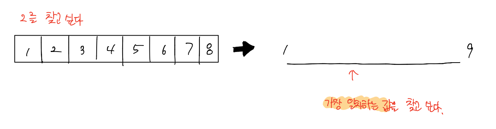

# 백준 문제

- [1300 : K번째 수](#1300-K번째-수)
- [2343 : 기타 레슨](#2343-기타-레슨)
- [3020 : 개똥벌레](#3020-개똥벌레)
- [14003 : 가장 긴 증가하는 부분 수열5](#14003-가장-긴-증가하는-부분-수열5)


## 1300 K번째 수

[문제로 이동](https://www.acmicpc.net/problem/1300)

### 접근 방법 

#### Python

도저히 접근을 어떠한 방식으로 해야하는지 몰라서 검색을 통해 해결하였다. <br>

이 문제를 해결하는 방법은 **Parametric Search**라는 Binary Search를 응용한 방법을 통해 해결할 수 있다. <br>

Parametric Search의 기본적인 탐색방법은 Binary Search와 동일하지만, 기존의 Binary Search는 주어진 배열의 값들을 기준으로 <br>

찾는 값이 존재하는지를 확인한다면, Parametric Search는 **내가 원하는 실수의 정답의 범위에서 이진탐색을 진행**한다고 생각하면 된다. <br>



즉, 그림처럼 배열에서의 특정 값을 찾는 것이 아닌, 수직선 상 위에서 내가 원하는 값을 이진탐색으로 찾아가는 느낌이다. <br>

따라서 이 문제서는 **임의의 mid값을 정하고 나서 과연 이 mid가 k번째 수일까?** 라는 풀이를 진행할 것이다. <br>

그렇다면 mid보다 작은 원소의 개수는 몇개인지 파악해야한다. <br>

배열 A[i]\[j]에서 i 행에 속한 원소들은  i x **j** 이므로 모두 i 의 배수이다. 따라서  **min(mid/i, N)**이 i 번째 행에서 mid 보다 작은 숫자들의 개수이다. <br>

``` python
# i행의 원소들은 ix1, ix2, ix3 ,,, ,ixN 으로 구성되어있다.
# 이때 i행의 원소들중에 mid보다 작거나 같은 원소는 ixj <= mid를 만족하는 j의 개수이고 
# 이는 ix1, ix2, ix3, ,,, ,ixj 이므로 mid/i와 같은 값이다.
```

예를 들어 N = 1000인 경우에는, mid가 1000 x 1000 / 2 = 50만이 되는데 이 경우에는 50만/i 가 N을 넘어갈 수 있으므로 N과 비교를 통해 <br>

최소값을 개수로 선택한다.

따라서 N까지 위의 경우를 반복하여 mid보다 작은 원소의 개수를 파악한 뒤, K값과의 비교를 통해 이분 탐색을 진행하면 된다. 


#### C++

python과 동일한 로직으로 해결하였다. <br>


## python code

```python
# 백준 1300 k번째 수 
# python solved by binary search

N, k = int(input()), int(input())
left, right = 1, k

# parametric Search 
# check mid is k'th element or not 
# count the number of element under mid 
# and binary search according to compare result of cnt & k
while left <= right:
    # just set mid as half of arr
    # so time complexity can be log(k)
    mid = (left + right)//2

    cnt = 0
    # count the number of element under mid 
    for i in range(1,N+1):
        cnt += min(mid//i, N)

    # and binary search according to compare result of cnt & k
    if cnt >= k:
        ans = mid
        right = mid -1
    else:
        left = mid + 1

print(ans)
```

### 메모리 및 수행 속도

메모리 : 29380 KB <br>

시간 : 1092 ms <br>


## c++ code

```c++
// 백준 1300 k 번째수
// cpp solved by binary search

#include<iostream>
#include<algorithm>
int N, k;

int main(void){
    scanf("%d\n%d", &N,&k);
    int left = 1, right = k, ans = 0;
    while(left <= right){
        int mid = (left + right)/2;

        int cnt = 0;
        for(int i = 1; i < N + 1; i++){
            cnt += std::min(mid/i, N);
        }

        if (cnt >= k){
            ans = mid;
            right = mid - 1;
        }else{
            left = mid + 1;
        }
    }
    
    printf("%d", ans);
    return 0;
}
```

### 메모리 및 수행 속도

메모리 : 1984 KB <br>

시간 : 12 ms <br>


## 2156 포도주 시식

[문제로 이동](https://www.acmicpc.net/problem/2156)

### 접근 방법 

#### Python

dp 문제들을 접근해서 푸는 방법은 규칙을 찾거나 dp[N] 번째의 경우에는 어떠한 경우가 가능한지를 찾아보면 되는 것같다. <br>


#### C++

pythonr과 동일한 방법으로 문제를 해결하였다. <br>


## python code

```python

```

### 메모리 및 수행 속도

메모리 : 29516 KB <br>

시간 : 484 ms <br>

## c++ code

```c++

```

### 메모리 및 수행 속도

메모리 : 1984 KB <br>

시간 : 0 ms<br>


## 10942 팰린드롬 

[문제로 이동](https://www.acmicpc.net/problem/10942)

### 접근 방법 

#### Python


#### C++

python과 같은 로직으로 풀었다.


## python code

```python

```

### 메모리 및 수행 속도

메모리 : 61644 KB <br>

시간 : 2620 ms <br>


## c++ code

```c++

```

### 메모리 및 수행 속도

메모리 : 17704 KB <br>

시간 : 336 ms<br>


## 10844 쉬운 계단수

[문제로 이동](https://www.acmicpc.net/problem/10844)

### 접근 방법 

#### Python

처음에 이 문제를 접근 할 때는 1-9까지의 숫자중 가장 큰 자리수를 기준으로해서 -1, +1 한 숫자들만 가능하므로 N자리 수일 때, <br>


#### C++

python과 같은 로직이지만 공간복잡도에서 훨씬 절약할 수 있는 방법을 찾아내었다.  <br>


## python code

```python

```

### 메모리 및 수행 속도

메모리 : 29380 KB <br>

시간 : 72 ms <br>


## c++ code

```c++

```

### 메모리 및 수행 속도

메모리 : 1984 KB <br>

시간 : 0 ms<br>


---

### 참조

[개발 일기's 2098 외판원 순회](https://developmentdiary.tistory.com/406) <br>

[코딩 못하는 사람's 2098 외판원 순회](https://cantcoding.tistory.com/1)<br>

[10844 쉬운 계단수 슬라이딩 윈도우 기법](https://sihyungyou.github.io/baekjoon-10844/) <br> 

