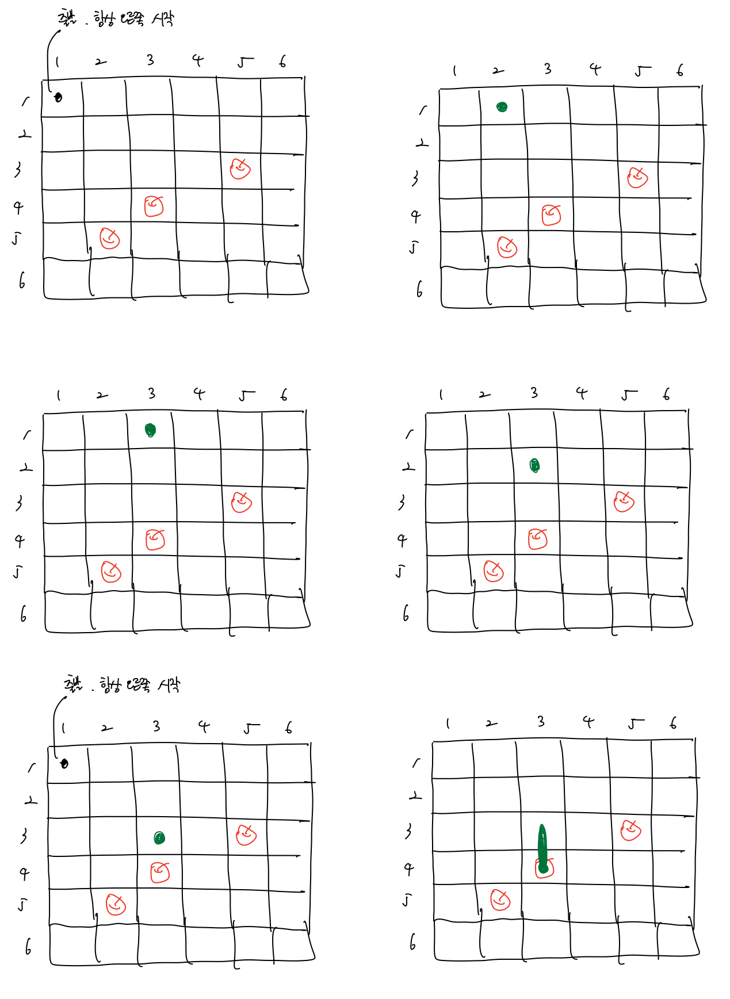
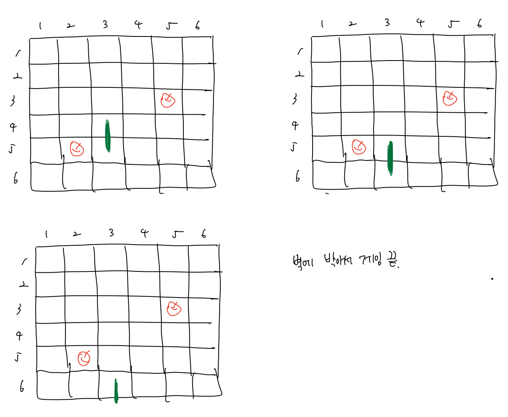
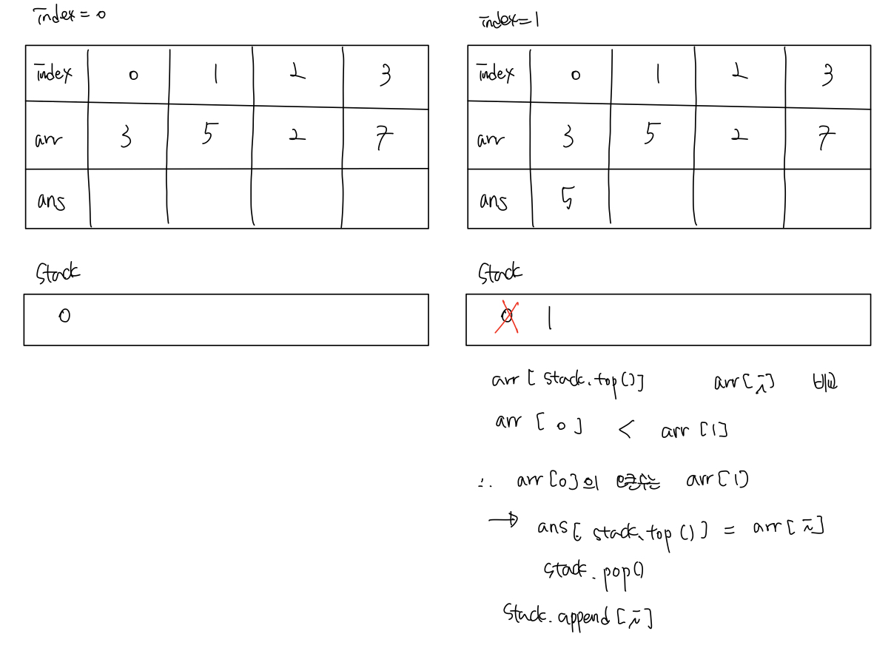
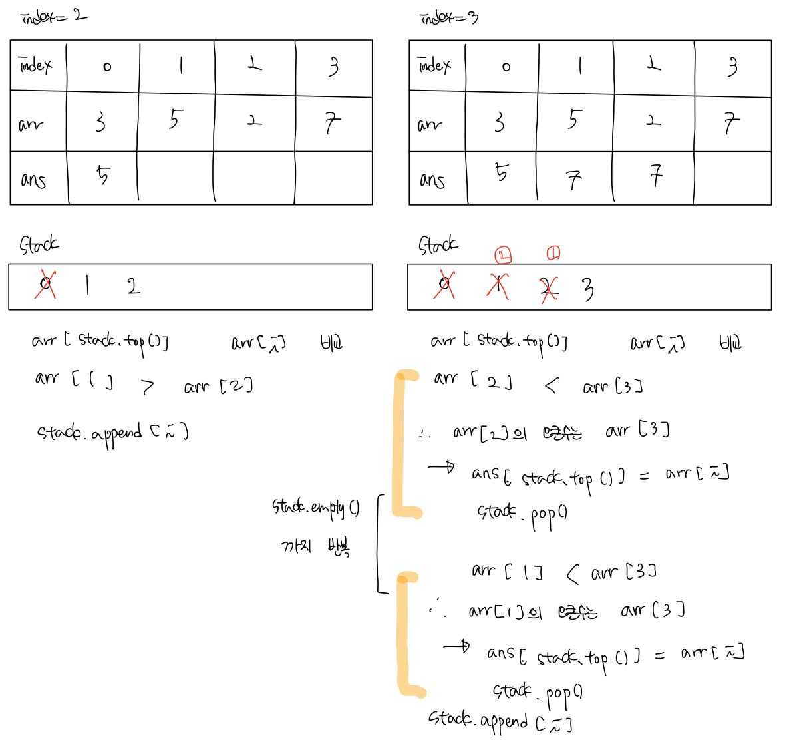

# 백준 문제

- [3015 : 오아시스 재결합](#3015-오아시스-재결합)
- [3190 : 뱀](#3190-뱀)
- [5430 : AC](#5430-AC)
- [17298 : 오큰수](#17298-오큰수)


## 3015 오아시스 재결합

[문제로 이동](https://www.acmicpc.net/problem/3015)

### 접근 방법 

#### Python

이 문제를 접근할 때, 처음 넣은 수보다 즉 **stack의 top보다 큰 수가 나오면 그 전의 수까지는 필요없다는 필수 요건**을 가지고 풀어보았지만 <br>

같은 경우와 숫자를 카운트 하는 것이 어려워서 결국 검색을 하게 되었다. <br>

따라서 문제를 해결하는 방법은 다음과 같았다. 먼저 stack을 선언할 때 페어 형식처럼 선언하여 높이와 함께 동일한 높이를 가지는 사람의 수 <br>

를 저장하고 사용하는 방법이다. 따라서 문제는 다음과 같은 방법으로 해결한다. <br>

1.  먼저 사용자로 부터 N과 키를 입력받아 arr에 저장한다.

2. N만큼의 반복문을 돌리면서 아래의 과정을 수행한다.

3. 먼저 스택이 비어있지 않고 `stack.top()` 의 높이 보다 `h(arr[i])` 가 더 크다면 pop()을 해주면서 

   해당 stack값의 동일한 높이 값을 가지는 수를 ans에 더해준다.

4. 만약 스택이 비어있다면 stack에 `h 와 1` , 즉 `높이`와 `현재 그 높이를 가지는 사람(1)`을 스택에 push한다.

5. 스택이 비어있지 않은 경우

   - `stack.top()` 과 `h` 가 같은 경우 pop()을 해주고 해당 스택의 카운트를 수정해준다.
     - 이때 만약 스택이 비어있지 않다면 스택 내 제일 큰 사람과 쌍을 이룰 수 있으므로 ans += 1을 해준다.
   - `stack.top()` 보다 `h` 가 작은 경우에는 스택에 push해주고 스택 내 가장 큰 사람과 쌍을 이루므로 ans += 1을 해준다.

6. ans를 출력해준다.


#### C++

python과 동일한 로직으로 해결하였다. 


## python code

```python
# 백준 3015 오아시스 재결합
# python solved by stack
import sys
N = int(sys.stdin.readline())
arr = [int(sys.stdin.readline()) for _ in range(N)]
stack = []
HEIGHT, COUNT = 0, 1
ans = 0

for h in arr:
    # 스택이 비어있지 않고 스택의 top이 h보다 작은 경우에는
    # 전부 pop()해주고 해당 stack의 count를 ans에 더해준다. 
    while stack and stack[-1][HEIGHT] < h:
        ans += stack.pop()[COUNT]
    # 스택이 비어있는 경우에는 높이와, 개수를 넣어줌
    if not stack :
        stack.append((h,1))
    # 스택이 비어있지 않는 경우
    else:
        # 스택의 top의 높이가 h와 같은 경우
        if stack[-1][HEIGHT] == h:
            cnt = stack.pop()[COUNT]
            ans += cnt
            # 스택이 비어있지 않다면, 스택 내 제일 큰 사람과 쌍을 이루므로 ans += 1
            if stack:
                ans += 1
            stack.append((h, cnt+1))
        # 스택의 top의 높이가 h 보다 큰 경우
        # 이경우에는 스택 내 제일 큰 사람과 현재 키가 쌍을 이루기 때문에 ans += 1
        else:
            stack.append((h, 1))
            ans += 1
print(ans)
```

### 메모리 및 수행 속도

메모리 : 48416 KB <br>

시간 : 660 ms <br>


## c++ code

```c++
// 백준 3015 오아시스 재결합
// cpp solved by stack
#include<iostream>
#include<stack>
using namespace std;
int N, arr[500001];
long long ans = 0;
stack<pair <int, int> > st;

long long solution(){
    for(int i = 0; i < N; i++){
        while(!st.empty() && st.top().first < arr[i]){
            ans += st.top().second;
            st.pop();
        }
        if(st.empty()){
            st.push({arr[i], 1});
        }else{
            if(st.top().first == arr[i]){
                int cnt = st.top().second;
                st.pop();
                ans += cnt;

                if(!st.empty()){
                    ans += 1;
                }
                st.push({arr[i], cnt + 1});
            }else{
                st.push({arr[i], 1});
                ans += 1;
            }
        }
    }
    return ans;
}
int main(void){
    scanf("%d", &N);
    for(int i = 0; i < N; i++){
        scanf("%d",&arr[i]);
    }
    printf("%lld\n",solution());
    return 0;
}
```

### 메모리 및 수행 속도

메모리 : 3936 KB <br>

시간 : 132 ms <br>


## 3190 뱀

[문제로 이동](https://www.acmicpc.net/problem/3190)

### 접근 방법 

#### Python

이 문제를 접근 할 때 가장 중요한 점은 rotate를 어떻게 시켜주는가 인 것 같다. <br>

또한 N x N 전체 배열을 0으로 초기화 해놓고 사과가 있는 위치에만 1로 저장해 놓아야한다. <br>

뱀의 위치를 저장할 수 있는 N x N 배열이 필요하며 뱀의 위치가 있는 위치는 1로 지정을 해놓는다. <br>

마지막으로 뱀의 머리는 x, y 를 통해서 움직이고, 꼬리를 따로 저장해주어서 사과를 먹은 경우와 그렇지 않은 경우로 나누어야 한다. <br>

그렇다면 과연 rotate를 어떠한 방법으로 시켜주어야 하는가? 바로 **회전 변환 행렬**을 사용하였다. <br>

```python
# 회전 변환 행렬 R(x') = [cos() - sin()] [x]
#              (y') = [sin() + cos()] [y]
```

이를 사용하여 python의 math에서 `[ [round(math.cos(x)), - round(math.sin(x))], [round(math.sin(x)), round(math.cos(x))]] 를 통해 <br>

변환 행렬을 구해준 뒤, 이를 direction 즉 현재 가고 있는 방향으로 좌표와 곱해주어서 방향을 회전해준다. <br>

따라서 뱀이 이동하다가 사과를 발견한 경우에는 꼬리를 줄이지 않고, 사과를 발견하지 못한 경우에는 꼬리를 줄이게 해준다. <br>

첫 번째 예시는 다음과 같이 나타낼 수 있다. <br>






#### C++

시간이 없어서 cpp로는 풀지 않음 <br>


## python code

```python
# 백준 3190 뱀 
# python solved by deque, rotation matrix 
import math 
from collections import deque
# 회전 변환 행렬 R(x') = [cos() - sin()] [x]
#              (y')   [sin() + cos()] [y]
def R(x):
    return [[round(math.cos(x)), - round(math.sin(x))], [round(math.sin(x)), round(math.cos(x))]]

# 회전 변환행렬을 가지고 회전시켜주는 함수 
def Rotation(str, d):
    result = []
    if str == 'L' : # left
        rMatrix = R(math.radians(90))
    else: # right 
        rMatrix = R(math.radians(-90))
    
    # 회전 변환 행렬에 d 곱해서 계산하기  
    for i in range(len(rMatrix)):
        temp = 0
        for j in range(len(rMatrix[0])):
            temp += rMatrix[i][j] * d[j]
        result.append(temp)
    
    return result

N = int(input())
arr = [[0 for _ in range(N)] for _ in range(N)] # 전체판 리스트 
snake = [[0 for _ in range(N)] for _ in range(N)] # 뱀의 위치 저장 리스트 
snake[0][0] = 1

# 사과 위치는 1로 표시
K = int(input())
for _ in range(K):
    row, col = map(int, input().split())
    arr[row - 1][col - 1] = 1

# 뱀의 이동 경로 
L = int(input())
trace = deque()
for _ in range(L):
    x, d = input().split()
    trace.append((int(x), d))
time, rotation = trace.popleft() # x초와 방향 

x, y, second = 0, 0, 1 # 뱀의 시작위치와 시간초
direction = [0, 1] # 처음 이동하는 방향
tail = deque() # 뱀의 꼬리

while True :
    if second - 1 == time:
        direction = Rotation(rotation, direction)
        if trace:
            time, rotation = trace.popleft()
        else: # 더 이상 방향 전환이 없는 경우 time -1 로 설정
            time = -1 
    tail.append([x,y])
    x, y = x + direction[0], y + direction[1]
    
    if (0 > x or x >= N) or (0 > y or y >= N): # 벽에 부딪히는 경우 종료
        break
    if snake[x][y] == 1: # 뱀의 몸통과 부딪히는 경우 
        break

    if arr[x][y] == 0 : # 사과가 없는 경우
        s_x, s_y = tail.popleft()
        snake[s_x][s_y] = 0 # 뱀의 꼬리가 움직이므로 0으로 위치 변경
    else : # 사과가 있는 경우
        arr[x][y] = 0 # 사과를 먹었으므로 1에서 0으로 변경
    
    snake[x][y] = 1
    second += 1

print(second)
```

### 메모리 및 수행 속도

메모리 : 33960 KB <br>

시간 : 104 ms <br>

## c++ code

```c++

```

### 메모리 및 수행 속도

메모리 : 0 KB <br>

시간 : 0 ms<br>


## 5430 AC

[문제로 이동](https://www.acmicpc.net/problem/5430)

### 접근 방법 

#### Python

처음에는 reverse를 arr[::-1]로 실제로 바꿔줬지만, 그러면 무조건 시간초과가 발생하여 deque를 사용하여 마치 reverse가 일어난것처럼 <br>

원소를 pop(), popleft() 해주었다. 다른 문제들보다 귀찮은 점은 입력받을 때와 출력할 때 형식에 맞추는 것이 매우 번거롭다. <br>

또한 D와 R의 개수를 카운트 해주기 위해서 defaultdict를 사용하였다. <br>


#### C++

입력과 출력 처리가 너무 귀찮아서 작성하지 않았다.<br>

## python code

```python
# 백준 5430 AC
# python solved by deque
from collections import defaultdict
from collections import deque
T = int(input())
for _ in range(T):
    p = input()
    # D의 개수와 R의 개수를 편하게 세기 위해서 defaultDict사용
    p_count = defaultdict(int)
    for func in p:
        p_count[func] += 1
    
    n = int(input())
    arr = input()
    # []와 , 제거하기 
    arr = arr.replace('[','').replace(']','').split(',')
    # 길이가 0 이 아닐 때만 deque에 넣어주기
    if n > 0:
        dq_arr = deque(map(int,arr))
    # 실제로 reverse를 하지 않기 위해서 선언한 bool 변수 
    R = False

    if p_count['D'] > n :
        print("error")
    elif p_count['D'] == n :
        print([])
    else:
        for i in range(len(p)):
            # 평상시 상태이다가 R이 처음 나오는 경우 
            if p[i] == 'R' and R == False:
                R = True
            # Reverse 되어있는 상태에서 R이 나온 경우
            elif p[i] == 'R' and R == True:
                R = False
            # D 가 나오는 경우
            else:
                # R이 True이면 Reverse 되었기때문에 pop()으로 삭제
                if R == True :
                    dq_arr.pop()
                # R이 False이면 원래 상태이므로 popleft()으로 삭제
                else :
                    dq_arr.popleft()

        # 마지막 출력전에 R의 개수가 홀수면 reverse하여 출력해주어야함
        if p_count['R'] % 2 == 1 :
            dq_arr.reverse()
        print('[',end="")
        print(','.join(map(str,dq_arr)),end="")
        print(']',end="\n")

```

### 메모리 및 수행 속도

메모리 : 43088 KB <br>

시간 : 492 ms <br>


## c++ code

```c++

```

### 메모리 및 수행 속도

메모리 :  KB <br>

시간 :  ms<br>


## 17298 오큰수

[문제로 이동](https://www.acmicpc.net/problem/17298)

### 접근 방법 

#### Python

처음에는 뒤에서부터 숫자를 넣어가면서 경우를 나눠서 풀이를 하려고 했는데 경우가 너무 많아서 실패하였다. <br>

stack을 사용한 O(N)의 풀이를 사용하게 되었는데 처음에는 이해하기 어려웠다. <br>

 스택을 사용한 방법은 다음과 같다. 사용자로 부터 입력받는 arr, stack, ans 리스트 총 3개가 필요하다.<br>



stack에 저장되는 것은 arr의 인덱스가 저장되며, 처음에는 arr의 첫번째 원소가 stack에 들어가므로 0이 stack에 들어가있다. <br>

이후 `arr[stack.top()]` 의 값과 `arr[i]` 의 값을 비교하여 `arr[i]`가 크다면 `arr[stack.top()]` 의 오큰수는 `arr[i]` 가 된다. <br>

따라서 `ans[stack.top()]`에 `arr[i]` 의 값을 저장해주고 stack에서 해당 값을 빼준다. <br>



마지막에 stack에 남아있는 값들은 오큰수가 없는 수들이므로 `ans[stack.top()]` -1을 대입해주면 된다. <br>


#### C++

python과 동일한 로직으로 해결하였다. 


## python code

```python
# 백준 17298 오큰수
# python solved by stack
N = int(input())
arr = list(map(int,input().split()))
# 스택은 처음에 index 0 이 들어갈 것이므로 0을 미리 넣어줌
# ans 같은 경우에는 stack에 남아있는 애들은 전부 -1일 것이므로 미리 -1로 초기화
stack, ans = [0],[-1]*N

for i in range(N):
    # 만약 스택이 비어있다면 stack에 i 추가
	if not stack:
		stack.append(i)
	# stack 안에 원소가 있고 arr[stack.top()] 이 arr[i] 보다 작은 경우
    # 해당 원소는 arr[i]가 오큰수 이므로 ans에 저장하고 stack에서 pop() 
	while stack and arr[stack[-1]] < arr[i]:
		ans[stack[-1]] = arr[i]
		stack.pop()
	stack.append(i)

# 스택에 남아있는 원소들은 오큰수가 없는 것이므로 -1을 넣어줌
while stack:
	ans[stack[-1]] = -1
	stack.pop()

print(' '.join(map(str,ans)))
```

### 메모리 및 수행 속도

메모리 : 161932 KB <br>

시간 : 1240 ms <br>


## c++ code

```c++
// 백준 17298 오큰수
// cpp solved by stack
#include<iostream>
#include<stack>
#include<vector>
using namespace std;
int N, arr[1000001], ans[1000001];
stack<int> st;
int main(void){
    scanf("%d", &N);
    for(int i = 0; i < N; i++){
        scanf("%d", &arr[i]);
    }
    st.push(0);
    for (int i = 0; i < N; i++){
        if(st.empty()){
            st.push(i);
        }

        while(!st.empty() && arr[st.top()] < arr[i]){
            ans[st.top()] = arr[i];
            st.pop();
        }
        st.push(i);
    }
    
    while(!st.empty()){
        ans[st.top()] = -1;
        st.pop();
    }

    for(int i = 0; i < N; i++){
        printf("%d ", ans[i]);
    }
    return 0;
}
```

### 메모리 및 수행 속도

메모리 : 13960 KB <br>

시간 : 412 ms<br>


---

### 참조

[seovalue.log 백준 3190 뱀](https://velog.io/@seovalue/%EB%B0%B1%EC%A4%80-3190%EB%B2%88-%EB%B1%80-python) <br>

[꾸준함 백준 3015오아시스](https://jaimemin.tistory.com/831) <br>