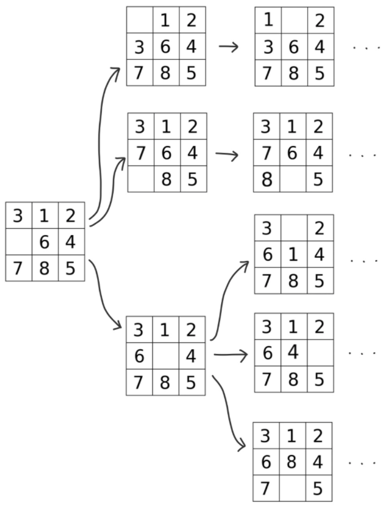
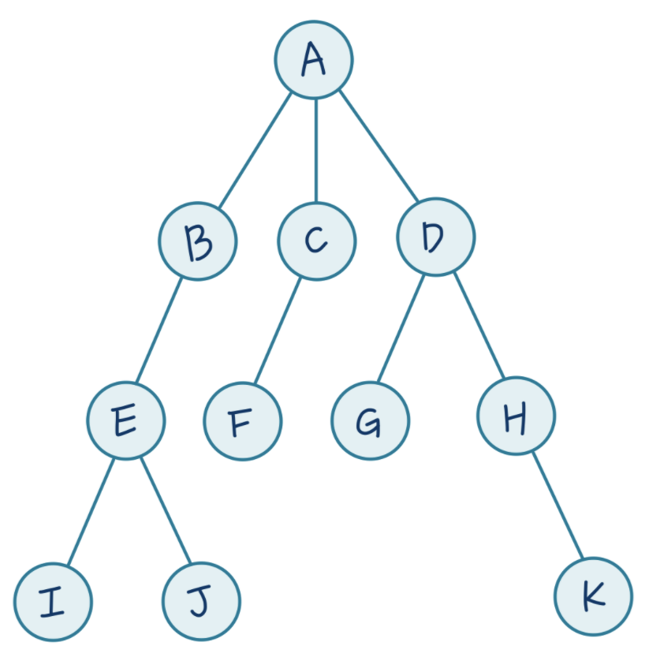
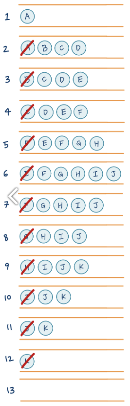
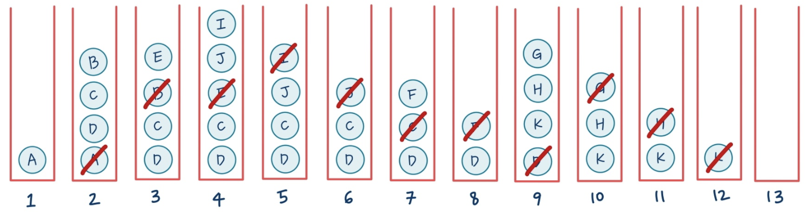

# 알고리즘 - BFS & DFS

BFS와 DFS는 둘 다 그래프의 모든 노드를 방문하는 알고리즘이다. <br>

이 둘은 **탐색알고리즘**이며, 탐색할 때 사용되는 **트리와, 스택, 큐** 같은 자료구조들이 필요하다. <br>

**BFS(Breadth - First - Search)**와 **DFS(Depth - First - Search)**는 탐색을 어떤 순서로 하느냐만 살짝 다를 뿐, 어떤 효율성도 생각하지 않고 <br>

모든 자료를 하나하나 다 확인해 본다는 점은 동일하다. 따라서 탐색 알고리즘으로서 가장 기본 알고리즘으로 배우지만 현실에서는 사용하지 않는다. <br>

너무 비효율적이기 때문이다. 따라서 이러한 BFSd와 DFS에서 발전된 A* 알고리즘 등이 현실에서 사용되는 알고리즘이다. <br>


### BFS(Breadth - First - Search) : 너비 우선 탐색

먼저 BFS는 너비 우선 탐색으로 `1) 한 단계 진행 시 가능한 경우의 수`,  `2) 두 단계 진행 시 가능한 경우의 수` 와 같이 <br>

매 단계에서 가능한 경우의 수들을 모두 확인하며 탐색하는 방법이다. <br>

따라서 너비 우선 탐색은 아래의 그림과 같이 트리를 넓혀가면서 탐색하는 알고리즘이라고 할 수 있다. <br>



즉 **BFS**는 **`매 단 계에서 가능한 모든 경우의 수를 확인`** 해준다. <br>

따라서 아래의 트리에서 BFS를 활용하여 탐색을 해보자. <br>



BFS에서는 탐색을 수행할 때 자료구조로 queue나, dequeue를 사용하여 탐색을 수행하게 된다. <br>

먼저 BFS의 탐색 순서는 `A → B → C → D → E → F → G → H → I → J → K` 이다. 즉 한 단계마다 갈 수 있는 모든 곳을 방문하게 된다. <br>

따라서 위의 순서대로 queue에 알파벳을 순서대로 넣었다가 확인한 곳은 지워서 빼는 방식으로 나타낼 수 있다. <br>

**queue**는 **FIFO 구조**로 선입 선출 방식이므로 아래와 같이 먼저 들어간 것들이 먼저 나가게 된다. <br>



따라서 위의 그림과 같이 큐의 가장 왼쪽에 있는 노드가 먼저 들어온 노드이기 때문에 먼저 나가는 것을 확인할 수 있다. <br>

이때 queue.pop(0) 을 하게 되면, O(N)이라는 시간 복잡도가 걸리기 때문에  <br>

dequeue를 사용하여 popleft()를 하여 O(1)이라는 시간복잡도를 가질 수 있다. <br>

BFS의 python 코드는 다음과 같다. <br>

```python
from collections import deque
def BFS(start):
  dq = deque()
  dq.append(start) # 1. dq에 첫번째 노드 넣으면서 시작
  
  # 2. dq가 비어있을 때까지 계속 반복
  while dq:
    next = dq.popleft() # 3. dq의 맨 앞 노드를 꺼내준다.
    
    if next == TARGET: # 4. next가 TARGET이면 탐색 중단
      print("find Target")
      return next
    
    child = expand(next) # 5. next 노드의 자식노드들을 expand하여 child에 저장
    dq.append(child) # 6. child를 dq에 다시 삽입
```


### DFS (Depth - First - Search) : 깊이 우선 탐색

 깊이 우선 탐색은 `1) 여러 경우의 수 중 하나를 선택`, `2) 선택 ㅜ 가능한 여러 경우의 수 중 또 하나를 선택` 하는 식으로 매 단계에서 가능한 것 <br>

중에서 일단 하나를 선택하여 끝을 볼 때 까지 깊게 들어가는 것이다. 만약 한 우물만 파서 끝에 도착했는데 원하는 답이 아니라면, <br>

그 직전으로 돌아왔다가 다시 또 다른 끝을 확인하는 방식이다. <br>


즉, **DFS**는 **`한 우물만 파고 들며 끝을 볼 때 까지 확인` ** 해준다. <br>

따라서 아래의 트리에서 DFS를 활용하여 탐색을 해보자. <br>


DFS에서는 탐색을 수행할 때 자료구조로 stack를 사용하여 탐색을 수행하게 된다. <br>

먼저 DFS의 탐색 순서는 `A → B → E → I → J → C → F → D → G → H → K` 이다. <br>

즉 한 노드에서 끝가지 탐색을 진행한 다음에 직전의 노드에서의 끝까지 탐색을 진행하는 방식이다.. <br>

따라서 위의 순서대로 stack에 알파벳을 순서대로 쌓았다가 다시 꺼낼 때는 맨 위에 있는 노드, 즉 방금 넣은 노드 부터 꺼내게 된다. <br>

**stack**는 **LIFO 구조**로 후입 선출 방식이므로 아래와 같이 나중에 들어간 것들이 먼저 나가게 된다. <br>



즉, 다음과 같은 단계를 따라서 탐색이 이루어진다. <br>

1. 루트 노드 (시작점) 인 `A` 를 스택에 넣는다.
2. `A` 를 `Pop` 하면서 `Expand` 한다. 즉, `A` 는 지우고 `A` 의 자식인 `B`, `C`, `D` 를 스택에 넣는다.
3. 스택의 맨 위에 있는 `B` 를 `Pop` and `Expand` 한다. 즉, `B` 는 지우고 `B` 의 자식인 `E` 를 스택에 넣는다.
4. 스택의 맨 위에 있는 `E` 를 `Pop` and `Expand` 한다. 즉, `E` 는 지우고 `E` 의 자식인 `I`, `J` 를 스택에 넣는다.
5. 스택의 맨 위에 있는 `I` 를 `Pop` and `Expand` 한다. 이 때, `I` 는 자식이 없으므로 (끝에 도달했으므로) 스택에 넣을 것이 없다.
6. 스택의 맨 위에 있는 `J` 를 `Pop` and `Expand` 한다. 이 때, `J` 또한 자식이 없으므로 스택에 넣을 것이 없다.
7. 스택의 맨 위에 있는 `C` 를 `Pop` and `Expand` 한다. 즉, `C` 는 지우고 `C` 의 자식인 `F` 를 스택에 넣는다.
8. 스택의 맨 위에 있는 `F` 를 `Pop` and `Expand` 한다. 이 때, `F` 는 자식이 없으므로 스택에 넣을 것이 없다.
9. 스택의 맨 위에 있는 `D` 를 `Pop` and `Expand` 한다. 즉, `D` 는 지우고 `D` 의 자식인 `H`, `K` 를 스택에 넣습니다.
10. 스택의 맨 위에 있는 `G` 를 `Pop` and `Expand` 한다. 이 때, `G` 는 자식이 없으므로 스택에 넣을 것이 없다.
11. 스택의 맨 위에 있는 `H` 를 `Pop` and `Expand` 한다. 이 때, `H` 는 자식이 없으므로 스택에 넣을 것이 없다.
12. 스택의 맨 위에 있는 `K` 를 `Pop` and `Expand` 한다. 이 때, `K` 는 자식이 없으므로 스택에 넣을 것이 없다.
13. 스택에 남아있는 것이 아무 것도 없다. 이 말은 모든 노드를 탐색했다는 뜻이다. 


DFS의 python 코드는 다음과 같다. <br>

```python
def DFS(start):
  stack = []
  stack.append(start) # 1. stack에 첫 번째 노드 넣으면서 시작
  
  while stack: # 2. stack에 남는 것이 없을 때까지 반복
    next = stack.pop() # 3. stack에서 맨 위의 노드를 pop
    
    if next == TARGET: # 4. 만약 next가 찾고자하는 TARGET이라면 탐색 종료
      print("find Target")
      return next
    
    child = expand(next) # 5. next의 자식들을 exapand해서 child에 저장
    stack.append(child) # 6. child를 stack에 쌓아준다. 
```


## 참조 

아래의 블로그를 참고하여 작성하였습니다. <br>

[DFS & BFS](https://jeinalog.tistory.com/18) <br>


