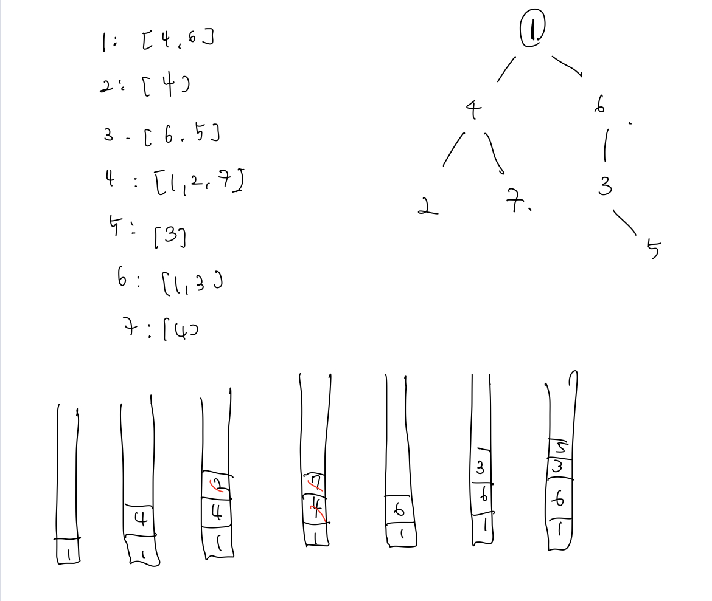

# 백준 문제

- [1405 : 미친 로봇](#1405-미친-로봇)
- [2468 : 안전 영역](#2468-안전 영역)
- [2668 : 숫자 고르기](#2668-숫자-고르기)
- [11725 : 트리의 부모찾기](#11725-트리의-부모찾기)


## 1405 미친 로봇

[문제로 이동](https://www.acmicpc.net/problem/1405)

### 접근 방법 

#### Python

이 문제는 dfs로만 풀 수 있는 문제이다. 왜냐하면 bfs로 풀 경우에는 한 단계에서 갈 수 있는 단계를 모두 표시하는데 그렇게 되면 <br>

다음 단계로 갔을 경우에 실제로 방문했던 곳이나 아직 방문하지 않았던 곳이 모두 표시되어있을 수 있으므로 확률을 계산하는데 영향을 <br>

미치게 되므로 dfs로만 해결할 수 밖에 없다.  <br>

이 문제를 해결하기 위해서는 다음과 같은 과정을 거치게 된다. <br>

1. 사용자로부터 N, 각 방향으로의 갈 수 있는 확률을 입력받아서 100으로 나눈 형태로 저장해놓는다. 

2. 총 N 번 움직일 수 있다고 하면 방문이 가능한 부분을 모두 표시하기 위한 맵의 크기는 (2N+1) x (2N+1) 이다. 

   따라서 해당 크기만큼의 visited배열을 0으로 초기화하여 선언해준다. 

3. dfs를 수행하는데 초기 위치는 가운데에서 부터 시작하고, count = 0 부터 시작하게 된다.

4. 만약 count == N 인 경우에는 더 이상 이동하지 않으므로 return 1을 해주고

   그렇지 않은 경우에는 동, 서, 남, 북에서 아직 방문하지 않은 곳으로 방문표시를 하고 재귀함수를 통해 방문하고 확률을 계산해준다. 

5. 이때 해당 방향에서의 확률 계산을 마쳤다면 다시 visited = 0으로 표시해주어야만 한다.

아래의 그림은 N = 2일때 먼저 east 방향으로 갔을 경우 result를 구하게 되는 과정이다. <br>


## python code

```python
# 백준 1405 미친로봇
# python solved by dfs
import sys
sys.setrecursionlimit(10**9)
def dfs(x, y, count):
    # 기저 조건 count개 만큼 확인했으면 return 1
    if count == N:
       return 1
    result = 0
    _map[x][y] = 1
    for i in range(4):
        nx, ny = x + dx[i], y + dy[i]
        if _map[nx][ny] == 1:
            continue
        result += dfs(nx,ny,count+1) * probability[i]
    _map[x][y] = 0
    return result

# 순서대로 e, w, s, n
dx = [0, 0, 1, -1]
dy = [1, -1, 0, 0]
N, e, w, s, n =  map(int,input().split())
probability = [e/100, w/100, s/100, n/100]
_map = [[0] * (2*N + 1) for _ in range(2*N + 1)]

print(dfs(N,N,0))
```

### 메모리 및 수행 속도

메모리 : 29088 KB <br>

시간 : 2108 ms <br>


## 2468 안전 영역

[문제로 이동](https://www.acmicpc.net/problem/2468)

### 접근 방법 

#### Python

이 문제 같은 경우에는 헷갈리는 부분이 비가 아예 내리지 않는 경우이다. <br>

만약 비가 아예 안내리는 경우에는 전체 영역이 하나의 안전영역이 될 것이다. <br>

이 부분을 고려하여 강수량인 height를 0부터 시작하면 문제를 쉽게 해결할 수 있다. <br>

 문제는 bfs와 dfs를 둘 다 사용하여 풀었는데 기본적인 탐색 문제이다. <br>


## python code - dfs

```python
# 백준 2468 안전영역
# python solved by dfs
import sys
sys.setrecursionlimit(10**9)
def dfs(height, x, y):
    for i in range(4):
        nx, ny = x + dx[i], y + dy[i]
        if 0 <= nx < N and 0 <= ny < N and location[nx][ny] > height and visited[nx][ny] == 0:
            visited[nx][ny] = 1
            dfs(height, nx, ny)

dx = [0, 1, 0, -1]
dy = [1, 0, -1, 0]
N = int(input())
location = [list(map(int,input().split())) for _ in range(N)]
ans, height = 0, 0 # 비가 안올경우도 있으므로 height는 0부터 시작
maxHeight = max(max(location))

while height <= maxHeight:
    cnt = 0
    visited = [[0] * N for _ in range(N)]
    for i in range(N):
        for j in range(N):
            if location[i][j] > height and visited[i][j] == 0:
                dfs(height,i,j)
                cnt += 1
    ans = max(ans, cnt)
    height += 1

print(ans)
```

### 메모리 및 수행 속도

메모리 : 38088 KB <br>

시간 : 1632 ms <br>


## python code - bfs

```python
# 백준 2468 안전영역
# python solved by bfs
from collections import deque
def bfs(b,a, height):
    dq = deque()
    dq.append((a,b))
    visited[b][a] = 1
    while dq:
        x, y = dq.popleft()
        for i in range(4):
            nx, ny = x + dx[i], y + dy[i]
            if 0 <= nx < N and 0 <= ny < N and location[ny][nx] > height and visited[ny][nx] == 0:
                dq.append((nx,ny))
                visited[ny][nx] = 1
dx = [0, 1, 0, -1]
dy = [1, 0, -1, 0]
N = int(input())
location = [list(map(int,input().split())) for _ in range(N)]
ans, height = 0, 0 # 비가 안올경우도 있으므로 height는 0부터 시작
maxHeight = max(max(location))

while height <= maxHeight:
    cnt = 0
    visited = [[0] * N for _ in range(N)]
    for i in range(N):
        for j in range(N):
            if location[i][j] > height and visited[i][j] == 0:
                bfs(i,j,height)
                cnt += 1
    ans = max(ans, cnt)
    height += 1

print(ans)
```

### 메모리 및 수행 속도

메모리 : 31920 KB <br>

시간 : 1588 ms <br>


## 2668 숫자 고르기

[문제로 이동](https://www.acmicpc.net/problem/2668)

### 접근 방법 

#### Python

이 문제는 전형적인 dfs문제라고 생각한다. <br>

해결하는 방법은 다음과 같다.  <br>

1. 사용자로부터 전체 개수를 입력받고, dictionary 형태로 입력 값들을 저장한다.
2. 그리고 정답을 저장할 ans을 set 타입으로 선언한다.
3. 1부터 N까지 for문을 반복하면서 만약 i 가 ans에 저장되어 있지 않은 경우 dfs 실행
4. dfs에서는 해당 key값의 해당하는 원소를 visited에 저장하고 value값으로 dfs실행 
5. 만약 value값을 방문한적이 있다면, ans에 num, key를 추가해준다.

이를 반복해서 수행하다보면 정답을 구할 수 있다. <br>


## python code

```python
# 백준 2668 숫자고르기
# python solved by dfs
import sys
sys.setrecursionlimit(10**9)
def dfs(key):
    num = tree[key][0] # num은 key에 해당하는 원소값 
    # 만약 num을 방문했던 적이 있으면 
    # 그 숫자는 서로 순환되는 것이므로 ans에 num, key 추가
    if num in visited: 
        ans.add(num)
        ans.add(key)
    # num이 방문한 적이 없으면 
    # 방문했다고 표시하고 dfs(num) 진행후 만약 정답이 아닌 경우 pop()
    else:
        visited.append(key)
        dfs(num)
        visited.pop()

N = int(sys.stdin.readline())
tree = {}
for i in range(1, N + 1): # 딕셔너리 key값 및 value형태 설정
    tree[i] = []
for i in range(1, N + 1): # 딕셔너리 value에 사용자로부터 입력값 넣기
    num = int(sys.stdin.readline())
    tree[i].append(num)
ans = set() # 정답을 저장할 set

for i in range(1,N): # 1 부터 N까지 ans에 없으면 dfs 들어감
    visited = []
    if i not in ans:
        dfs(i)

print(len(ans))
for i in sorted(ans): # 정답은 오름차순으로 해줘야함 
    print(i)
```

### 메모리 및 수행 속도

메모리 : 29088 KB <br>

시간 : 68 ms <br>


## 11725 트리의 부모찾기

[문제로 이동](https://www.acmicpc.net/problem/11725)

### 접근 방법 

#### Python



처음에는 visited라는 배열을 선언하여 방문한 곳들을 저장하고 더 이상 방문할 곳이 없는 경우에 pop()해주면서 <br>

트리의 부모를 찾는 방식으로 문제를 해결하려고 하였다. 그러나 tree[node]를 하나씩 pop()해주고, 그 값을 visited[]에서 찾는 것에서 시간초과가 <br>

발생한것 같다. 따라서 다른 방법을 사용하였다.<br>

```python
import sys
sys.setrecursionlimit(10**9)
def dfs(node):
  	# 처음에 해당 노드를 방문한것으로 표시
    visited.append(node)
    while tree[node]:
        temp = tree[node].pop()
        # tree[node]를 pop()한 것이 visited에 없는 경우
        # dfs(temp) 수행
        if temp not in visited:
            dfs(temp)
            child = visited.pop()
            ans[child] = visited[-1]

N = int(input())
tree = {}
for i in range(1, N+1):
    tree[i] = set()
for _ in range(N-1):
    a, b = map(int,input().split())
    tree[a].add(b)
    tree[b].add(a)
ans, visited = [0]*(N+1), []
dfs(1)
for i in range(2,N+1):
    print(ans[i])
```

따라서 visited를 사용하지 않고 단지 ans만을 사용해서 문제를 해결하였다. <br>

ans[tree[node]] 가 0인 것들은 아직 부모노드가 정해지지 않은 자식들이므로 부모를 정해줌과 동시에 dfs(tree[node])를 반복하였다. <br>


## python code

```python
# 백준 11725 트리의 부모찾기
# python solved by dfs
import sys
sys.setrecursionlimit(10**9)
def dfs(node):
    for i in tree[node]:
        if ans[i] == 0:
            ans[i] = node
            dfs(i)

N = int(sys.stdin.readline())
tree = {}
for i in range(1, N+1):
    tree[i] = set()
for _ in range(N-1):
    a, b = map(int,sys.stdin.readline().split())
    tree[a].add(b)
    tree[b].add(a)
ans = [0]*(N+1)
dfs(1)
for i in range(2,N+1):
    print(ans[i])
```

### 메모리 및 수행 속도

메모리 : 154800 KB <br>

시간 : 692 ms <br>


---

### 참조

