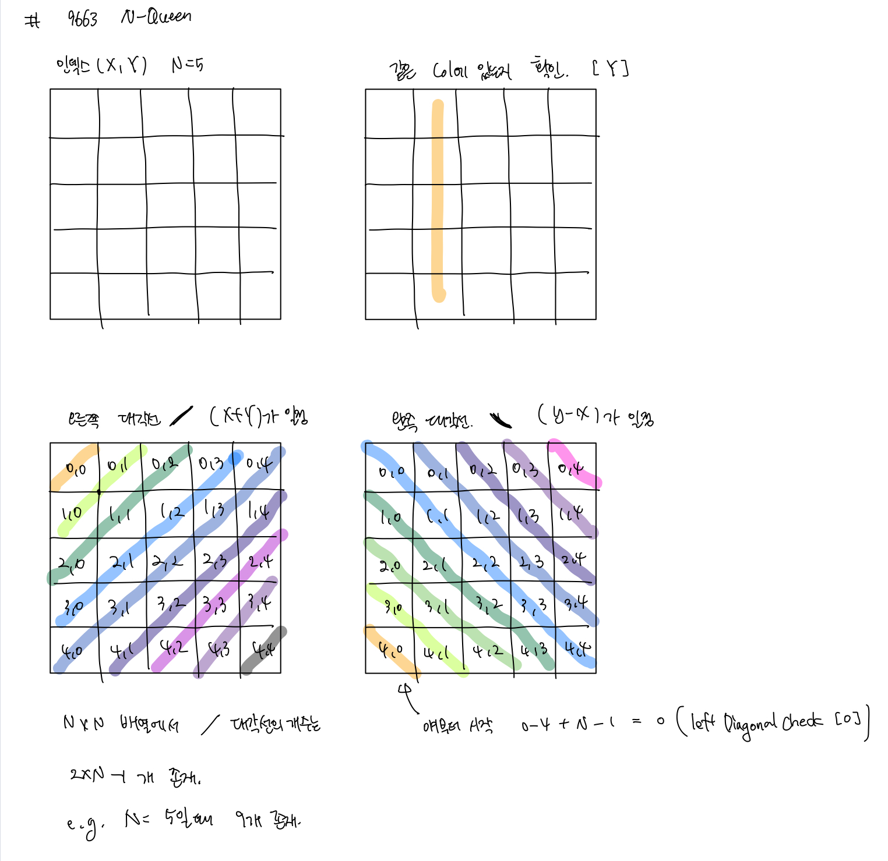

# 백준 문제

- [1941 : 소문난 칠공주](#1941-소문난-칠공주)
- [2023 : 신기한 소수](#2023-신기한-소수)
- [9663 : N Queen](#9663-N-Queen)
- [14888 : 연산자 끼워넣기](#14888-연산자-끼워넣기)


## 1941 소문난 칠공주

[문제로 이동](https://www.acmicpc.net/problem/1941)

### 접근 방법 

#### Python

이 문제는 dfs를 사용하여 풀었는데 백트래킹을 한것은 아닌 것 같다. <br>

처음에는 아예 dfs로 모든 경우를 찾아보려고 했지만 질문검색을 보니 찾지 못하는 경우들이 있다고 하여 조합을 사용하여 <br>

25칸에서 7개를 뽑는 모든 경우에 대해서 S가 4개 이상일 때, 이 경우에 7개의 숫자가 인접해 있는지를 확인하는 방식으로 <br>

코드를 작성하였다. 여기서 아이디어 하나는 바로 25칸을 표시할 때 1차원 배열로 모든 수를 나타낸 다음 이를 2차원 배열 <br>

에서 x, y로 바꿀 때 x 좌표는 해당 숫자 / 5, y 좌표는 해당 숫자 % 5를 해주면 구할 수 있었다. <br>

## python code

```python
# 백준 1941 소문난 칠공주
# python solved by dfs
from itertools import combinations
# combinations(조합)과 permutations(순열)의 차이
# 순열은 순서가 있는 조합 즉, 순열은 원소의 순서가 상관이 있음 
# 조합은 순서가 상관 없다
dx = [0, -1, 0, 1]
dy = [-1, 0, 1, 0]

students = [list(input()) for _ in range(5)]
num, ans = [x for x in range(25)], 0
selectedCombination = list(combinations(num,7))

def dfs(x, y, visited, _map):
    for i in range(4):
        nx, ny = x + dx[i], y + dy[i]
        if 0 <= nx < 5 and 0 <= ny < 5 and visited[nx][ny] == 0 and _map[nx][ny] == 1:
            visited[nx][ny] = 1
            dfs(nx,ny, visited, _map)

def IsSover4(selected): # S가 4개 이상이면 True 나머지 False
    cnt = 0
    for i in range(25):
        if selected[i] == True:
            x, y = i // 5, i % 5
            if students[x][y] == "S":
                cnt += 1
    if cnt > 3:
        return True
    else: return False

def IsSevenAdjacent(case): # 7개가 근접해 있는지 dfs 로 확인
    global ans
    _map = [[0] * 5 for i in range(5)]
    visited = [[0] * 5 for i in range(5)]
    for i in range(7):
        x, y = case[i] // 5, case[i] % 5
        _map[x][y] = 1
    cnt = 0
    for i in range(5):
        for j in range(5):
            if _map[i][j] == 1 and visited[i][j] == 0:
                if cnt > 1 : return
                dfs(i,j, visited, _map)
                cnt += 1
    if cnt == 1 : ans += 1

# 조합으로 만들 것들을 하나씩 진행
for case in selectedCombination: 
    selected = [False] * 25
    # 조합에서 선택된 숫자들을 selected에 표시
    for i in range(7):
        selected[case[i]] = True
    # selected에 표시된 것들 중에 S가 몇개인지 확인 
    if IsSover4(selected) :
        # S가 4개 이상인 경우에 대해서 7개가 근접해 있는지 확인
        IsSevenAdjacent(case)

print(ans)
```

### 메모리 및 수행 속도

메모리 : 78980 KB , 182136 KB<br>

시간 : 7108 ms , 1100 ms <br>


## 2023 신기한 소수

[문제로 이동](https://www.acmicpc.net/problem/2023)

### 접근 방법 

#### Python

이 문제 같은 경우에는 백트래킹이 아닌 dfs 방식을 활용하여 해결하였다. <br>

먼저 처음에 올수있는 자리수의 경우에는 2,3,5,7 즉 한 자리수가 소수인 숫자들만 올 수 있으므로 이 숫자들을 기준으로 <br>

N 자리수 까지 숫자를 붙여 나간다. 이때 뒷 자리수에 들어갈 수 있는 수는 짝수인 경우에는 2로 나눠질 수 있으므로 <br>

홀수인 숫자들만 더해주고 그 수가 소수인지 판별한다. <br>

소수인지 판별하는 방식은 해당 수를 루트 씌운 숫자까지 직접 나눠보고 만약 나눠진다면 소수가 아니고 나눠지는 숫자가 <br>

없다면 소수이다. 


## python code 

```python
# 백준 2023 신기한 소수
# python solved by dfs
import math
N = int(input())
primeNums = [2, 3, 5, 7]

def isPrime(num):
    if num < 2: return False
    # N의 루트씌운 것까지 나눠봤을 때 나눠지는 숫자가 있으면 소수가 아님
    for i in range(2, int(math.sqrt(num)) + 1): 
        if num % i == 0 : return False
    return True


def dfs(primeNumber, count):
    if count == 0: 
        print(primeNumber)
    # 짝수가 오게되면 무조건 소수가 아니므로 홀수만 더해주고 확인
    for i in range(1,10,2): 
        nextDigitPrime = primeNumber * 10 + i
        if isPrime(nextDigitPrime):
            dfs(nextDigitPrime, count-1)

for primeNumber in primeNums:
    dfs(primeNumber, N-1)

```

### 메모리 및 수행 속도

메모리 :  31200 KB <br>

시간 : 84 ms <br>


## 9663 N Queen

[문제로 이동](https://www.acmicpc.net/problem/9663)

### 접근 방법 

#### Python

이 문제는 대표적인 백트래킹 문제이다. 여기서 확인해야하는 것은 queen이 움직일 수 있는 방향인데 행같은 경우에는 <br>

하나를 놓게되면 아예 다른 queen은 놓을 수 없으므로 한 행에 하나씩 놓는다고 생각하고 나머지 세로, 대각선을 <br>

체크해주면 된다. 이때 세로와 대각선은 미리 N x N 일때 존재하는 것 만큼의 개수를 만들어 놓고 해당 줄에 존재한다면 <br>

True로 변경해주면 된다. <br>




## python code - pypy3로 제출

```python
# 백준 9663 N-Queen
# python solved by back-tracking
N = int(input())
ans = 0
colCheck, rightDiagonalCheck, leftDiagonalCheck = [False] * N, [False] * (2*N-1), [False] * (2*N-1)

def dfs(row):
    global ans
    # Row 가 마지막 줄까지 왔다면 정답이 되는 것이므로 정답 하나 추가
    if row == N:
        ans += 1
        return 
    for col in range(N):
        # 만약 세로줄, 오른쪽 대각선, 왼쪽 대각선이 표시되어 있지 않다면 해당 대각선 표시 후 다음 행으로 이동 
        if not (colCheck[col] or rightDiagonalCheck[row + col] or leftDiagonalCheck[row - col + N - 1]):
            colCheck[col] = rightDiagonalCheck[row + col] = leftDiagonalCheck[row - col + N -1] = True
            dfs(row+1)
            colCheck[col] = rightDiagonalCheck[row + col] = leftDiagonalCheck[row - col + N -1] = False
dfs(0)
print(ans)
```

### 메모리 및 수행 속도

메모리 : 132672 KB <br>

시간 : 6828 ms <br>


## 14888 연산자 끼워넣기

[문제로 이동](https://www.acmicpc.net/problem/14888)

### 접근 방법 

#### Python

이 문제 역시도 back tracking이 아닌 dfs를 활용하여 해결하였다. <br>

먼저 사용자로부터 N, number을 입력받고 연산자의 개수를 입력받는다. <br>

그리고 dfs를 활용하여 모든 경우에 수를 계산하면서 _max, _min값을 갱신해준다. <br>

## python code

```python
# 백준 14888 연산자 끼워넣기
# python solved by dfs
N = int(input())
number = list(map(int,input().split()))
add, sub, mul, div = map(int,input().split()) # 차례대로 + - x % 의 개수 
_min, _max = 1e9, -1e9 # python에서 1e9 = 1*10^9 = 1000000000

def dfs(n, result, add, sub, mul, div):
    global _min, _max
    if N == n : 
        _max = max(result,_max)
        _min = min(result,_min)
    
    else:
        if add:
            dfs(n+1, result + number[n], add - 1, sub, mul, div)
        if sub:
            dfs(n+1, result - number[n], add, sub - 1, mul, div)
        if mul:
            dfs(n+1, result * number[n], add, sub, mul - 1, div)
        if div:
            dfs(n+1, int(result / number[n]), add, sub, mul, div - 1)

dfs(1,number[0],add,sub,mul,div)
print(_max)
print(_min)
```

### 메모리 및 수행 속도

메모리 : 29088 KB <br>

시간 : 100 ms <br>


---

### 참조

