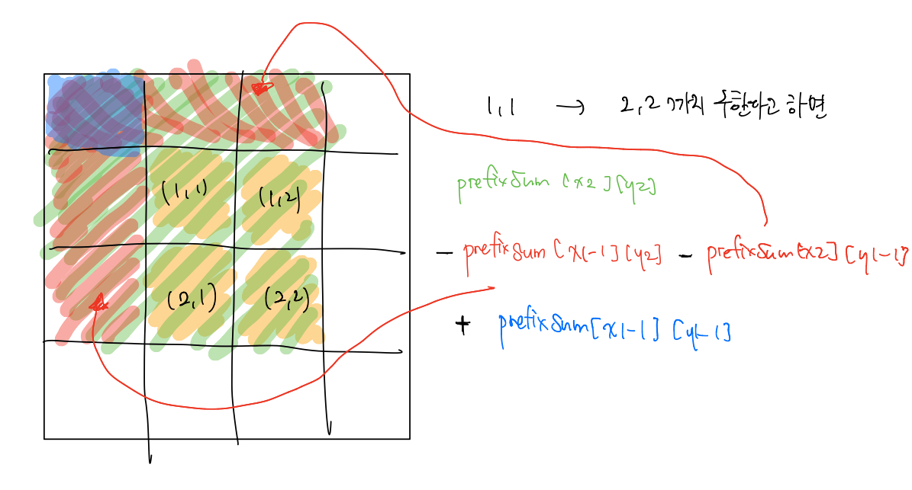

# 백준 문제

- [13398 : 연속합 2](#13398-연속합-2)
- [2559 : 수열](#2559-수열)
- [11659 : 구간 합 구하기4](#11659-구간-합-구하기4)
- [11660 : 구간 합 구하기5](#11660-구간-합-구하기5)


## 13398 연속합 2

[문제로 이동](https://www.acmicpc.net/problem/13398)

### 접근 방법 

#### Python

처음에는 정답이 항상 양수인 경우만 생각을 해서 코드를 작성하였더니 최대값이 음수인 경우에는 정답을 구할 수 없었다. <br>

따라서 이 문제를 해결하기 위해서는 2가지 형태를 저장해놓는 방법을 사용하였다. <br>

prefixSum[0]\[i] 는 제거할 횟수가 남아있지 않은 배열을 저장하고 i 번째를 제외한 그 전까지의 누적합과 <br>

i 번째 까지 더했을때의 결과 중에 큰 값을 저장한다. prefixSum[1]\[i] 는  제거할 횟수가 남아있는 배열로서 이전에 제거된 <br>

배열에 i 번째 원소를 더했을 때의 합과 i 번째 원소 중 큰 것을 저장한다. 이때 이전 값들의 합이 음수인 경우를 고려하여  <br>

i번째 원소와 비교를 한다. 따라서 값이 다 저장되었다면, 들어올 수 있는 최솟값인 -1000보다 1작은 -1001과 비교해서 <br>

큰 경우 _max 값이 되고 결국 _max값을 출력하면 된다. 

## python code

```python
# 백준 13398 연속합 2
# python solved by prefixSum
N = int(input())
numbers = list(map(int, input().split()))
prefixSum = [[0] * N for _ in range(2)]
prefixSum[0][0], prefixSum[1][0] = numbers[0], numbers[0]
for i in range(1, N):
    # [0][i]는 자기 자신을 뺀 누적합과, 더한 것 중 큰 것을 저장
    prefixSum[0][i] = max(prefixSum[1][i-1], prefixSum[0][i-1]+numbers[i])
    # [1][i]는 누적합들 중에서 큰 값을 저장 이때 이전 값들의 합이 -인 경우를 위해서 numbers[i]와 비교
    prefixSum[1][i] = max(prefixSum[1][i-1]+numbers[i], numbers[i])

_max = -1001
for i in range(2):
    for j in range(N):
        if _max < prefixSum[i][j]:
            _max = prefixSum[i][j]
print(_max)
```

### 메모리 및 수행 속도

메모리 : 37268 KB <br>

시간 : 204 ms <br>


## 2559 수열

[문제로 이동](https://www.acmicpc.net/problem/2559)

### 접근 방법 

#### Python

이 문제는 K개의 연속되는 온도들을 더해주어야하므로 다음과 같이 해결하였다. <br>

먼저 입력 받은 온도들의 누적합을 계산한 prefixSum이라는 리스트를 생성해준다. <br>

이후에 ans라는 리스트에 K개씩 더해진 누적합들을 저장해준다. <br>

이때 ans의 첫 번째 원소는 무조건 prefixSum[k]일 것이고 이후부터는 `prefixSum[i] - prefixSum[i-K]` 가 <br>

K개의 연속된 값들의 합이므로 O(1)의 시간내에 결과를 구할 수 있다.  <br>


## python code 

```python
# 백준 2559 수열 
# python solved by prefixSum
import sys
N, K = map(int,sys.stdin.readline().split())
temperatures = list(map(int,sys.stdin.readline().split()))
prefixSum = [0] * (N + 1)

for i in range(N):
    prefixSum[i+1] = prefixSum[i] + temperatures[i]

ans = [prefixSum[K]]
for i in range(K+1 ,N+1):
    ans.append(prefixSum[i] - prefixSum[i-K])
print(max(ans))
```

### 메모리 및 수행 속도

메모리 :  38292 KB <br>

시간 : 148 ms <br>


## 11659 구간 합 구하기4

[문제로 이동](https://www.acmicpc.net/problem/11659)

### 접근 방법 

#### Python

이 문제는 주어진 숫자들을 저장할 수 있는 1차원의 prefixSum 리스트를 만들고 누적합을 저장한다. <br>

i번째 부터 j번째 까지의 합을 구하면 되므로 `prefixSum[j] - prefixSum[i-1]`을 진행하면 정답을 구할 수 있다. <br>


## python code 

```python
# 백준 11659 구간 합 구하기4
# python solved by prefix sum
import sys
N, M = map(int,sys.stdin.readline().split())
numbers = list(map(int,sys.stdin.readline().split()))
prefixSum = [0] * (N+1)
#구간 합을 미리 저장하는 배열 prefixSum
for i in range(N):
    prefixSum[i+1] = prefixSum[i] + numbers[i]

for _ in range(M):
    i, j = map(int,sys.stdin.readline().split())
    print(prefixSum[j] - prefixSum[i-1])

```

### 메모리 및 수행 속도

메모리 : 39572 KB <br>

시간 : 292 ms <br>


## 11660 구간 합 구하기5

[문제로 이동](https://www.acmicpc.net/problem/11660)

### 접근 방법 

#### Python

이 문제는 위의 문제와는 다르게 누적합을 저장할 수 있는 2차원 배열이 필요하다. <br>

이때 prefixSum[i+1]\[j+1]째의 원소는 prefixSum[i]\[j+1] + prefixSum[i+1]\[j] - prefixSum[i]\[j] + numbers[i]\[j] <br>

로 저장할 수 있다. 그리고 x1, y1에서 부터 x2, y2까지의 합은 다음과 같이 구할 수 있다. <br>



따라서 초록색부분에서 빨간색 부분 2개를 빼주고 파란색 부분은 두 번 뺐긴때문에 한 번 더해주면 구할 수 있다. <br>


## python code

```python
# 백준 11660 구간 합 구하기5
# python solved by prefix sum
import sys
N, M = map(int,sys.stdin.readline().split())
numbers = [list(map(int,sys.stdin.readline().split())) for _ in range(N)]
prefixSum = [[0] * (N+1) for _ in range(N+1)]
# 구간 합을 미리 저장하는 prefixSum 배열
for i in range(N):
    for j in range(N):
        prefixSum[i+1][j+1] = prefixSum[i][j+1] + prefixSum[i+1][j] - prefixSum[i][j] + numbers[i][j]

for _ in range(M):
    x1, y1, x2, y2 = map(int,sys.stdin.readline().split())
    ans = 0
    print(prefixSum[x2][y2] - prefixSum[x1-1][y2] - prefixSum[x2][y1-1] + prefixSum[x1-1][y1-1])
```

### 메모리 및 수행 속도

메모리 : 103696 KB <br>

시간 : 1348 ms <br>


---

### 참조

