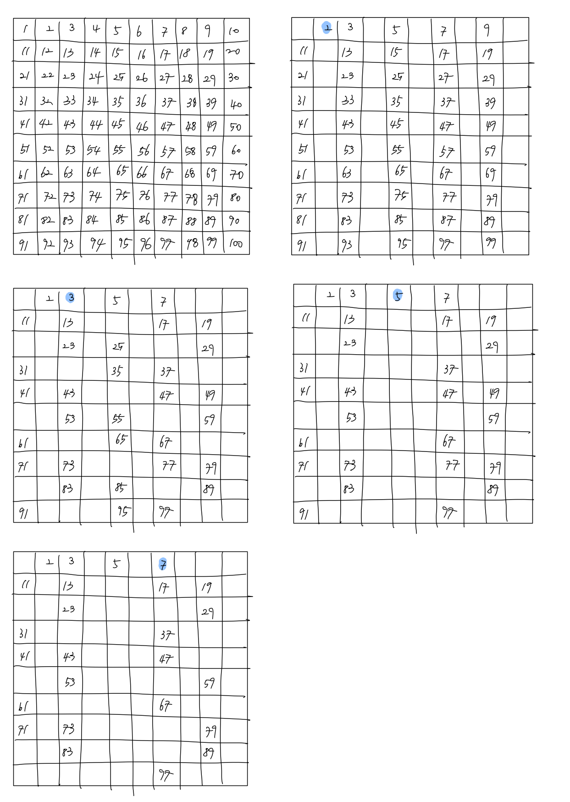

# 에라토스테네스의 체

#### 에라토스테네스의 체란? 

고대 그리스 수학자 에라토스테네스가 만들어낸 소수를 찾는 방법이다. 이 방법은 마치 체로 치듯이 수를 걸러낸다고 해서  

에라토스테네스의 체라고 부르는 것이고 이를 수식으로 나타내면 다음과 같이 나타낼 수 있다.  

f(x) = x / 1p(x) 의 수열을 표로 나타낸 것이 에라토스테네스의 체이다.  

적은 수의 수를 소수인지 아닌지 판별하는 데에는 에라토스테네스의 체 알고리즘은 상당히 비효율적이고 시간이 더 오래  

소요될 수 있다. 왜냐하면 쓸데없는 숫자들도 소수인지 아닌지 판단이 되기 때문이다.  

반면에 n ~ m 까지 큰 범위에서의 모든 소수를 찾아야하는 경우 에라토스테네스의 체 알고리즘은 좋은 효율을 보인다. 

예를 들어 1부터 100까지의 숫자 안에 소수를 찾는다고 하자. 이때 에라토스테네스의 체 방법은 다음과 같다.  

1부터 100까지의 숫자를 적은 뒤에, 기초수인 1을 제외하고 2의 배수부터 모두 지워준다. 이때 2는 제외한다.  

다음에는 3의 배수 그리고 4의 배수는 이미 2의 배수에서 지워졌으므로 다음으로 가장 작은 소수인 5를 제외하고 배수를  

지우는 방식을 택할 것이다. 이렇게 11전까지 배수들을 지우다보면 1부터 100사이의 소수를 찾을 수 있다.  

이때 11은 11x11이 121, 즉 100을 넘기 때문에 볼 필요가 없다.  

이때 또 하나의 수학적인 공식을 적용해 볼 수 있다. 만약 1부터 n 범위 사이에 있는 어떤 수 m = ab라면 a와 b중 적어도  

하나는 <squrt>n</squrt> 이하이다. 즉, n 보다 작은 합성수 m은 <squrt>n</squrt> 보다 작은 수의 배수만  

체크하여도 전부 지워진다는 의미이므로, **결론은 <squrt>n</squrt> 이하의 수의 배수만 지우면 된다는 뜻이다.**  

따라서 1부터 100까지의 경우에는 n이 100이므로 10이하의 수의 배수만 지우면 된다는 뜻이고, 그 결과 7의 배수까지만  

지워주면 범위 안에 있는 모든 소수를 찾을 수 있다.

## 참조 

[에라토스테네스의 체](https://namu.wiki/w/%EC%97%90%EB%9D%BC%ED%86%A0%EC%8A%A4%ED%85%8C%EB%84%A4%EC%8A%A4%EC%9D%98%20%EC%B2%B4)

