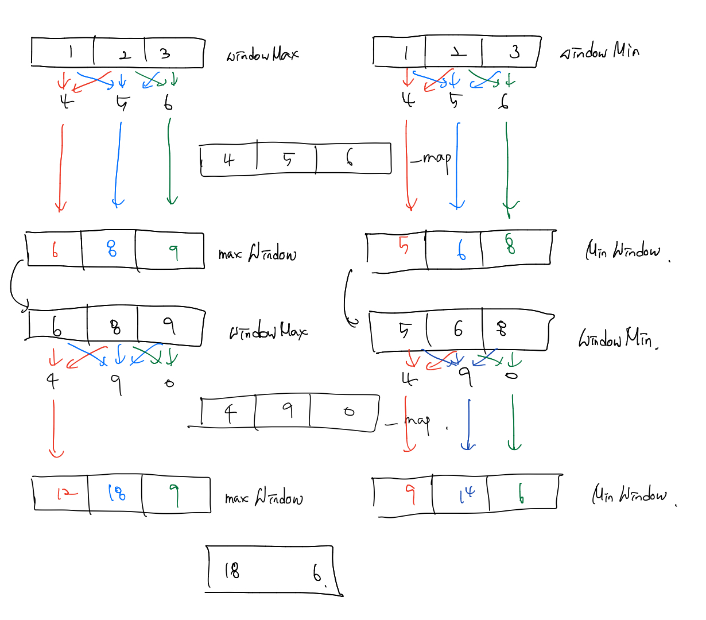

# 백준 문제

- [2003 : 수들의 합 2](#2003-수들의-합-2)
- [2096 : 내려가기](#2096-내려가기)
- [2531 : 회전 초밥](#2531-회전-초밥)
- [11728 : 배열 합치기](#11728-배열-합치기) 

## 2003 수들의 합 2

[문제로 이동](https://www.acmicpc.net/problem/2003)

### 접근 방법 

#### Python

이 문제는 정말 two-pointers 로 풀 수 있는 대표적인 문제인 것 같다. <br>

시간 제한이 0.5초 이므로 일반적인 이중 for문을 사용하면 시간초과가 날 것이다. 따라서 이 때는 투 포인터 알고리즘을 <br>

사용하여 문제를 해결하면 된다. <br>

해결 방법은 다음과 같다. 이떼 s가 가르키는 원소는 포함되고 e가 가르키는 원소는 windowSum에 포함이 되지 않는다. <br>

1. s, e, windowSum을 0으로 선언한다. 

2. windowSum >= M 인 경우 

   - windowSum == M 인 경우 → 정답 카운트
   - 이후에는 windowSum에서 s를 빼주고 s를 하나 증가한다.

3. windowSum < M 인 경우

   이 경우에는 e를 windowSum에 더해주고 e를 하나 증가시킨다.

4. e == N 인 경우

   이 경우에는 더 이상 증가할 수 없으므로 반복을 종료해준다.


## python code

```python
# 백준 2003 수들의 합 2
# python solved by two-pointers
import sys
N, M = map(int, sys.stdin.readline().split())
arr = list(map(int, sys.stdin.readline().split()))

s, e, ans = 0, 0, 0
windowSum = 0
while(True):
    if windowSum >= M:
        if windowSum == M:
            ans += 1
        windowSum -= arr[s]
        s += 1
    elif e == N:
        break
    else:
        windowSum += arr[e]
        e += 1
print(ans)
```

### 메모리 및 수행 속도

메모리 : 30108 KB <br>

시간 : 76 ms <br>


## 2096 내려가기

[문제로 이동](https://www.acmicpc.net/problem/2096)

### 접근 방법 

#### Python

내려가기는 전형적인 슬라이딩 윈도우 문제이다. 왜냐하면 N이 1 - 100,000 까지인데 메모리의 제한이 4MB이므로 <br>

만약 기존의 풀이처럼 전체 배열을 받아서 계산을 하게되면 메모리 초과 문제가 발생하게 된다. <br>

따라서 문제의 풀이법은 다음과 같다. <br>



1. 사용자로 부터 N과 첫째 줄을 입력받아서 N, windowMax 배열에 저장한다. 이때 windowMin에 deepcopy를 해준다.
2. 이후 N-1번을 반복해주는데 이때 총 3줄이기 때문에 index가 0 인 경우, 1인 경우, 2인 경우를 나눠서 maxWindow, minWindow를 계산해주었다.
3. 계산을 마친 뒤에는 다시 windowMax와 windowMin에 maxWindow와 minWindow를 대입하여 더해진 값으로 계산할 수 있도록 하였다.
4. N-1번의 반복을 마친 뒤 maxWindow의 max와 minWindow의 min을 출력하면 정답이다.  


## python code 

```python
import sys, copy
N = int(sys.stdin.readline())
windowMax = list(map(int, sys.stdin.readline().split()))
windowMin = copy.deepcopy(windowMax)
minWindow, maxWindow = [0]*3, [0]*3
for _ in range(N - 1):
    _map = list(map(int, sys.stdin.readline().split()))
    for i in range(3):
        if i == 0:
            maxWindow[i] = max(windowMax[i]+_map[i], windowMax[i+1]+_map[i])
            minWindow[i] = min(windowMin[i]+_map[i], windowMin[i+1]+_map[i])
        elif i == 1:
            maxWindow[i] = max(windowMax[i-1]+_map[i] ,max(windowMax[i]+_map[i], windowMax[i+1]+_map[i]))
            minWindow[i] = min(windowMin[i-1]+_map[i] ,min(windowMin[i]+_map[i], windowMin[i+1]+_map[i]))
        else:
            maxWindow[i] = max(windowMax[i]+_map[i], windowMax[i-1]+_map[i])
            minWindow[i] = min(windowMin[i]+_map[i], windowMin[i-1]+_map[i])
    windowMax = copy.deepcopy(maxWindow)
    windowMin = copy.deepcopy(minWindow)

if N == 1:
    print(max(windowMax), min(windowMin))
else:
    print(max(maxWindow), min(minWindow))
```

### 메모리 및 수행 속도

메모리 : 29944 KB <br>

시간 : 1192 ms <br>


## 2531 회전 초밥

[문제로 이동](https://www.acmicpc.net/problem/2531)

### 접근 방법 

#### Python

이 문제의 경우에는 투 포인터를 사용한 풀이는 아니다. <br>

사용자로부터 초밥들을 입력받고 해당 초밥들을 k개 만큼씩 잘라서 안에 있는 것들의 개수와 보너스 초밥의 중복 여부를 확인한 뒤 <br>

가장 큰 개수를 찾아주면 된다. 따라서 k개의 초밥 리스트의 시작을 susi[-k+1:] + susi[:1] 부터 시작하였다. <br>

그러면 N-1까지 반복할 경우 k개씩 초밥 리스트를 모든 경우에 대해서 구할 수 있기 때문이다. <br>

그리고 countSusi라는 함수를 만들어서 susi_list를 set으로 변환하여 중복이 없는 개수를 파악하고, 보너스 초밥과의 중복 여부를 파악하여 <br>

최대 초밥의 가지수를 반환해준다. 


## python code 

```python
# 백준 2531 회전초밥 
# python solved by 
import sys 
N, d, k, c = map(int, sys.stdin.readline().split())
susi = list(int(sys.stdin.readline()) for _ in range(N))

def countSusi(susi_kind):
    cnt = set(susi_list)
    if c not in cnt:
        susi_kind = max(susi_kind, len(cnt)+1)
    else:
        susi_kind = max(susi_kind, len(cnt))
    return susi_kind

susi_list = susi[-k+1:] + susi[:1]
susi_kind = 0
susi_kind = countSusi(susi_kind)

for i in range(N-1):
    susi_list.pop(0)
    susi_list.append(susi[i+1])
    susi_kind = countSusi(susi_kind)

print(susi_kind)
```


### 메모리 및 수행 속도

메모리 : 30096 KB <br>

시간 : 2820 ms <br>


## 11728 배열 합치기

[문제로 이동](https://www.acmicpc.net/problem/11728)

### 접근 방법 

#### Python

이 문제는 문제 선정을 잘못한 거 같다.. <br>


## python code

```python
import sys
N, M = map(int,sys.stdin.readline().split())
arrA = list(map(int,sys.stdin.readline().split()))
arrB = list(map(int,sys.stdin.readline().split()))
arrSum = sorted(arrA + arrB)
for num in arrSum:
    print(num,end=" ")
```

### 메모리 및 수행 속도

메모리 : 184056 KB <br>

시간 : 1920 ms <br>


---

### 참조

1. [회전초밥](https://lazyren.tistory.com/28)

