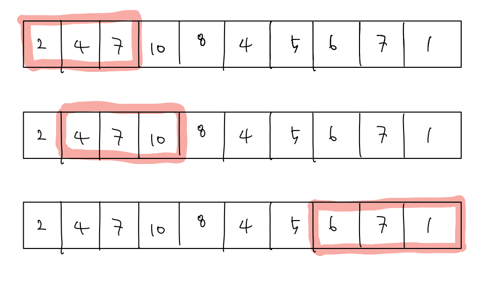
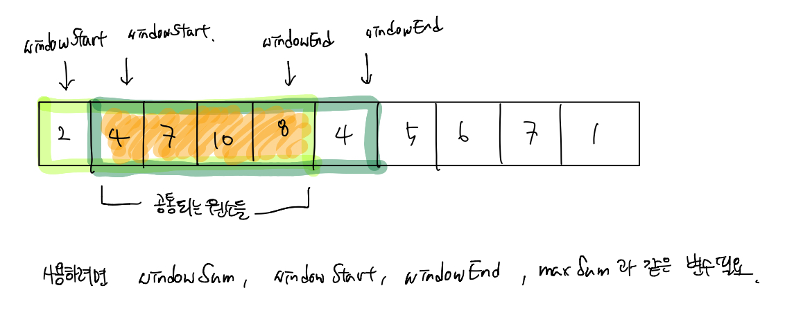

# 알고리즘 - 투 포인터

#### 투 포인터(Two Pointers)

1차원 배열이 있고 이 배열에서 각자 다른 원소를 가리키고 있는 2개의 포인터를 조작해가면서 원하는 것을 얻는  

알고리즘이 바로 투 포인터 알고리즘이다. 즉, 절대 정답이 되지 않는 경우를 skip하는 알고리즘이라고 할 수 있다.  

주로 a 부터 b 까지의 합이 M이 되는 경우를 묻는 문제에서는 이중 for문을 사용해서 문제를 해결해야하는데  

이때 배열의 갯수가 많은 경우 경과되는 시간을 줄이기 위해서 사용되는 알고리즘이다.   

예시를 들어보면 다음과 같다.  

Q ► N 칸의 1차원 배열이 존재한다고 할 때, 부분 배열 중 그 원소의 합이 M이 되는 경우의 수를 구해보아라.  

2개의 포인터를 s(start), e(end) 라고 해보자. 맨 처음에는 s = e = 0 이어야하고 항상 s <= e 를 만족해야한다.  

이때 s 가 가르키는 칸은 부분합에 포함하고, e가 가르키는 배열의 원소는 포함하지 않도록 기준을 잡는다고 하자.  

그렇다면 이제 다음의 순서를 반복하면 된다.  

1. 만약 현재의 부분 합이 M보다 큰 경우에는 앞 부분인 s를 한 칸 옮겨 준다. → s++ 하고 부분합에서 배열[s]를 빼준다.
2. 만약 현재의 부분 합이 M보다 작은 경우 뒷 부분인 e를 한 칸 옮겨 준다.  → e++ 하고 부분합에 배열[e]를 더해준다.
3. 만약 현재의 부분 합의 M인 경우 → 정답의 개수를 ++ 해준다.
4. 만약 e 가 N인 경우 위의 반복을 종료해준다. 

이 알고리즘의 시간 복잡도는 O(N)이다. 이유는 매 루프마다 항상 두 포인터 중 하나는 1씩 증가하고 각 포인터가 N번  

누적 증가해야지 알고리즘이 끝나게 된다. 따라서 각각 배열의 마지막 원소에 도달하는데 O(N)이기 때문에 합쳐도  

O(2N) 즉, O(N)이 된다.  

이와 비슷한 테크닉으로는 슬라이딩 윈도우(Sliding Window)라는 테크닉이 존재한다.  

이름이 슬라이딩 윈도우인 이유는 마치 창문을 한쪽으로 밀면서 문제를 푸는 것과 모양새가 유사해서 붙여졌다고 한다.  

투 포인트처럼 구간을 훑으면서 지나가는 공통점이 있으나, 다른 점은 어느 순간에나 그 구간의 넓이가 동일하다는 점이다.  

즉, 슬라이딩 윈도우 알고리즘은 **배열이나 리스트의 원소의 일정 범위의 값을 비교할 때 사용**하면 유용한 알고리즘이다.  

예를 들면 다음과 같은 문제가 있다고 하자.  

정수로 이루어진 배열 [2, 4, 7, 10, 8, 4, 5, 6, 7, 1] 에서 길이가 3인 서브배열의 합계가 가장 큰 서브배열은 무엇인가?  

기존의 for문을 사용하는 풀이는 너무 쉬우니까 넘어가겠다. 따라서 더 효율적인 방법을 알아보자.  

예를 들어 서브 배열의 크기가 5라고 할 때 0 - 4까지의 범위와 1 - 5까지의 서브 배열은 공통적으로 1 - 4범위가 중복된다.  

따라서 이러한 **공통되는 원소들을 재사용하는 것**이 바로 슬라이딩 윈도우의 핵심 알고리즘이다.  

이때 windowSum, windowStart, windowEnd, maxSum과 같은 변수를 사용해서 이중 for문을 사용하는 것 처럼  

매번 서브배열의 합계를 구할 필요없이 모든 요소를 1번만 순회하면서 최대 값을 구해주면 된다.   

## 참조 

1. [two-pointers](https://m.blog.naver.com/kks227/220795165570)

2. [sliding window](https://blog.fakecoding.com/archives/algorithm-slidingwindow/) 