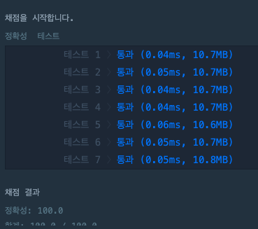
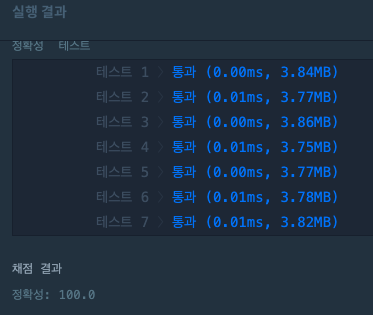

## 버블 정렬 (Bubble Sort)
### 개념 : 버블 정렬은 옆에 있는 원소와 비교하여 더 작은 값을 앞으로 보내는 정렬 <br>
단순히 반복적으로 두 숫자를 비교하여 작은 수를 앞으로 보내고, 그 결과 각 사이클마다 가장 큰 값이 맨 뒤로 보내진다. <br>
구현은 가장 쉽지만 실질적으로 컴퓨터 내부 연산횟수가 제일 많은 가장 비효율적인 알고리즘 <br>

## 프로그래머스 정렬 문제 - K 번째 수 
  - https://programmers.co.kr/learn/courses/30/lessons/42748

## 접근 방법
1. commands의 size만큼 반복하여 commands[i][0]부터 commands[i][1]까지 주어진 배열 자르기 <br>
2. 구현한 버블 정렬 함수를 사용하여 정렬 (c++, python 기본 제공 sort라이브러리 사용 x) <br>
3. 정렬된 배열에서 commands[i][2]의 값을 index로 가지는 원소를 꺼내서 answer에 추가 

## python code
```python
#프로그래머스 k번째 수 
#버블 정렬 함수
def bubbleSort(object):
    for i in range(len(object)-1,-1,-1):
        temp = 0
        for j in range(0,i):
            if object[j] > object[j+1]:
                temp = object[j]
                object[j] = object[j+1]
                object[j+1] = temp

def solution(array, commands):
    answer = []
    for i in commands :
        temp = array[i[0]-1:i[1]]
        bubbleSort(temp)
        answer.append(temp.pop(i[2]-1))
    return answer
``` 
### 수행 속도


## c++ code
```c++
#include <string>
#include <vector>
#include <iostream>
#include <algorithm>

using namespace std;
void bubbleSort(vector<int> &arr){
    int temp =0;
    for(int i = arr.size() - 1; i > 0; i--){
        for(int j = 0; j< i; j++){
            if(arr[j] > arr[j+1]){
                temp = arr[j];
                arr[j]= arr[j+1];
                arr[j+1] = temp;
            }
        }
    }
} 

vector<int> solution(vector<int> array, vector<vector<int>> commands) {
    vector<int> answer;
    vector<int> temp;
    for(int i =0; i< commands.size();i++){
        temp={};
        for(int j = commands[i][0] - 1; j<commands[i][1];j++){
            temp.push_back(array[j]);
        }
        bubbleSort(temp); //sort(temp.begin(),temp.end());
        answer.push_back(temp[commands[i][2]-1]);
    }
    return answer;
}
```
### 수행속도


## 시간복잡도
1 2 3 4 5 6 7 8 9 10의 원소를 가지는 배열이 있다고 하면 1은 10번 비교를 해야하며, 2는 9번, 3은 8번,... 9는 2번, 10은 1번의 비교를 하게된다. <br>
즉, 10 + 9 + 8 + 7 + ... + 2 + 1 이므로 N x (N + 1) / 2 가 선택 버블 정렬(bubble sort)의 시간복잡도가 된다.<br>
따라서 버블 정렬의 시간 복잡도는 선택 정렬과 같은 O(N^2)이다.

## 공간복잡도
