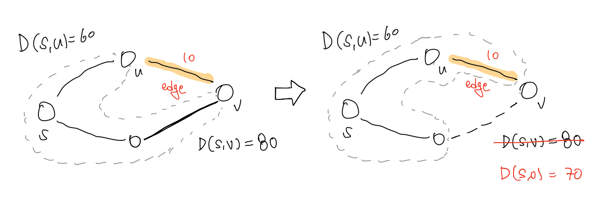
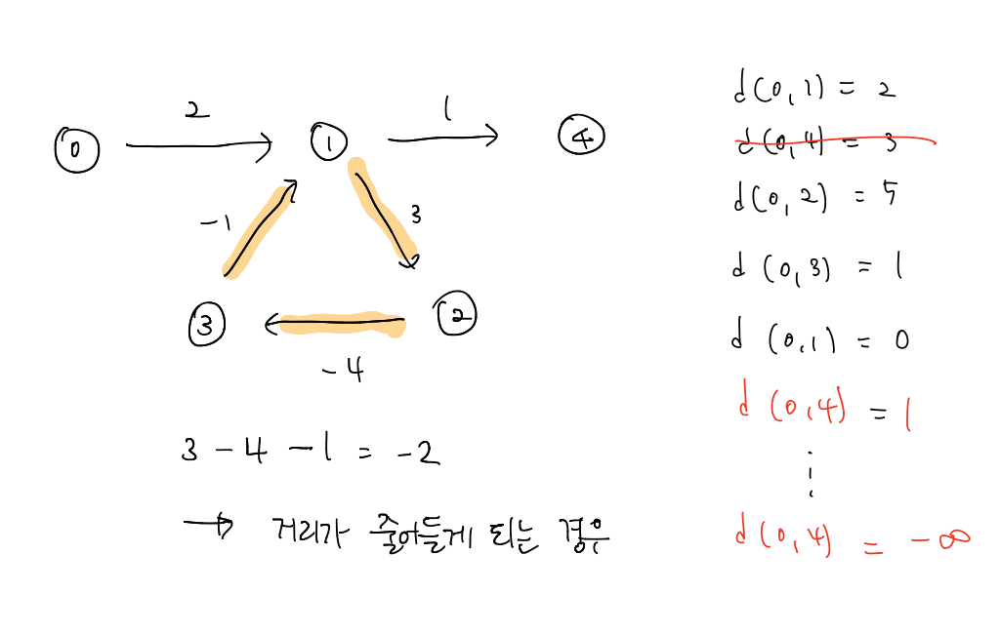

# 알고리즘 - 벨만 포드(Bellman-Ford)

#### 벨만 포드(Bellman-Ford)

벨만 포드 알고리즘 역시 지난 주에 학습했었던 다익스트라 알고리즘과 동일하게 `최단 경로(Shortest Path)` 를 찾는 대표적인 기법 중에 하나이다. 

최단 경로 문제는 다음과 같이 수식으로 나타낼 수 있다. 시작을 s라고 하고 목적지를 v라고 할 때, s에서 v로의 최단 경로는 s에서 u까지의 최단 경로에 u부터 v사이의 거리를 더한 값이라고 할 수 있다. (D= Distance, W= Weight를 의미)

`D(s, v) = D(s, u) + W(u, v)` 

이때 벨만 포드 알고리즘은 s, u 사이의 최단 경로를 구할 때 그래프 내 모든 정점에 대해서 **edge relaxation**을 수행하게 된다. 

여기서 **edge relaxation**은 다음과 같이 설명할 수 있다. 아래의 그림과 같이 s에서 v까지 현 시점에 알고 있던  최단거리는 D(s, v) = 80 이다. 또한 s에서 u까지의 최단 거리는 D(s, u) = 60이라고 한다. 탐색 과정에서 새로운 edge를 발견하게 되고 edge를 경우하는 거리가 총 70인 것을 발견하게 된다면, 기존에 알고있던 80은 최단 거리가 될 수 없다. 따라서 이에 최단 경로를 구성하고 있는 노드와 edge의 정보, 그리고 최단 거리의 합을 업데이트 해주는 것이 바로 edge relaxation이라고 할 수 있다. 

 

그렇다면 벨만 포드 알고리즘은 이러한 **edge relaxation**을 몇 번 수행하게 되는 것일까? 모든 정점에 대해서 edge relaxation을 수행한다고 했으니까 전체 노드의 개수인 V에서 현재 정점인 u를 제외한 모든 정점에 대해서 검사를 하게 된다. 즉, edge relaxation을 V - 1회 수행하게 된다. 

동작원리는 다음과 같다. 아래의 사진은 벨만 포드 알고리즘을 처음에 1회 수행을 한 그림이다. 

1. 시작점 s를 제외한 모든 점의 거리를 INF로 초기화한다. (s의 거리는 0으로)
2. 시작점인 s를 제외한 모든 정점의 개수 만큼 반복적으로 가중치가 있는 모든 선분을 검사한다. (edge relaxation 수행)
3. 갱신 가능한 거리가 있다면 s로 부터의 최단 거리를 갱신한다.
4. 최종적으로 모든 점들에 대해서 검사를 마쳤다면, 전제 정점들에 대해서 마지막으로 검사를 수행하고 이때 만약 거리가 갱신이 된다면 이는 음수 싸이클이 있는 것이므로 처리를 해주고 그렇지 않다면 s로 부터의 최단 거리들 반환해주면 된다. 

벨만 포드 알고리즘이 다익스트라 알고리즘과의 다른 점은 바로 음수 가중치에 대해서도 반영을 하는 점이다. 다익스트라의 경우에는 거리(가중치)에 음수가 있다면 이러한 값들에 대해서는 반영을 하지 않으므로 정확한 답을 얻을 수 없다. 그러나 벨만 포드 알고리즘은 거리(가중치)가 음수인 경우에도 반영하여 최단 거리를 갱신하므로 정확하게 최단 거리를 알 수 있다. 

그러나 이때 음수 싸이클이 존재하면 안된다. 간단하게 말해서 음의 가중치가 있는 그래프에서 최단 경로를 구할 때 항상 고려해야할 사항이다. 

위의 그림에서 볼 수 있듯이 1에서 2로, 2에서 3으로, 3에서 1로 가는 싸이클을 이루고 있는데 이때 거리(가중치)의 합이 음수가 된다. 따라서 이를 계속해서 반복하다보면 시작점 0에서 목적지 4까지의 거리를 결구 음의 무한대가 될 것이다. 이렇듯 거리(가중치)의 합이 0보다 작은 cycle을 음수 싸이클(negative Cycle)이라고 하며 이러한 음수 싸이클이 있으면 벨만 포드 알고리즘은 적용되지 못한다. 물론 알고리즘 문제에서는 아마 이에 따라 처리를 해주어야 할 것이다. 이러한 negative cycle을 찾는 방법은 아까 위에서 언급한 순서에서 4번째 단계를 진행하는 과정에서 값이 갱신된다면 negative cycle이 존재한다는 것이다. 

### 벨만 포드 알고리즘의 시간 복잡도

벨만 포드 알고리즘은 그래프의 모든 정점에 대해서 edge relaxation을 시작노드를 제외한 전체 노드 수 만큼 반복 수행하고, 마지막으로 그래프 모든 정점에 대해서 edge relaxation을 1회 수행하게 되므로 시간 복잡도는 O(|V||E|)이 된다.  이때 dense gragh는 엣지의 수가 대개 정점의 수의 제곱에 근사하다고 가정하면 O(|V3|)이 되게 된다. 이는 다익스트라 알고리즘의 시간복잡도인 O(V2) 보다 더 큰데, 이는 음수 가중치까지 처리를 할 수 있기 때문에 생기는 trade off라고 생각하면 될 것 같다. 

## 참조 

1. [벨만포드 알고리즘](https://m.blog.naver.com/kks227/220796963742)
2. [벨만포드 알고리즘](https://ratsgo.github.io/data%20structure&algorithm/2017/11/27/bellmanford/)

