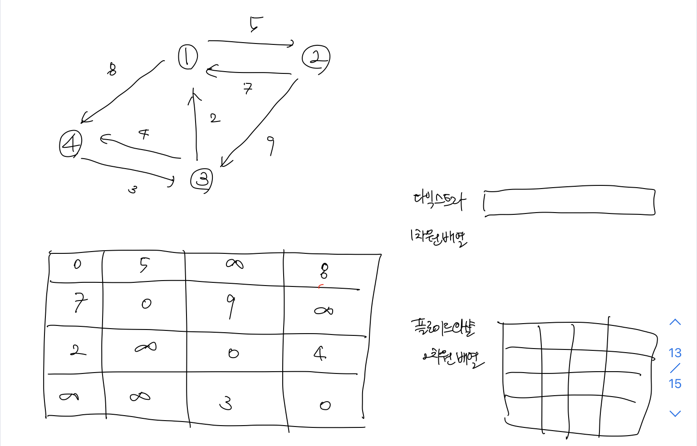
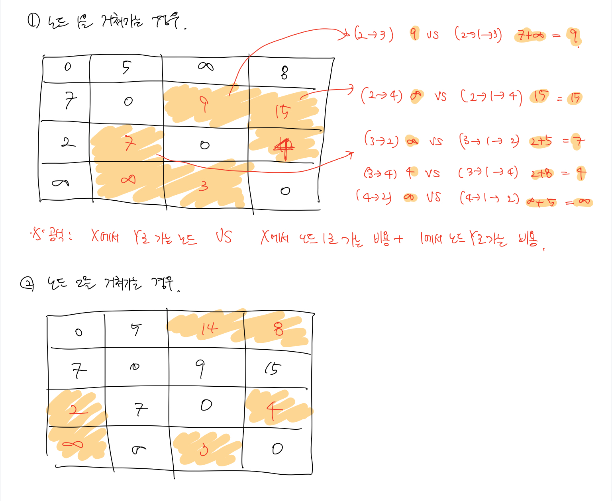

# 알고리즘 - 플로이드 와샬

#### 플로이드 와샬(Floyd warshall)

`다익스트라 알고리즘` 은 <u>하나의 정점에서 출발했을 때 다른 모든 정점</u>으로의 최단 경로를 구하는 알고리즘이다.  

그러나 만약 <u>모든 정점에서 모든 정점으로의 최단 경로</u>를 구하고 싶으면 플로이드 **와샬 알고리즘**을 사용해야한다.  

다익스트라 알고리즘은 가장 적은 비용을 하나씩 선택해서 최단 거리를 갱신했다면, 플로이드 와샬 알고리즘은 기본적으로 거쳐가는 정점을 기준으로 알고리즘을 수행한다는 점이 특징이다.  

플로이드 와샬 알고리즘의 핵심 아이디어는 **"거쳐가는 정점"을 기준으로 최단 거리를 구하는 것이다**. 

위와 같은 그래프가 있다고 할 때, 아래의 표는 각 정점에서 다른 정점으로 가는 거리를 기록해 놓은 것이다.  

이때 `다익스트라` 의 경우에는 **1차원 배열**을 사용해 하나의 정점에서 다른 정점으로의 최단 거리를 구했다면  

`플로이드 와샬` 의 경우에는 **2차원 배열**을 사용하여 모든 정점에서 모든 정점으로의 최단 거리를 구하게 된다.  

구하는 과정은 위의 그림과 같으며 다음과 같은 공식을 사용해서 갱신을 할 수 있다.  

하나의 정점을 설정한 뒤 해당 정점을 거쳐가는 경우를 갱신하는 방법이다.  

 **공식 : `X 에서 Y로 가는 노드의 비용` VS  ` X에서 하나의 정점으로 가는 비용` + `해당 정점에서 Y로 가는 비용 `**   

위의 공식을 정점의 개수 만큼 반복을 하게 되면 모든 정점에서의 모든 정점으로의 최단 거리를 구할 수 있게 된다.  

## 참조 

1. [플로이드와샬](https://m.blog.naver.com/PostView.nhn?blogId=ndb796&logNo=221234427842&proxyReferer=https:%2F%2Fwww.google.com%2F)

