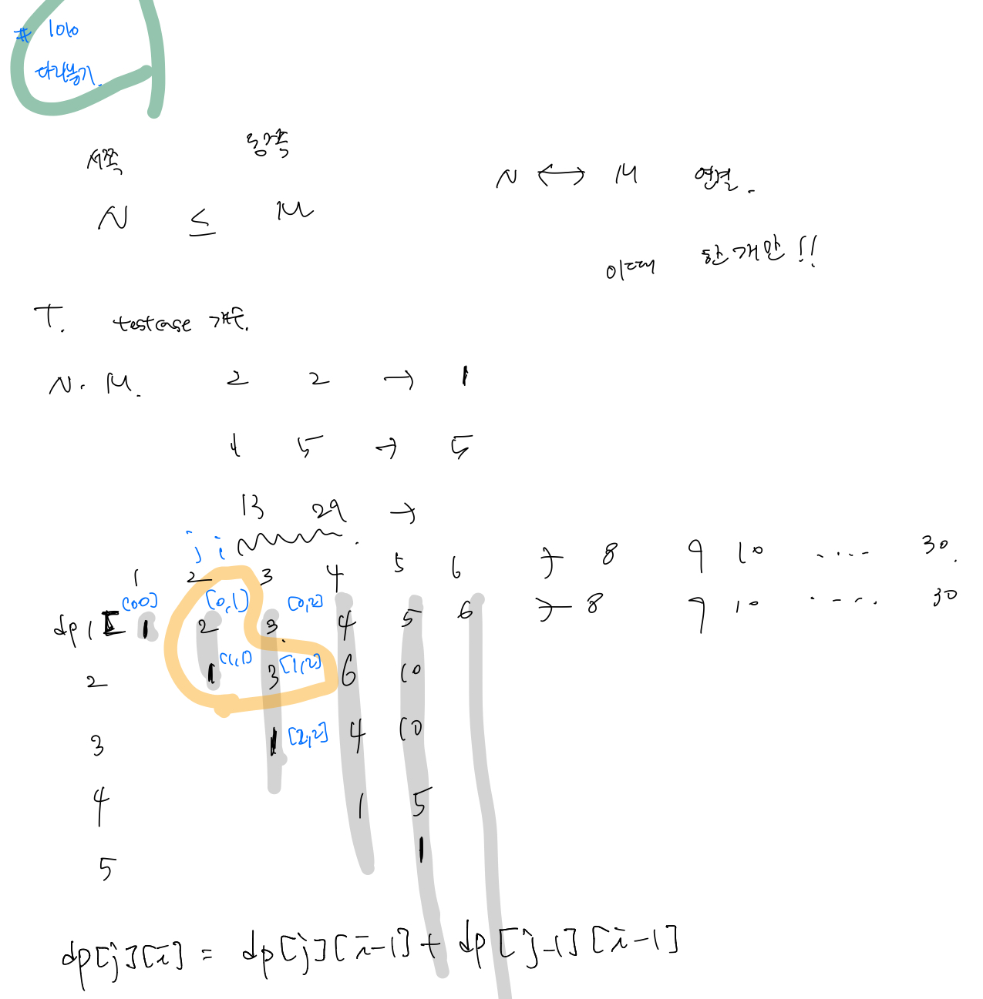
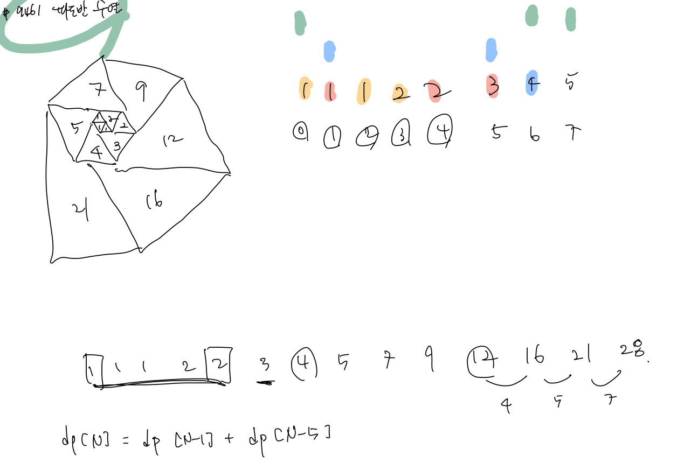
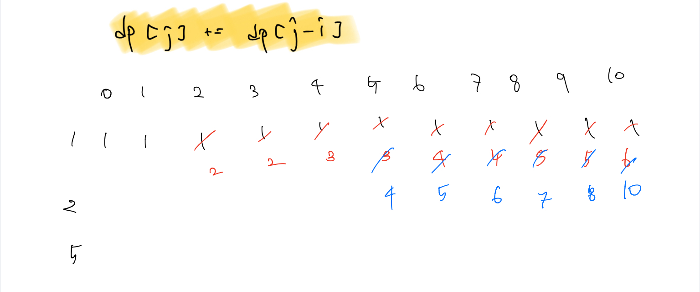

# 백준 문제

- [1010 : 다리놓기](#1010-다리놓기)
- [14501 : 퇴사](#14501-퇴사)
- [9461 : 파도반 수열](#9461-파도반-수열)
- [2293 : 동전1](#2293-동전1)
- [1965 : 상자넣기](#1965-상자넣기)

## 1010 다리놓기

[문제로 이동](https://www.acmicpc.net/problem/1010)

### 접근 방법 



접근 방법은 점화식을 발견하였다. <br>

2차원 배열을 생성하고 가로는 M을 의미, 세로는 N을 의미한다. 이때 위와 같은 규칙을 발견해서 dp로 해결 <br>

## python code

```python
# 백준 1010 다리놓기
# python solved by dp
import sys
input = sys.stdin.readline

T = int(input())
dp = [[0]*30 for _ in range(30)]
for i in range(0,30):
    dp[0][i] = i+1
    dp[i][i] = 1
    for j in range(1,i+1):
        dp[j][i] = dp[j][i-1] + dp[j-1][i-1]

for _ in range(T):
    N, M = map(int, input().split())
    print(dp[N-1][M-1])
```

### 메모리 및 수행 속도

메모리 : 28776 KB <br>

시간 : 68 ms <br>


## 14501 퇴사

[문제로 이동](https://www.acmicpc.net/problem/14501)

### 접근 방법 

접근 방법은 처음에는 ti가 1에서 5일 사이라서 5개의 dp를 비교해보려하였다. <br>

그러나 그럴 필요가 없이 `dp[i + t[i]] = max(ans + p[i], dp[i + t[i]])`를 통해서 매번 값을 갱신해주면 가장 최대의 수익을 얻도록 할 수 있다. 

## python code 

```python
# 백준 14501 퇴사
# python solved by dp
import sys
input = sys.stdin.readline

N = int(input())
t, p = [0] * 16, [0] * 16
dp = [0] * 16
ans = 0
for index in range(N):
    ti, pi = map(int, input().split())
    t[index] = ti
    p[index] = pi

for i in range(N+1):
    ans = max(dp[i], ans) 
    if i + t[i] > N: continue
    dp[i + t[i]] = max(ans + p[i], dp[i + t[i]])
print(ans)

```

### 메모리 및 수행 속도

메모리 : 28776 KB <br>

시간 : 64 ms <br>


## 9461 파도반 수열

[문제로 이동](https://www.acmicpc.net/problem/9461)

### 접근 방법 



접근 방법은 다음과 같다. <br>

그림을 그려보면서 수를 나열하다 보니 위와 같은 규칙 발견해서 점화식으로 문제 해결 <br>

## python code 

```python
# 백준 9461 파도반 수열
# python solved by dp
import sys
input = sys.stdin.readline

T = int(input())
dp = [0] * 100
dp[0],dp[1],dp[2],dp[3],dp[4] = 1,1,1,2,2
for i in range(5,100):
    dp[i] = dp[i-1] + dp[i-5]

for _ in range(T):
    num = int(input())
    print(dp[num-1])
```

### 메모리 및 수행 속도

메모리 : 28776 KB <br>

시간 : 68 ms <br>


## 2293 동전1

[문제로 이동](https://www.acmicpc.net/problem/2293)

### 접근 방법 

이 문제는 비슷하게 접근했지만 결국 해결하지 못해서 구글링하였다.. <br>

그 결과 결국 10을 만들 수 있는 경우의 수는 dp[5], dp[8], dp[9]의 합으로 만들어진다. <br>



따라서 열은 동전의 종류, 행은 K까지의 금액으로 한 2차원 dp배열을 만들어서 위의 점화식을 수행하도록 하면 해결 할 수 있다. <br>

## python code

```python
# 백준 2293 동전1
# python solved by dp
import sys
input = sys.stdin.readline

N, K = map(int, input().split())
coins = []
dp = [0] * (K+1)
dp[0] = 1
for _ in range(N):
    coins.append(int(input()))

for coin in coins:
    for money in range(1, K+1):
        if money - coin >= 0:
            dp[money] += dp[money - coin]
print(dp[K])
```

### 메모리 및 수행 속도

메모리 : 29028 KB <br>

시간 : 316 ms <br>


## 1965 상자넣기

[문제로 이동](https://www.acmicpc.net/problem/1965)

### 접근 방법 

처음에는 dp를 사용해서 접근했는데, 예외사항을 해결하지 못해서 다른 방법 사용. <br>

예전에 풀었던 LIS 문제인것 같아서 LIS에서 가장 긴 수열을 찾는 방식으로 접근하여 문제 해결 <br>

## python code

```python
# 백준 1965 상자넣기 
# python solved by dp
import sys
from bisect import bisect_left
input = sys.stdin.readline

N = int(input())
boxes = list(map(int, input().split()))
stack = [boxes[0]]

for i in range(N):
    print(stack)
    if stack[-1] < boxes[i]:
        stack.append(boxes[i])
    else:
        stack[bisect_left(stack,boxes[i])] = boxes[i]
print(len(stack))

## 다른 방법
import sys
input = sys.stdin.readline

N = int(input())
boxes = list(map(int, input().split()))
dp = [0]*N
dp[0] = 1
for i in range(1, N):
    for j in range(i):
        if boxes[i] > boxes[j]:
            dp[i] = max(dp[i], dp[j]+1)
print(max(dp))
```

### 메모리 및 수행 속도

메모리 : 30836 KB <br>

시간 : 72 ms <br>

---

### 참조


