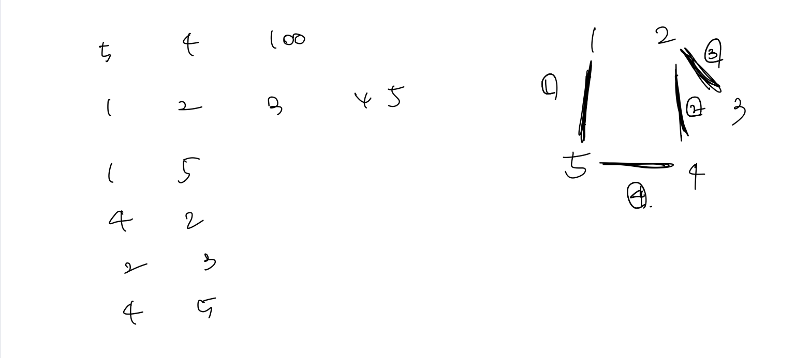

# 백준 문제

- [1717 : 집합의 표현](#1717-집합의-표현)
- [1976 : 여행가자](#1976-여행가자)
- [10216 : Count Circle Groups](#10216-Count-Circle-Groups)
- [16562 : 친구비](#16562-친구비)

## 1717 집합의 표현

[문제로 이동](https://www.acmicpc.net/problem/1717)

### 접근 방법 

기본적인 Union-Find 문제로 find와 union 함수를 구현하고 주어진 조건에 맞춰 실행하면된다. <br>

이때 문제에서 {0}, {1}, ... , {n} 총 N+1 개로 주어진다는 점을 확인해봐야한다. <br>

## python code

```python
# 백준 1717 집합의 표현
# python solved by union-find
import sys
sys.setrecursionlimit(10**6)
input = sys.stdin.readline
def find(x):
    if x == graph[x]: return x
    graph[x] = find(graph[x])
    return graph[x]

def union(x,y):
    x_parent = find(x)
    y_parent = find(y)
    if x_parent == y_parent: return
#    if rank[x_parent] > rank[y_parent]:
#        x_parent, y_parent = y_parent, x_parent    
    graph[y_parent] = x_parent
#    if rank[x_parent] == rank[y_parent]:
#        rank[y_parent] += 1
  
N, M = map(int, input().split())
graph = {i:i for i in range(N+1)}
# rank = {i:1 for i in range(N+1)}
for _ in range(M):
    case, x, y = map(int, input().split())
    if case == 0:
        union(x, y)
    else:
        if find(x) == find(y):
            print("YES")
        else:
            print("NO")
```

### 메모리 및 수행 속도

메모리 : 112236 KB (216924KB) <br>

시간 : 520 ms (오히려 rank최적화를 하면 시간이 더 길어짐 (656ms))<br>


## 1976 여행가자

[문제로 이동](https://www.acmicpc.net/problem/1976)

### 접근 방법 

전형적인 Union-Find 문제이다. <br>

먼저 딕셔너리 {i:i}를 만들어주었다. 그리고 주어진 도시끼리의 연결정보를 union을 통해서 합쳐주고 <br>

연결 루트를 find해서 set 형태로 저장해서 개수가 2개 이상이면 NO, 2개 미만이면 YES 출력

## python code 

```python
# 백준 1976 여행가자
# python solved by Union-Find
import sys
sys.setrecursionlimit(10**6)
input = sys.stdin.readline

def find(index):
    if graph[index] == index: 
        return index
    # path compression 최적화 진행
    graph[index] = find(graph[index])
    return graph[index]

def union(x, y):
    x_parent = find(x)
    y_parent = find(y)
    if x_parent == y_parent: return
    graph[y_parent] = x_parent

N = int(input())
M = int(input())
graph = {i:i for i in range(N)}
disjointGraph = []

for i in range(N):
    a = list(map(int,input().split()))
    disjointGraph.append(a)

for i in range(N):
    for j in range(N):
        if disjointGraph[i][j] == 1:
            union(i,j)

route = list(map(int,input().split()))
ans = set([find(i-1) for i in route])
if len(ans) > 1:
    print("NO")
else:
    print("YES")
```

### 메모리 및 수행 속도

메모리 : 28776 KB <br>

시간 : 76 ms (확실히 path-compression 최적화를 해준것과 안해준것의 차이는 있음(84ms)) <br>


## 10216 Count Circle Groups

[문제로 이동](https://www.acmicpc.net/problem/10216)

### 접근 방법 

이문제는 정말 python으로는 풀기가 불가능한 문제인가했다. 뭐 물론 BFS,DFS를 사용하는 방법도 있었겠지만 Union-Find를 사용해서<br>

문제를 해결하려고했는데 시간초과와 메모리 초과로 인해서 pypy3로 제출했는데 운좋게 통과한것 같다. <br>

(참고로 C++이나, JAVA 통과한 코드랑 로직은 똑같았는데 왜 시간초과와 메모리 초과가 겁나 나는지....)  <br>

문제의 로직 자체는 매우 간단하다. 실제로 원끼리의 접하는지 확인하는 방법은 두 원의 중심사이의 거리가 반지름의 합보다 작다면 두 원은 <br>

겹친다고 할 수 있다. 따라서 이러한 경우에는 Union을 해주면 된다. <br>

## pypy3 code 

```python
# 백준 10216 Count Circle Groups
# python solved by Union-Find
import sys
sys.setrecursionlimit(10**5)
input = sys.stdin.readline

def find(x):
    if x == graph[x]: return x
    graph[x] = find(graph[x])
    return graph[x]

def union(x,y):
    x = find(x)
    y = find(y)
    if x == y: return
    if x < y:
        graph[y] = x
    else: graph[x] = y

T = int(input())
for _ in range(T):
    N = int(input())
    graph = {i:i for i in range(N)}
    location = []

    for _ in range(N):
        x, y, r = map(int,input().split())
        location.append([x,y,r])
    
    cnt = N
    for i in range(N):
        for j in range(i+1,N):
            if  find(i) != find(j):
                if (location[i][0]-location[j][0])**2 + (location[i][1] - location[j][1])**2 <= (location[i][2] + location[j][2])**2:
                    union(i,j)
                    cnt -= 1
    print(cnt)
```

### 메모리 및 수행 속도

메모리 : 263012 KB <br>

시간 : 21224 ms <br>


## 16562 친구비

[문제로 이동](https://www.acmicpc.net/problem/16562)

### 접근 방법 

이 문제도 기본적인 UnionFind 문제이지만 특이 케이스들이 있다. <br>



다음과 같은 케이스이다. 결국 5개가 다 연결은 되지만 4와 5가 연결되므로써 1과 4가 <br>

연결이 되어야하는데 find()함수를 통해서 전체 업데이트를 하지 않으면 연결되어있음에도 <br>

불구하고 2개의 집합처럼 나온다. <br>

따라서 find()를 0부터 i까지 진행해주므로써 연결상태로 만들어 줄 수 있다. 

그리고 조건에 맞춰 해결하면 된다. <br>

## python code

```python
# 백준 16562 친구비
# python solved by union-find
import sys
sys.setrecursionlimit(10**9)
input = sys.stdin.readline

def find(x):
    if x == graph[x][0]: return x
    graph[x][0] = find(graph[x][0])
    return graph[x][0]

def union(x,y):
    x = find(x)
    y = find(y)
    if x == y: return
    graph[y][0] = x

N,M,K = map(int, input().split())
cost = list(map(int, input().split()))
graph = {i:[i,cost[i]] for i in range(N)}
for _ in range(M):
    v, w = map(int, input().split())
    union(v-1,w-1)
## 전체 연결된 것을 업데이트 해주는 부분
for i in range(N):
    find(i)

ans = sorted(graph.items(), key = lambda x : (x[1], x[1][1]))

first = ans[0][1][0]
totalCost = ans[0][1][1]

for index, [root, cost] in ans:
    if root == first: continue
    else:
        first = root
        totalCost += cost

if totalCost <= K:
    print(totalCost)
else:
    print("Oh no")
```

### 메모리 및 수행 속도

메모리 : 32032 KB <br>

시간 : 128 ms <br>


---

### 참조


