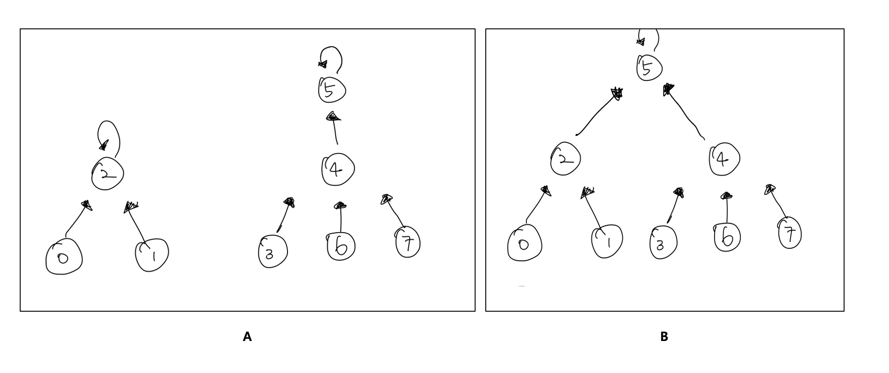
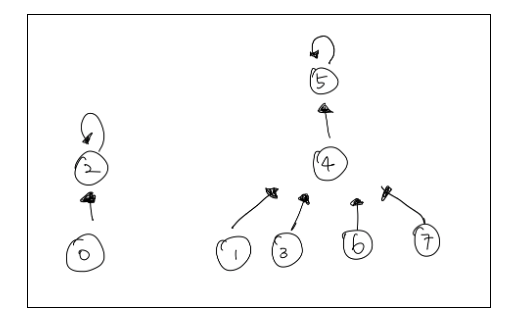
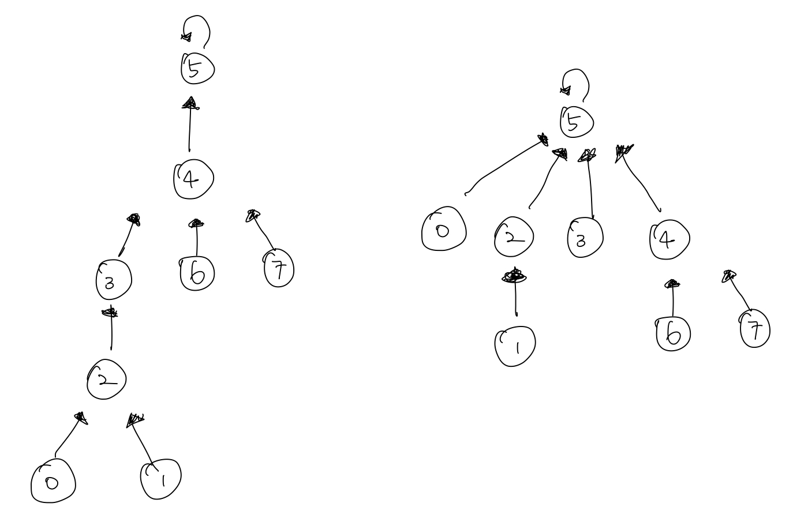

# 자료구조 - 유니온 파인드


## 유니온 파인드(Union Find)

유니온 파인드는 독특한 **트리구조**로 **상호 배타적 집합(disjoint-set)을 표현** 할 때 쓰는 **자료구조**이다. 

### 상호배타적 집합

상호 배타적 집합이라는 것은 무엇일까? <br>

> 어떤 파티에 n명의 사람이 있다고 하자. 이때 생일이 같은 사람들끼리 팀을 구성하라고 했을 때, 처음에는 다 각자 있다가 생일이 같은 사람들이 모여서 그룹을 이루기 시작할 것이다. 그리고 그룹끼리 생일이 같다는 것을 확인하면 그룹은 합쳐질 것이다. 

이러한 상황을 자료구조로 어떻게 나타낼까? <br>

파티에 온 사람들을 전체 집합이라고 하면, 실제로 같은 생일끼리의 그룹은 전체 집합을 여러개의 부분 집합들로 나눈 쪼갠 것이다. <br>

그리고 이때 두 개 이상의 그룹에 속한 사람은 없다는 것이 중요한 점이다. 즉, 상호배타적인 부분 집합들로 나눠진 원소들에 대한 정보를 저장하고 <br>

조작하는 자료구조가 바로 유니온 파인드 자료구조이다. <br>

이때 총 3가지 연산이 필요하게 된다. <br>

1. 초기화 : n 개의 원소가 각각의 집합에 포함되어 있도록 초기화시킨다.
2. 합치기(Union) 연산 : 두 원소 a,b가 주어질 때 이들이 속한 두 집합을 하나로 합친다.
3. 찾기(find) 연산 : 어떤 원소 a 가 주어졌을 때 이 원소가 속한 집합을 반환한다.

### 배열로 상호 배타적 집합 표현

이러한 상호배타적 집합은 가장 간단하게는 1차원 배열 하나를 이용해서 표현할 수 있다. <br>

다음과 같은 belongsTo 배열을 만들자. <br>

```python
belongsTo[i] = i번 째 원소가 속하는 집합의 번호
```

처음에 belongsTo 배열을 각각 다른 숫자로 초기화하면 크기가 1인 n 개의 집합을 만들 수 있다. <br>

이때 찾기 연산의 경우에는 O(1)이라는 상수 시간안에 구현을 할 수 있게 된다. <br>

그러나 반면에 합치기 연산의 경우에는 belongsTo의 모든 원소를 순회하면서 한 쪽 집합에 속한 원소들을 다른 쪽으로 옮겨주어야하는데, <br>

belongsTo배열의 모든 원소를 순회하는데는 O(N)이라는 시간이 걸리게 된다. <br>

따라서 배열로 상호 배타적 집합을 표현하는 것 합치기 연산에 많은 시간이 소요 되므로 좀 더 빠른 방법을 찾게 된다. <br>

### 트리로 상호 배타적 집합 표현

트리를 사용해 상호 배타적 집합을 표현할 수 있다. <br>

이때 한 집합에 속하는 원소들은 하나의 트리로 묶어준다. 따라서 상호 배타적 집합적 자료구조는 트리들의 집합으로 표현된다. <br>

예를 들어 아래의 사진을 보자.<br>

 여기서 A는 원소 8개가 2개의 집합으로 분할 되어 있는 것을 볼 수 있다. <br>

#### 찾기 연산

이때 두 원소가 같은 집합에 포함되는 지 확인하는 방법은 바로 각 원소가 포함된 트리의 루트를 찾은 뒤 이들이 같은지 비교하는 것이다. <br>

즉, 찾기 연산은 주어진 원소가 포함된 트리의 루트를 찾는 것으로 구현된다. <br>

이러한 연산을 하기 위해서 모든 자식 노드는 부모에 대한 포인터를 가지고 있어야한다. 그리고 루트는 자기 자신을 가리키도록 구현한다.<br>

(이때 부모노드에서 자식으로 갈 일은 없으므로 부모가 모든 자식 노드에 대한 포인터는 필요 없다.)<br>

#### 합치기 연산

합치기 연산도 매우 간단하다. 각 트리의 루트를 찾은 뒤, 하나를 다른 한쪽의 자손으로 넣어주면 된다. <br>

위의 그림에서 B는 A에서 2를 루트로 가지는 집합을 5를 루트로 가지는 집합의 자손으로 넣어준 것이다. <br>

이때 꼭 주의해야할 점이 바로 한 노드를 다른 노드의 자식으로 넣기 전에 먼저 양 트리의 루트를 찾아야한다는 점이다. <br>

예를 들어 원소 1을 4가 포함되는 집합에 합친다고 할 때 만일 루트를 확인하지 않고 합친다면 아래의 그림과 같은 결과가 나올 것이다. <br>



#### 코드로 구현

```python
class DisjointSet:
  def __init__(self, n):
    self.data = {i:i for i in range(n)}
    self.size = n 
  
  def find(self, index):
    if index = data[index]:
      return 
    return self.find(data[index])
  
  def merge(self,x,y):
    x_parent = find(x)
    y_parent = find(y)
    if x_parent = y_parent: return
    data[x_parent] = y_parent
```


이때 find를 진행하는데에 걸리는 시간은 트리의 높이에 비례하고, merge의 경우 또한 find가 있기 때문에 같은 시간이 걸린다. <br>


### 상호배타적 집합의 최적화

트리로 상호 배타적 집합을 표현할 때, 루트 하나의 정보만 바꾸게 된다. 즉, 배열보다는 훨씬 효율적이지만 만약 연산 순서가 <br>

잘못된다면 트리가 한쪽으로 기울어질 수 있다는 문제가 발생하고 이는 즉 높이가 O(n)이 되는 경우가 나올 수 있다. <br>

그렇게 되면 결국 find를 진행하는 데에도 O(n)이 되므로 이는 배열보다도 효율이 나빠진 셈이다. <br>

따라서 최적화를 하는 방법은 다음과 같다. <br>


#### 랭크에 의한 합치기 (Union by rank)

트리를 합칠 때 항상 높이가 더 낮은 트리를 높은 트리 밑으로 집어넣는다는 조건을 통해서 트리의 높이가 높아지는 상황을 방지하는 것이다. <br>


#### 경로 압축 (Path compression)

찾기 연산이 중복된 계산을 여러 번 하고 있다는데에 착안한다. 즉, find(u)를 통해 u 가 속하는 트리의 루트를 찾아냈다고 하자. <br>

이때 parent[u]를 찾아낸 루트로 아예 바꿔버리면 다음번에 find(u)가 호출되었을 때 경로를 따라서 올라갈 필요없이 <br>

바로 루트를 찾을 수 있게 되는 것이다. <br>



따라서 왼쪽에 있는 그림처럼 0에서 루트까지 올라가는 경로에 있던 다른 노드 2,3 도 다 루트에 직접적으로 연결되는 것이다. <br>

#### 최적화를 코드에 적용

```python
class DisjointSet:
  def __init__(self, n):
    self.data = {i:i for i in range(n)}
    self.size = n 
    self.rank = {i:1 for i in range(n)}
  
  def find(self, index):
    if index = data[index]:
      return 
    return data[index] = find(data[index]) # 경로 압축 최적화가 적용
  
  def merge(self,x,y):
    x_parent = find(x)
    y_parent = find(y)
    if x_parent = y_parent: return
    # 랭크에 의한 합치기 최적화 적용
    if rank[x_parent] > rank[y_parent]: # 이경우에 x의 크기가 y보다 크다
      swap(x_parent,y_parent)
    data[x_parent] = y_parent
    if rank[x_parent] == rank[y_parent]:
      rank[y_parent] += 1
```


### Union-Find 주의해야 할 부분❗️

문제를 풀다보면 union을 다 해주고 나서 **find를 처음부터 끝까지 진행해주어야지** 다 미쳐 연결되지 못한 부분들이 연결되는 것을 확인할 수 있다. 


## 참조 

1. 종만북 (상호배타적 집합)
