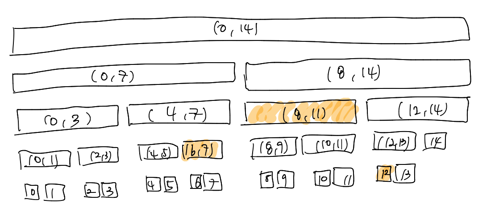
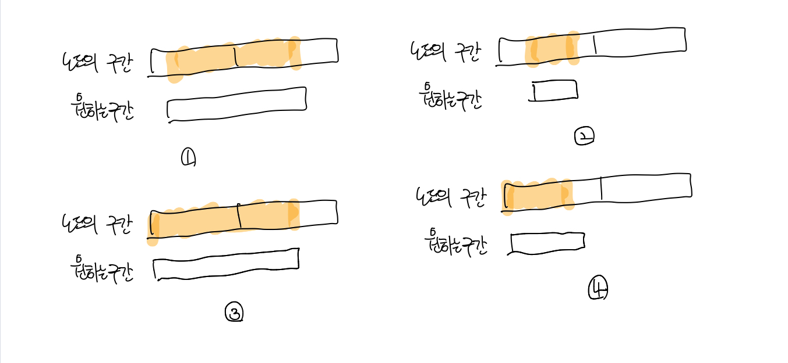

# 알고리즘 - 구간 트리


## 구간 트리(Segment Tree)

구간 트리는 저장된 자료들을 적절히 전처리해서 그들에 대한 질의들을 O(log n)이라는 시간복잡도 안에 대답할 수 있도록 한다. <br>

흔히 **일차원 배열의 특정 구간에 대한 질문을 빠르게 대답하는데 사용**된다.  <br>

예를 들어 A = {1, 2, 1, 2, 3, 1, 2, 3, 4} 라는 배열이 있다면, [2, 4] 구간의 최소치는 1이고, [6, 8] 구간의 최소치는 2이다.  <br>

이 연산을 구현하는 가장 간단한 알고리즘은 구간이 주어질 때 마다 배열을 순회하면서 최소치를 찾는 것으로,  <br>

질문 하나에 대답을 하는데 O(n) 시간이 걸리게 된다.   <br>

반면에 해당 배열을 전처리해 구간 트리를 생성하면 같은 연산을 빠르게 구할 수 있다. <br>

기본적인 아이디어는 **주어진 배열의 구간들을 표현하는 이진트리를 만드는 것**이다. <br>

이때 구간 트리의 루트는 항상 배열 전체의 구간[0, n-1]을 표현하며, 한 트리의 왼쪽 자식과 오른쪽 자식은 각각 

해당 구간의 왼쪽 반과 오른쪽 반을 표현한다. <br>

길이가 **1인 구간을 표현하는 노드들은 구간 트리의 리프**가 된다. <br>



배열의 길이가 15인 구간트리의 각 노드가 표현하는 구간들은 위의 그림이 나타내는 것과 같다. <br>

맨 위가 루트가 표현하는 구간이고, 양쪽 아래는 루트의 두 자식 노드들이 표현하는 구간이다. <br>

이때 구간 트리는 노드마다 해당 구간에 대한 계산 결과를 저장해 둔다. <br>

예를 들어 최소치를 구하는 구간트리는 해당 구간의 최소값을 각 노드에 저장한다. <br>

예를 들어 구간 [6, 12] 사이의 최솟값을 알고싶다면 색칠된 세 구간의 노드를 비교해서 최소값을 찾으면 정답을 구할 수 있다. <br>


## 구간 트리의 표현

**특정 구간의 최소치**를 찾는 문제를 풀어보자. <br>

이 문제는 **구간 최소 쿼리(range minimum query, RMQ)**라고도 부른다. <br>

**구간트리는 비교적 '꽉 찬' 이진 트리**이다. 이러한 꽉 찬 이진 트리는 이진 검색처럼 포인터로 연결된 객체로 표현하기 보다는, <br>

**배열로 표현하는 것이 메모리를 더 절약할 수 있다.** <br>

**루트 노드를 배열의 1번 원소**로, 노드 i의 **왼쪽 자손과 오른쪽 자손을 각각 2 x i, 2 x i + 1번 원소**로 표현할 수 있다. <br>

이러한 배열의 길이는 안전하게 구하려면 **가장 가까운 2의 거듭제곱으로 n을 올림한 뒤 2를 곱해야한다.** <br>

즉 예를 들어 n = 6 인 경우에는 6보다 큰 가장 가까운 2의 거듭제곱인 8의 2배를 한 16이 배열의 길이가 되어야한다는 것이다.<br>

만약 이것이 귀찮다면, 그냥 **n에 4를 곱해주는 것**도 하나의 방법이다. (물론 메모리의 낭비가 좀 있을 수는 있지만 모든 경우를 해결 가능)<br>


## 구간 트리의 초기화

배열 arr[]이 주어질 때, 각 노드마다 해당 구간의 최소치를 계산하는 함수 init()은 다음과 같이 작성할 수 있다. <br>

```c++
struct RMQ {
  int n; // 배열의 길이
  vector<int> rangeMin; // 각 구간의 최소치를 저장
  RMQ(const vector<int>& array) {
    n = array.size();
    rangeMin.resize(n * 4)
    init(array, 0, n-1, 1)
  }
  // node를 루트로 하는 서브트리를 초기화하고, 이 구간의 최소치를 반환
  int init(const vector<int>& array, int left, int right, int node) {
      if(left == right) {
        return rangeMin[node] = array[left]
      }
      int mid = (left + right)/2
      int leftMin = init(array, left, mid, node*2)
      int rightMin = init(array, mid + 1, right, node*2 + 1)
      return rangeMin[node] = min(leftMin, rightMin)
  }
}
```

이때 **초기화에 걸리는 시간 복잡도**는 다음과 같다. <br>

각 노드마다 걸리는 시간은 O(1) 이므로 초기화 과정에서는 노드의 수만큼의 시간이 걸리고 배열의 길이가 n이므로 **O(n)**이 걸리게 된다. <br>


## 구간 트리의 질의 처리

초기화를 했다면 이제 임의의 구간의 최소치를 구할 수 있다. <br>

이것을 **질의(query) 연산**이라고 부른다. 질의 연산은 구간트리에서의 순회를 응용해 간단한게 구현할 수 있다. <br>

> Query(left, right, node, nodeLeft, nodeRight) = node 가 **표현하는 범위 [nodeLeft, nodeRight]**와 **실제로 최소치를 구해야하는 범위인**
>
> **[left, right]** 구간의 **교집합의 최소원소를 반환**한다. 

예를 들어 루트인 1번 노드는 배열 전체 범위인 [0, n-1]을 표현하기 때문에 [i, j] 구간의 최소치는 query(i, j, 1, 0, n-1)라고 할 수 있다. <br>

이때 다음과 같은 경우들이 발생한다. <br>

- **교집합이 공집합인 경우**: 두 구간이 서로 겹치지 않는다. 이때 반환값은 존재하지 않고 **반환값이 무시되도록 아주 큰 값을 반환**하면된다. 
- **교집합이 [nodeLeft, nodeRight]인 경우** : [left, right]가 노드가 표현하는 집합을 완전히 포함하는 경우로 **미리 계산해둔 최소치를 반환**하면된다.
- **이 외의 모든 경우** : 두 개의 자식 노드에 대해 **query()를 재귀 호출하여 두 값 중 더 작은 값을 반환**하면 된다.

```c++
const int INT_MAX = numberic_limits<int>::max();
struct RMQ {
  int query(int left, int right, int node, int nodeLeft, int nodeRight) {
      if(right < nodeLeft || nodeRight < left) return INT_MAX;
      if(left <= nodeLeft && nodeRight <= right) return rangeMin[node];
      int mid = (nodeLeft + nodeRight) / 2;
      return min(query(left, right, node*2, nodeLeft, mid), query(left, right, node*2+1, mid+1, nodeRight));
  }
}
```

**query()의 시간복잡도는 O(log n)**이다.<br>

재귀 호출할 때 양쪽 자손노드를 모두 탐색하기 때문에, 자칫 모든 노드를 다 방문한다고 생각할 수 있겠지만 그렇지 않다.  <br>



위의 그림은 **노드가 표현하는 구간과 최소치를 원하는 구간이 겹치는 형태**들을 보여준다. <br>

즉, 노드가 표현하는 구간을 절반으로 나눠 재귀호출 했을 때, 해당 구간이 노드에 완전히 포함되거나 아예 포함되지 않는다면 곧장 종료된다. <br>

따라서 (2,3,4)에서는 재귀 호출을 하였을 때 양쪽의 한쪽은 반드시 바로 종료되게 된다. <br>

1번만 양쪽 재귀 호출 둘 중 하나도 곧장 종료하지 않고 탬색을 하는 경우인데, 즉 **양쪽 구간에 겹쳐야만 이러한 경우가 발생**한다. <br>

그런데 이러한 경우는 **결국 최대 2번까지**이다. 다음 재귀 호출에서는 결구 2,3,4와 같은 형태가 되므로 시간 복잡도는 O(log n)이라고 할 수 있다. <br>


## 구간 트리의 갱신

전 처리를 통해 구간 트리를 생성한 다음에 원래 배열의 값이 바뀐다면 어떻게 해야할까?<br>

처음부터 다시 생성할 수도 있지만, **값이 하나 바 뀔때**는 구간트리를 빠른 시간에 갱신 할 수 있다. <br>

원래 배열의 index 위치의 값이 new value로 바뀌었다고 하자. 그렇다면 이 위치를 포함하는 구간은 트리에 총 O(log n)개 있을 것이다. <br>

따라서 이들만 재계산하면 **O(log n) 시간**에 구간 트리를 갱신할 수 있다. <br>

```c++
struct RMQ {
  int update(int index, int newValue, int node, int nodeLeft, int nodeRight) {
    if (index < nodeLeft || nodeRight < index) return rangeMin[node];
    if (nodeLeft == nodeRight) return rangeMin[node] = newValue;
    int mid = (nodeLeft + nodeRight) / 2;
    return rangeMin[node] = min(update(index, newValue, node*2, nodeLeft, mid), update(index, newValue, node*2+1, mid+1, nodeRight));
  }
}
```

갱신 과정은 query()와 init()을 합친 것처럼 구현된다. 이러한 **update의 시간복잡도는 O(log n)**이다.<br>


## 참조 

1. 종만북 (구간 트리)

