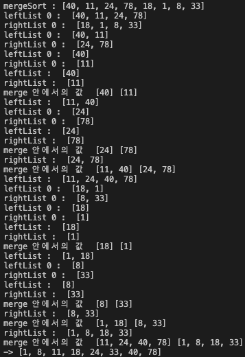
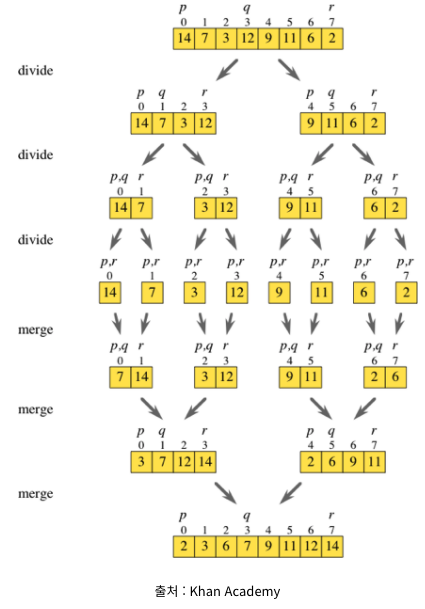

# quickSort(퀵 정렬)
## 목차
- [퀵 정렬 개념](#개념)
- [퀵 정렬 동작 방식](#동작-방식)
- [퀵 정렬 특징](#특징)
- [퀵 정렬 시간복잡도와 공간복잡도](#시간복잡도)
- [퀵 정렬 python code](#python-code)
- [퀵 정렬 c++ code](#c-code)
- [참조](#참조)

#### <a id="information"></a>
### 개념 
기준 값(pivot)을 중심으로 작은 원소들은 왼쪽 부분집합으로, 큰 원소들을 오른쪽 부분집합으로 분할하여 정렬하는 방식의 정렬 알고리즘이다. <br>
퀵 정렬도 **분할 정복(divide and conquer)기법** 중 하나인데, 병합 정렬과의 차이가 존재한다. <br>
**병합 정렬**은 **분할 후 정복**하는 원리였다면, **퀵 정렬**은 **정복 후 분할**하는 원리의 알고리즘이다. <br>
기준 값(pivot)보다 작은 원소들을 왼쪽 부분집합으로, 큰 원소들을 오른쪽 부분집합으로 구분하는 **정복**을 수행하고, <br>
기준 값(pivot) 중심으로 2개의 부분 집합으로 **분할**한다.

#### <a id="How it works"></a>
### 동작 방식
0. 기준 값(pivot)을 자신의 목적에 맞게 선택한다. 예를 들면 제일 첫 번째 원소, 마지막 원소, 가운데 원소, 랜덤으로 뽑는 원소, 또는 <br>
3개의 랜덤으로 선택하여 3개 중에 중앙 값을 기준 값으로 지정하는 방법이 있다. 여기서는 가운데 원소를 기준 값(pivot)으로 사용한다.<br>
1. Left index를 리스트의 가장 왼쪽(0번째 원소), Right index를 리스트의 가장 오른쪽에 위치시킨다. (L과 R로 축약)
2. L에 위치한 원소가 pivot보다 큰 원소가 나올 때까지 L은 리스트의 오른쪽 방향으로 이동한다. <br>
R에 위치한 원소가 pivot보다 작은 원소가 나올 때까지 R은 리스트의 왼쪽 방향으로 이동한다. 
3. 이 때, L과 R이 교차하지 않았다면 두 인덱스를 교환하고 다시 2번 과정으로 돌아가서 반복한다. <br>
여기서 주의할 점은 **L과 R이 가르키는 인덱스는 유지한 채, 두 인덱스에 위치한 원소만을 교환**
4. L과 R이 교차하면, pivot은 R에 위치한 원소와 교환한다. 교환 후 pivot을 기준으로 왼쪽과 오른쪽 부분집합을 구분하고, <br>
두 부분집합에 대해서 퀵 정렬 알고리즘을 재귀 호출한다. 이때, 분할된 부분집합의 크기가 1이하일 경우에는 탈출하도록 한다.

 <br>
위의 사진은 8개의 원소가 들어가있는 배열의 동작되는 과정을 프린트 해본 것이다.

#### <a id="characteristic"></a>
## 특징
- **In-place(제자리 정렬)** 알고리즘이다. <br>
- **unstable(불안정)** 알고리즘이다.<br>
- 가장 광범위하게 사용되는 정렬 알고리즘으로, 평균적인 성능의 경우에서는 정렬 알고리즘 중에서 가장 빠르게 수행된다.

#### <a id="time complexity"></a>
## 시간복잡도

### 연산시간
1. **최선의 경우** : 왼쪽 부분집합과 오른쪽 부분집합이 정확히 이등분 되는 경우 <br>
최선의 경우 시간복잡도 **O(Nlog N)** <br>
2. **최악의 경우** : 부분집합이 1개와 n-1개로 치우쳐 분할되는 경우 <br>
최악의 경우 시간복잡도 **O(N^2)** <br>

### 시간 복잡도
퀵 정렬의 시간 복잡도는 최악의 경우가 아닌 평균적인 시간복잡도인 **O(Nlog N)** 으로 대부분 설명한다.<br>
왜냐하면 최악의 경우에는 리스트가 오름차순 혹은 내림차순으로 정렬된 상태로 주어져야 하는데, <br>
일반적인 상황에서 리스트가 정렬된 상태로 주어지는 경우가 드물기 때문이다.

## 공간복잡도
n개의 원소에 대해서 n개의 메모리를 사용

#### <a id="python code"></a>
## python code
```python
#quickSort 코드
import time
start = time.time()

def quickSort(lst):
    if len(lst) <= 1:
        return lst
    
    pivot = lst[len(lst)//2]
    less_arr, equal_arr, greater_arr = [],[],[]
    
    for num in lst:
        if num < pivot:
            less_arr.append(num)
        elif num > pivot:
            greater_arr.append(num)
        else:
            equal_arr.append(num)

    return quickSort(less_arr)+equal_arr+quickSort(greater_arr)

from random import randint
lst = [randint(1,101) for i in range(8)] # 1부터 101사이의 랜덤 값을 8개의 list 안에 초기화
print("quickSort :", lst, end=" "); print ("->",quickSort(lst))
print("time : ", time.time()-start )
``` 
위의 코드의 경우 구현이 간단하지만 재귀함수를 호출할 때 마다 매번 새로운 리스트를 생성하여 리턴하기 때문에 <br>
**메모리 사용 측면에서 효율적이지 못하다**고 할 수 있다.<br>
따라서 in-place 정렬로 코드를 수정하기 위해서 다음과 같은 코드를 작성했다. <br>
위의 코드와 동일하게 값의 대소 비교를 위해서 pivot값을 사용 하지만, 분할은 기준점이 pivot이 아닌 경우도 발생하게 된다. <br>
실제로 pivot 값을 기준으로 대소 비교 시 좌측과 우측의 원소의 개소가 일치하여 공간이 딱 맞는 경우가 드물기 때문이다. <br>

```python
#quickSort in-place 코드
import time
start = time.time()

def quickSort(lst):
    def sort(low, high): 
        if high <= low: #high와 low의 순서가 바뀌면 탈출 
            return

        mid = partition(low, high) 
        sort(low, mid-1)
        sort(mid, high)

    def partition(low, high): #분할 기준점의 인덱스(low)를 반환
        pivot = lst[(low + high) // 2]
        while low <= high:
            while lst[low] < pivot:
                low += 1
            while lst[high] > pivot:
                high -= 1
            if low <= high:
                lst[low], lst[high] = lst[high], lst[low]
                low, high = low + 1, high -1
        return low

    return sort(0,len(lst)-1)

from random import randint
lst = [randint(1,101) for i in range(8)] # 1부터 101사이의 랜덤 값을 8개의 list 안에 초기화
print("quickSort :", lst, end=" "); quickSort(lst); print ("->",lst)
print("time : ", time.time()-start )
``` 

#### <a id="c++ code"></a>
## c++ code
```c++
#include<iostream>
#include<string>
int cnt =0;

void merge(int arr[], int left, int mid, int right){
    int i = left, j = mid + 1, k = left ;
    int sorted_arr[1000];
    while(i <= mid && j <= right){
        if(arr[i] <= arr[j]){
            sorted_arr[k++] = arr[i++];
        }else{
            sorted_arr[k++] = arr[j++];
        }
    }
    if(i>mid){
        for(int m = j; m <= right; m++){
            sorted_arr[k++] = arr[m];
        }
    }else{
         for(int m = i; m<= mid; m++){
            sorted_arr[k++] = arr[m];
        }
    }
      for (int m = left; m <= right; m++) {
        arr[m] = sorted_arr[m];
    }
}
void mergeSort(int arr[], int left, int right){
    int mid =0;
    
    if(left < right){
        cnt++;
        mid = (left + right)/2;
        mergeSort(arr, left, mid);
        mergeSort(arr, mid +1, right);
        merge(arr, left, mid, right);
    }
}

int main(){
    int len = 0;
    std::cin >> len;
    int *arr = new int[len];
    for(int i = 0; i< len ; i++){
        std::cin >> arr[i];
    }
    mergeSort(arr, 0, len - 1);
    for(int i = 0; i < len; i++){
        printf("%d ", arr[i]);
    }
    return 0;
}
```
#### <a id="references"></a>
### 참조
아래의 링크를 참조하여 작성하였습니다. <br>
[몽구의 우탕탕탕 개발 공부](https://mong9data.tistory.com/48?category=885884)<br>
[Dale Seo](https://www.daleseo.com/sort-quick/)
