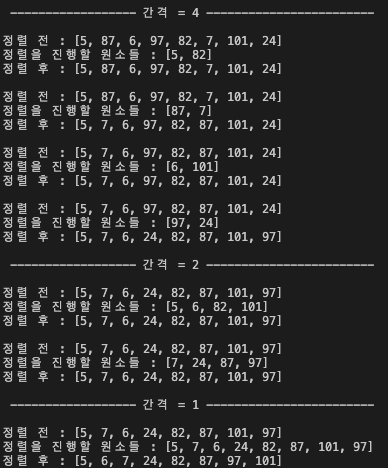
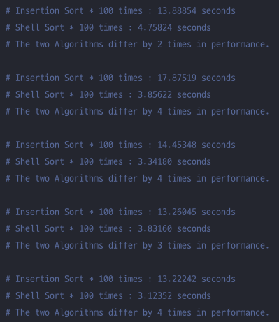

# shellSort(쉘 정렬)
## 목차
- [쉘 정렬 개념](#개념)
- [쉘 정렬 동작 방식](#동작-방식)
- [쉘 정렬 특징](#특징)
- [쉘 정렬 시간복잡도와 공간복잡도](#시간복잡도)
- [쉘 정렬 python code](#python-code)
- [쉘 정렬 c++ code](#c-code)
- [참조](#참조)

#### <a id="information"></a>
### 개념 
일정 간격(gap)만큼 떨어져 있는 원소들끼리 부분집합을 구성한 후 각 부분집합 원소들에 대해서 삽입 정렬을 수행하되 간격을 줄여가며 삽입 정렬을 반복하여 전체 원소들을 정렬하는 방식의 알고리즘이다. <br>
쉘 정렬은 **삽입 정렬의 문제점을 극복하기 위해** 개선한 정렬 알고리즘이다. <br>
삽입 정렬의 경우, 주어진 자료의 정렬 상태에 따라서 시간복잡도가 최선의 경우 O(N) 최악의 경우 O(N^2)으로 많이 달라졌는데, <br>
**역순으로 정렬된 형태에 가까울수록 비교횟수가 많이 늘어나는 치명적인 문제점**이 존재했다.<br>
따라서 Donald L.Shell은 이러한 문제점을 간격(gap)이라는 개념을 도입하여 쉘 정렬을 고안해내었다.

#### <a id="How it works"></a>
### 동작 방식
0. 간격(gap) gap = arr길의 / 2 <br>
1. 첫 번째 원소와 첫 번째 원소로부터 gap의 배수만큼 간격의 원소들을 부분집합에 포함
2. 부분집합에 포함된 원소들에 한해 삽입 정렬 수행
3. 두 번째 원소와 두 번째 원소로부터 gap의 배수만큼 간격의 원소들을 부분집합에 포함
4. 부분집합에 포함된 원소들에 한해 삽입 정렬 수행
5. 위 과정 gap번째 원소까지 반복 실행
6. gap = gap /2 로 간격의 크기를 조정
7. gap이 0 이상일 때까지 1-6까지의 과정 반복 수행 <br>

 <br>
위의 사진은 8개의 원소가 들어가있는 배열의 동작되는 과정을 프린트 해본 것이다.

#### <a id="characteristic"></a>
## 특징
- **In-place(제자리 정렬)** 알고리즘이다. <br>
약간의 추가적인 공간이 필요하지만, 해당 공간이 정렬하고자 하는 요소의 개수와 독립적이면 관련이 없는 제자리 정렬이라고 볼 수 있다. <br>
- **Unstable(불안정적)** 알고리즘이다.<br>
바로 옆의 원소끼리 교환하는 것이 아니므로 불안정적인 상황이 발생가능하다. <br> 

#### <a id="time complexity"></a>
## 시간복잡도
### 연산시간
- 간격(gap)에 의해 결정<br>
- 따라서 gap의 크기를 잘 결정하는 것이 쉘 정렬에서의 연산시간을 줄이는 중요한 요점이다.<br>

### 시간 복잡도의 경우에는 최선, 최악, 평균이 다 다르다.<br>
- 최선의 시간 복잡도 : O(N)<br>
- 평균의 시간 복잡도 : O(N^1.25 ~ N^1.5)<br>
- **최악의 시간 복잡도 : O(N^2)**<br>

Big-O Notation에는 최악의 시간 복잡도로 표현이 되어 있지만 실제로 삽입 정렬보다는 우수한 성능을 가지고 있다. <br>
**왜냐하면 삽입 정렬에 비해서 원소가 최종적으로 도달해야하는 위치로 가는 이동 속도가 빠르기 때문이다.** <br>



실제로 위의 사진에서 보듯이 역순으로 정렬된 상태에서 1-10000사이의 정수 1만개를 shellsort와 insertionsort를 사용하여 정렬해 보았을때 <br>
성능에서의 차이가 많이 나는 것을 확인해 볼 수 있다. 

## 공간복잡도
배열에 저장되는 n개의 원소에 대하여 n개의 메모리와 매개변수 gap에 대한 공간사용 

#### <a id="python code"></a>
## python code
```python
def insertionSort(list, first, last, gap):
    index = first + gap 
    #첫번째 while문은 생성한 배열에서의 gap만큼 인덱스를 last까지 증가시켜주는 역할
    while index <= last: 
        val = list[index]
        pos = index
        # 두 번째 while문은 첫 번째 while문에 의해서 설정된 index 값부터 gap만큼 
        # 빼가면서 앞에 원소중에서 크기가 작으면 교환, 즉 sort하는 역할 
        while pos > first and list[pos - gap] > val:
            list[pos] = list[pos-gap]
            pos -= gap
        list[pos] = val
        index += gap

def shellSort(list):
    length = len(list)
    gap = length//2 # 정렬한 원소의 크기의 반을 gap으로 지정
    while gap > 0: 
        # shellsort 개념에서 gap 개수만큼 배열을 만드는 부분인데
        # 실제로는 배열을 만드는 것이 아니라 리스트를 한번씩 정렬하는 방식 
        for i in range(0, gap): 
            insertionSort(list, i, length-1, gap)
        gap //= 2
    return list

from random import randint

lst = [randint(1,101) for i in range(8)] # 1부터 101사이의 랜덤 값을 8개의 list 안에 초기화
print("shellSort :", lst, end=" "); print ("->",shellSort(lst))
``` 
#### <a id="c++ code"></a>
## c++ code
```c++
#include<iostream>
#include<string>
#include<algorithm>
#include<random>
#define len 8

void insertionSort(int arr[], int first, int last, int gap){
    int index = first + gap;
    while(index <= last){
        int value = arr[index];
        int pos = index;
        while(pos>first && arr[pos-gap]>value){
            arr[pos] = arr[pos-gap];
            pos -= gap;
        }
        arr[pos] = value;
        index += gap;
    }
}

void shellSort(int arr[], int length){
    int gap = length/2;
    while(gap >0){
        for (int i = 0; i<length-1;i++){
            insertionSort(arr,i,length-1,gap);
        }
        gap /= 2;
    }
}

int main(void){
    int list[len] = {0,};
    printf("정렬 전 : ");
    for (int i = 0; i < len; i++){
        list[i] = rand()%101 + 1;
        printf("%d ", list[i]);
    }
    int length = sizeof(list)/sizeof(int);
    shellSort(list, length);
    printf("\n정렬 후 : ");
    for (int i = 0; i < len; i++){
        printf("%d ", list[i]);
    }
    return 0; 
}
```
#### <a id="references"></a>
### 참조
아래의 링크를 참조하여 작성하였습니다. <br>
[몽구의 우탕탕탕 개발 공부](https://starkying.tistory.com/entry/Insertion-Sort-%EC%82%BD%EC%9E%85-%EC%A0%95%EB%A0%AC-Shell-Sort-%EC%85%B8-%EC%A0%95%EB%A0%AC) <br>
[heejeong Kwon](https://mong9data.tistory.com/45)<br>
[kmmguumnn](https://gmlwjd9405.github.io/2018/05/08/algorithm-shell-sort.html)

