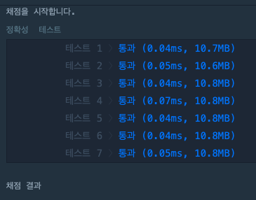
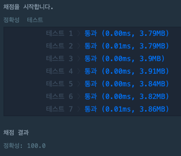

# 백준 정렬 문제
  - [10814번 : 나이순 정렬](https://www.acmicpc.net/problem/10814)
  - [1181번 : 단어 정렬](https://www.acmicpc.net/problem/1181)

## 나이순 정렬
### 접근 방법 
1. commands의 size만큼 반복하여 commands[i][0]부터 commands[i][1]까지 주어진 배열 자르기 <br>
2. 구현한 삽입 정렬 함수를 사용하여 정렬 (c++, python 기본 제공 sort라이브러리 사용 x) <br>
3. 정렬된 배열에서 commands[i][2]의 값을 index로 가지는 원소를 꺼내서 answer에 추가 

## python code
```python
#백준 10814 나이순 정렬
if __name__ == "__main__":
    num = int(input())
    arr = []
    
    #사용자로부터 입력 받음 
    for i in range(0,num): 
        n, name = input().split()
        arr.append([int(n),name])

    #입력받은 배열을 정렬하는데 먼저 x[0] : 나이를 기준으로 정렬 하고, 나이가 같으면 x[2] : index를 기준으로 비교하여 정렬
    #python의 sort, sorted는 안정적 정렬임
    arr.sort(key=lambda x: x[0])
    #arr.sort(key=lambda x: (x[0],x[2]))
    
    for n,name in arr:
        print(n,name)
``` 
### 수행 속도


## c++ code
```c++
#include<iostream>
#include<string>
#include<algorithm>
using namespace std;
class List{
    public:
        char name[101];
        int age;
        int index;

        bool operator < (List & student){
            if(this->age == student.age)
                return this->index < student.index;
            return this->age < student.age;
        }
};

int main(void){
    int num =0;
    cin >> num;
    List * student = new List[num];
    for (int i = 0; i < num; i++){
        scanf("%d %s",&student[i].age, student[i].name);
        student[i].index = i;
    }
    sort(student, student + num);
    for (int i = 0; i < num; i++){
        printf("%d %s\n", student[i].age, student[i].name);
    }
    return 0;
}
```
### 수행속도


## 시간복잡도


## 단어 정렬

### 접근 방법 
1. 숫자 입력 받고 해당 횟수 만큼 리스트에 단어를 입력받아서 저장 <br>
2. 중복되는 단어는 한 번만 출력이 되어야하므로 unique하게 만들기 위해서 **list를 set으로 변경**하여 unique하게 만들고 다시 list로 변환 <br>
3. 중복이 제거된 list에서 길이로 비교한 뒤, 길이가 같으면 단어순으로 정렬하기 위해서 lambda식 사용 **(key = lambda x: (len(x),x))**

## python code
```python
#백준1181_단어정렬 
import time
start = time.time()

if __name__ == "__main__":
    num = int(input())
    word_map =[]
    for i in range(num):
        word_map.append(input())
    #set으로 만들어주어서 list에서 중복되는 값들을 unique하게 만들어줌 
    word_set = set(word_map)
    #다시 set에서 list로 변환
    word_map = list(word_set)
    #먼저 길이로 정렬하고 같은 경우, 단어순으로 정렬하도록 lambda식 사용
    word_map.sort(key = lambda x:(len(x),x))
    for i in word_map:
        print(i)

print("time : ",time.time()-start) #단위는 초 
``` 
### 메모리 및 수행 속도
메모리 : 34200 KB
시간 : 872ms

## c++ code
```c++
#include<iostream>
#include<string>
#include<algorithm>
using namespace std;
class List{
    public:
        char name[101];
        int age;
        int index;

        bool operator < (List & student){
            if(this->age == student.age)
                return this->index < student.index;
            return this->age < student.age;
        }
};

int main(void){
    int num =0;
    cin >> num;
    List * student = new List[num];
    for (int i = 0; i < num; i++){
        scanf("%d %s",&student[i].age, student[i].name);
        student[i].index = i;
    }
    sort(student, student + num);
    for (int i = 0; i < num; i++){
        printf("%d %s\n", student[i].age, student[i].name);
    }
    return 0;
}
```
### 수행속도


## 시간복잡도
