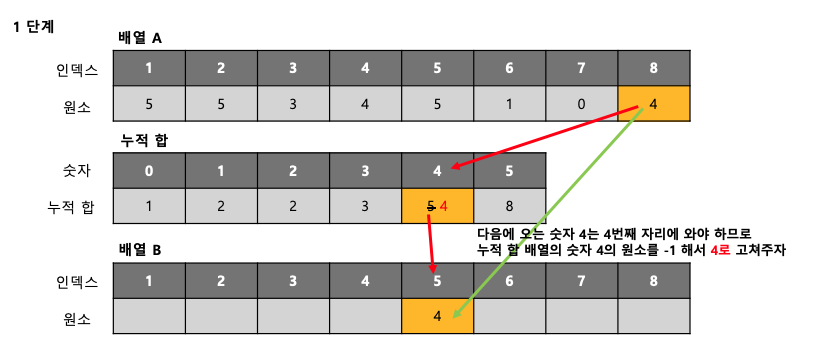
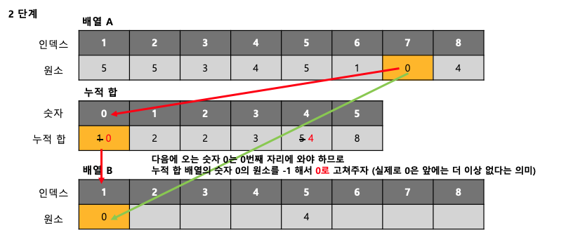
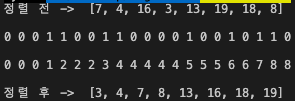

# 계수정렬(CountingSort)

## 목차

- [계수 정렬 개념](#개념)
- [계수 정렬 동작 방식](#동작-방식)
- [계수 정렬 특징](#특징)
- [계수 정렬 시간복잡도와 공간복잡도](#시간복잡도)
- [계수 정렬 python code](#python-code)
- [계수 정렬 c++ code](#c-code)
- [참조](#참조)

## 개념

계수정렬은 **원소들간의 비교를 하지 않고 정렬**을 하는 알고리즘이다 . <br>

일일이 비교를 하지 않고 각 숫자의 개수를 파악하고, 정렬을 수행하기 때문에 시간복잡도는 O(N)이 나오게된다. <br>

다만 계수정렬은 모든 리스트에 적용할 수 있는 것이 아니라 **일정한 조건을 만족하는 리스트에만 적용이 가능**하다. <br>

조건 1. 리스트 내의 모든 원소들은 0~k(k는 정수)의 범위를 가져야만 한다. 즉, 음수나 소수가 있으면 사용불가 <br>

조건 2. k = O(N)으로 나타낼 수 있어야만 한다.


## 동작방식

다음과 같이 8개의 원소를 가지는 배열 A를 정렬해야하는 상황이라고 해보자.<br>

| 인덱스 |  0   |  1   |  2   |  3   |  4   |  5   |  6   |  7   |
| :----: | :--: | :--: | :--: | :--: | :--: | :--: | :--: | :--: |
|  원소  |  5   |  5   |  3   |  4   |  5   |  1   |  0   |  4   |

정렬을 하게 되면 아래의 배열 B가 될 것이다. <br>

| 인덱스 |  0   |  1   |  2   |  3   |  4   |  5   |  6   |  7   |
| :----: | :--: | :--: | :--: | :--: | :--: | :--: | :--: | :--: |
|  원소  |  0   |  1   |  3   |  4   |  4   |  5   |  5   |  5   |

그렇다면 어떠한 과정을 거치는 지 한 번 알아보자.<br>

1. 0~k 번째 까지 숫자중에 각 원소가 몇번 등장하는지 세어준다 (여기서 k = 5) <br>

   |   숫자    |  0   |  1   |  2   |  3   |  4   |  5   |
   | :-------: | :--: | :--: | :--: | :--: | :--: | :--: |
   | 등장 횟수 |  1   |  1   |  0   |  1   |  2   |  3   |

2. 등장한 횟수를 누적합으로 바꾸어준다.

   |  숫자   |  0   |    1    |  2   |    3     |     4      |      5       |
   | :-----: | :--: | :-----: | :--: | :------: | :--------: | :----------: |
   | 누적 합 |  1   | 2 (1+1) |  2   | 3(1+1+1) | 5(1+1+1+2) | 8(1+1+1+2+3) |

   이 누적 합에서 알 수 있는 것은 숫자 0은 인덱스 1에 위치, 숫자 4는 인덱스 4~5에 위치한다는 것이다.

3. 따라서 이제 배열 A를 뒤에서 앞으로 순회하면서 정렬이 될 새로운 배열 B에 넣어준다. <br>이때 이 누적합을 토대로 배열 A의 원소가 배열 B의 어디 위치에 들어 갈지를 알려주게 된다. <br>

   아래의 그림을 보고 이해해보자.






-----------

실제로 코드를 통해서 정렬을 해본 결과 이다. 정렬 과정은 나와있지 않지만 k = 20일때 8개의 숫자가 배열에 있다고 가정할 때 <br>등장 횟수와 누적 합을 보여주는 사진이다. <br>




## 특징

- **안정(stable) 정렬** 알고리즘이다. <br>
- **비제자리(Not-in-place) 정렬** 알고리즘이다. (숫자 개수를 저장할 공간, 결과를 저장할 공간이 필요) <br>

- 지금까지 다뤘던 알고리즘 중에 처음으로 **비교 정렬**이 아니다. 또한 **가장 큰 원소**에 영향을 받는다는 단점이 존재한다. 


## 시간복잡도

계수정렬의 시간복잡도는 **O(N+K)**이다. 만약에 K=O(N)이면 계수정렬의 시간 복잡도는 O(N)이 된다. <br>

그렇다면 과연 일반적인 상황에서의 가장 빠른 정렬 알고리즘인 퀵 소트의 평균시간 복잡도는 O(Nlog N)인데, <br>

왜 계수정렬이 아닌 퀵 소트를 가장 많이 사용할까? <br>

먼저 계수 정렬의 빠른 시간복잡도는 비교를 하지 않기 때문에 빠르다고 할 수 있지만, <br>

만약 k의 값이 너무 커진다면 일반적인 비교 정렬 알고리즘보다 느려질 수 있는 단점이 있다. <br>

예를 들어 k의 값이 100인 경우 O(n^2)이라고 할 수 있고, k의 값이 1000이면 O(N^3)이라고 할 수 있다. <br>


## 공간복잡도

계수 정렬의 공간 복잡도는 K의 값에 따라서 달라지며 추가적으로도 숫자의 개수를 저장할 배열, 정렬된 결과를 저장할 배열도 필요하므로 <br>

메모리 낭비가 심한 정렬 알고리즘이다.


## python code

```python
# 계수 정렬
MAX_NUM = 20
def countingSort(arr):
    length = len(arr)
    # 배열 안의 원소의 개수를 세는 배열
    count_arr =[0] * (MAX_NUM+1)
    # 배열의 원소들의 개수를 더해가면서 저장하는 배열 
    count_sum = [0] *(MAX_NUM+1)
    
    for i in range(length):
        count_arr[arr[i]] +=1
    
    count_sum[0] = count_arr[0]
    for i in range(1,MAX_NUM+1):
        count_sum[i] = count_sum[i-1] + count_arr[i]

    #sorted_arr는 정렬된 결과를 저장하는 배열 
    sorted_arr = [0]*(length+1) 
    for i in range(length-1, -1, -1): 
        sorted_arr[count_sum[arr[i]]] = arr[i] 
        count_sum[arr[i]] -= 1

    sorted_arr = sorted_arr[1:]
    return sorted_arr

from random import randint
lst = [randint(1,MAX_NUM) for i in range(8)] # 1부터 101사이의 랜덤 값을 8개의 list 안에 초기화
print("정렬 전 -> ",lst, end= " "); print("정렬 후 -> ",countingSort(lst))
```


## c++ code

```c++
#include<iostream>
#include<string>
#define SWAP(a,b) { int temp = a; a =b; b =temp;}
#define LEN 8
using namespace std;

int partition(int arr[], int low, int high){
    int pivot = arr[(low+high)/2];
    while(low <= high){
        while(arr[low] < pivot){
            low++;
        }
        while(arr[high] > pivot){
            high--;
        }
        if(low <= high){
            SWAP(arr[low],arr[high]);
            low++;
            high--;
        }
    }
    return low;
}
void quickSort(int arr[], int low, int high){
    if (high<=low){
        return ;
    }
    int mid = partition(arr,low,high);
    quickSort(arr,low,mid-1);
    quickSort(arr,mid,high);
}
int main (void){
    int arr[LEN]={};
    srand((unsigned)time(NULL));
    printf("정렬 전: ");
    for (int i = 0;i < LEN; i++){
        arr[i]= (std::rand() % 101) + 1;
        printf("%d ", arr[i]);
    }
    quickSort(arr, 0, LEN-1);
    printf("-> 정렬 후: ");
    
    for(int i = 0; i < LEN; i++){
        printf("%d ",arr[i]);
    }
    return 0;
}
```


## 참조

아래의 링크를 참조하여 작성하였습니다. <br>

[멍멍멍]([https://bowbowbow.tistory.com/8#%EC%86%8C%EA%B0%9C](https://bowbowbow.tistory.com/8#소개)) <br>

[Dojin Kim](https://dojinkimm.github.io/algorithm/2019/09/22/sort-algorithm-8.html)<br>

[ZeroCho](https://www.zerocho.com/category/Algorithm/post/58006da88475ed00152d6c4b)<br>