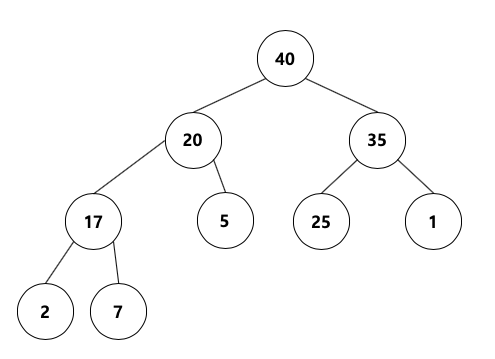
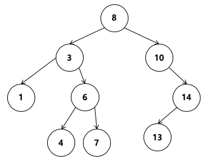
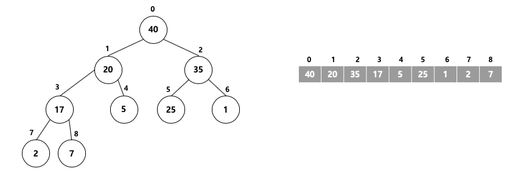
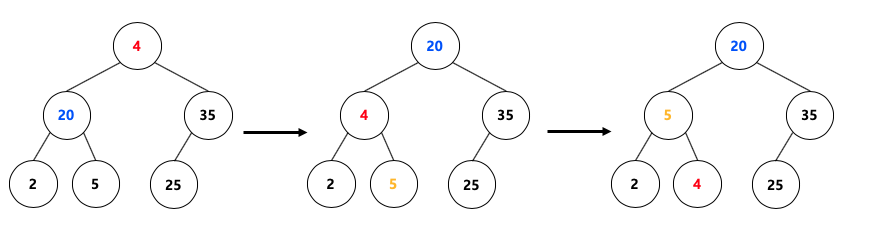
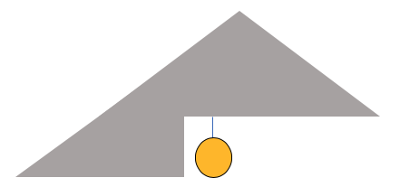
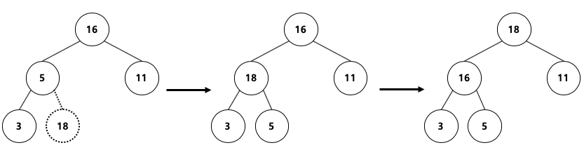
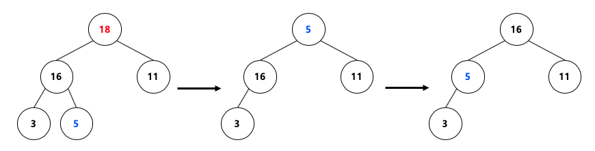
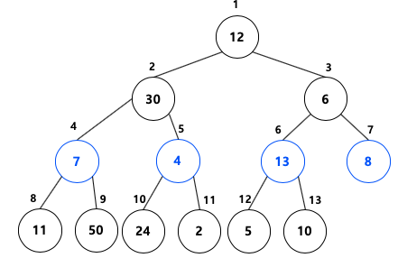
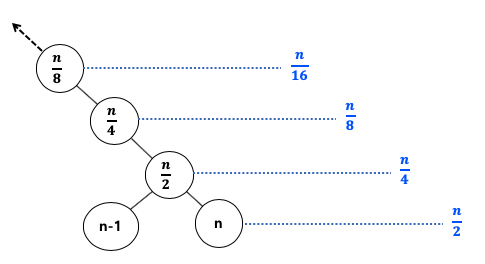

**# 힙 정렬(HeapSort)**

**## 목차**

\- [힙 개념](#개념)

- [힙 VS 이진탐색나무](#Heap-vs-Binary-Search-Tree)

- [힙을 배열로 표현](#Heap을-Array로-표현)

- [Heapify](#Heapify)
- [Heap insert & delete](#Insert-&-Delete)
- [Build Heap](#Build-heap)

\- [힙 정렬 동작 방식](#동작-방식)

\- [힙 정렬 특징](#특징)

\- [힙 정렬 시간복잡도와 공간복잡도](#시간복잡도)

\- [힙 정렬 python code](#python-code)

\- [힙 정렬 c++ code](#c-code)

\- [참조](#참조)


**## 개념**


**힙(Heap)**은 큰 키(우선 순위)에 자주 액세스 하거나 키(우선 순위) 중심으로 정렬된 시퀀스를 활용해야할 때 유용한 **자료구조**이다. <br>

힙은 한 노드(node)가 최대 두 개의 자식노드(child node)를 가지면서, 마지막 레벨을 제외한 모든 레벨에서 노드들이 꽉 채워진 <br>

**완전이진트리(complete binary tree)**를 기본으로 한다. <br>


힙 속성(heap property)는 다음의 두 가지이다.<br>

1. **Head order property** : 각 노드의 값은 자신의 자식노드가 가진 값보다 크거나 같다 (Max heap), 각 노드의 값은 자신의 자식노드가 가진 값보다 작거나 같다 (Min heap)<br>
2. **Heap shape property** : 모양은 완전 이진트리이다. 즉 마지막 레벨의 모든 노드는 왼쪽에 쏠려 있다. <br>


아래의 사진은 최대 힙 속성을 만족하는 자료구조이다.



## Heap vs Binary Search Tree

힙과 이진탐색트리는 모두 이진트리라는 점에서 공통점을 가진다. 하지만 노드값이 다소 다르게 구성되어 있는 점을 아래의 이진탐색트리사진을 보면 알 수 있다. <br>

힙은 각 노드의 값이 자식 노드보다 큰 반면, 이진탐색트리는 왼쪽 자식 노드가 제일 작고 부모노드가 그 다음 크며 오른쪽 자식 노드가 가장 큰 값을 가진다. <br>

힙은 우선순위(키) 정렬에, 이진탐색트리는 탐색에 강점을 지니는 자료구조이다. <br>




## Heap을 Array로 표현



힙은 완전이진트리의 성질을 만족하므로 위의 그림과 같이 1차원 배열로 표현이 가능하다.<br>

파이썬이나, C++에서는 데이터의 index가 0 부터 시작하므로 자식 노드의 인덱스는 다음과 같이 표현할 수 있다. <br>

index는 어떤 노드의 인덱스를 의미한다. <br>

```python
left_index = 2 * index + 1
right_index = 2 * index + 2
```

## Heapify

주어진 자료구조에서 힙 성질을 만족하도록 하는 연산을 heapify라고 한다. 아래의 그림이 그 예시이다.



먼저 root 노드인 4를 보았을 때, 4는 왼쪽 자식노드 20 보다 작으므로 힙의 성질을 만족하지 못한다. (오른쪽의 35보다도 작지만 알고리즘 구현 상 왼쪽 자식 노드 우선) <br>

따라서 4와 20의 위치를 바꿔준다. 위치를 변경 후에 힙의 성질이 유지되는지 살펴보아야 한다. <br>

4는 새로운 왼쪽 자식 노드 2보다는 크지만 오른쪽 자식노드 5보다는 작으므로 힙의 성질을 만족하지 못한다. 따라서 4와 5의 위치를 바꿔준다. <br>

위치 변경 이후에 힙의 성질이 유지되는지 살펴야하지만 더 이상 살펴볼 자식 노드가 없으므로 연산 수행을 종료한다. <br>

이러한 Heapify를 코드로 작성하면 다음과 같다.

```python
def heapify(arr, index, size):
  	largest = index
    left_index = 2 * index + 1
    right_index = 2 * index + 2
    
    if left_index < size and arr[left_index] > arr[largest]:
      	largest = left_index
    if right_index < size and arr[right_index] > arr[largest]:
      	largest = right_index
    if largest != index :
      	arr[largest], arr[index] = arr[index], arr[largest]
      	heapify(arr, largest, size)
```

heapify의 계산 복잡도는 최악의 경우 루트노드에서 잎새노드까지 값을 비교해야하므로 트리의 높이(h=log2 n)에 의존적이다. <br>

값을 바꾸거나 비교하는 연산은 O(1)이므로 계산 복잡도는 O(log n)이다.


## Insert & Delete

힙은 자료구조의 일종이므로 삽입 연산이 가능해야한다. 힙 속성 가운데 shape 속성을 만족하려면 새로운 노드는 아래의 그림과 같이 <br>

마지막 레벨의 비어있는 공간 가운데 가장 왼쪽에 들어가게 해야한다. <br>



예를 들어 다음과 같은 힙 구조에서 18을 삽입한다고 하면 마지막 레벨의 비어있는 공간 가운데 가장 왼쪽, 즉 5의 오른쪽 자식노드 위치에 처음으로 들어가게 된다. <br>



그러나 18이 들어오면서 힙의 성질이 만족되지 못하므로 heapify를 통해서 성질을 만족시켜주어야한다. <br>

먼저 18의 부모노드인 5와 비교하고 위치를 바꾸어준다. 이때 형제 노드에 대해서는 값을 비교할 필요가 없는데, 그 이유는 이미 힙 속성을 유지하고 있는 완전이진트리이기 때문에 <br>

형제노드는 자신의 부모노드보다는 작거나 같다는것이 보장 되어 있기 때문에 heapify를 진행할 때는 부모노드와만 비교를 수행해도 된다. <br>

따라서 **삽입 연산 시** heapify는 **아래에서 위**로 heapify를 진행해 준다. <br>

삽입 연산의 **계산 복잡도**는 삽입 연산 시 O(1), 해당 노드를 heapify하는데 O(log n)이 소요되므로 전체적으로 **O(log n)**이 된다. <br>

---

이제는 삭제 연산에 대해서 살펴보자. <br>



18이라는 원소를 위의 힙 구조에서 삭제하려고 할 때, 마지막 레벨의 마지막 값(힙을 배열로 표현했을 때 가장 마지막 원소) 5를 삭제된 원소의 위치에 옮긴다. <br>

이후 5가 잎새 노드에 다다르기까지 **위에서 아래**로 heapify를 진행해준다. 

삭제 연산의 계산 복잡도는 삭제하는데 드는 연산 O(1), 배열의 마지막 노드를 삭제위치로 옮기는 연산 O(1), 해당 노드를 heapify하는데 드는 연산 O(log n) 해서 **O(log n)**이다. <br>

## Build heap

임의의 숫자들을 최대 힙으로 구성하는 연산 과정을 **build heap**이라고 한다. 예를 들어 다음과 같은 리스트가 주어졌다고 해보자. <br>

list = [12, 30, 6, 7, 4, 13, 8, 11, 50, 24, 2, 5, 10] <br>

이때 위 숫자들을 가지고 build heap을 하는 가장 단순한 방법은 **차례대로 insert 연산을 수행**하여 힙을 만들어가면 된다. 하지만 이 경우에는 삽입해야하는 노드의 수가 n개라면 <br>

노드의 하나의 insert 연산을 총 n 번 반복 수행해야한다. 이 때 마지막 원소를 insert할 때 힙을 이미 구성하고 있는 노드의 수는 n - 1개일 것이므로 insert 연산의 복잡성은 O(log n) <br>

이고 이 단순한 방법의 계산 복잡도는 **O(nlog n)**이 된다. 이때 이러한 계산 복잡도를 줄이는 방법은 다음과 같다. <br>

아래의 그림과 같이 잎새노드를 가지지 않는 노드 (배열의 개수를 2로 나눈 몫을 인덱스로 하는 노드)부터 차례대로 heapify를 수행하는 것이다. <br>



즉 8, 13, 4, 7 순서대로 **위에서 아래로 heapify를 수행**하는 것이다. 이러한 방식으로 build heap을 하게되면 계산 복잡도는 다음과 같다. <br>

1개의 노드를 heapify하는데 드는 연산 O(log n)이고, n/2개 노드에 대해 heapify를 수행해야하므로 전체적인 연산은 O(nlog n)으로 단순한 방법과 똑같다. <br>

하지만 조금만 더 생각해보자. 다음과 같은 모든 레벨의 노드가 꽉 차있는 정이진트리(full binary tree)에서 오른쪽 맨 끝에 해당한다.



노드 안의 숫자들은 노드 수가 n개인 이진트리를 배열로 표현했을 때 인덱스를 나타낸다. 인덱스가 n인 데이터는 정이진트리의 오른쪽 끝 잎새노드라고 할 수 있다.<br>잎새노드에 해당하는 레벨을 d라고 했을 때 레벨이 d인 노드 수는 n/2개 이다. 왜냐하면 레벨 d−1의 오른쪽 끝 노드의 인덱스가 n/2이기 때문이다.<br>

레벨이 d−1인 노드의 수는 전체 노드(n)에서 레벨 d에 해당하는 노드 수(n/2)와 레벨 d−2에 해당하는 노드 수(n/4)를 뺀 n/4개가 됩니다.<br>

**build heap**의 계산 복잡도은 수행 대상의 노드가 전체 트리에서 차지하는 높이, 그리고 수행 대상 노드 수에 비례한다. <br>

레벨 d−1에 해당하는 노드는 그 높이가 1(=잎새노드까지의 엣지 수)입니다. 마찬가지로 레벨 d−2는 2, d−3은 3이 된다. 

따라서 build heap의 계산복잡도을 대략적으로 나타내면 다음과 같습니다.

0 x n/2^1 +1 x n/2^2 +2 x n/2^3 +3 x n/2^4 + … 

  = n/4 x (1+2 x  1/2+3 x  1/4 + …)

  = n/4 x c = **O(n)**

지금 설명한 방법이 단순하게 힙에 차례로 *insert* 연산을 수행해 힙을 만들어가는 방식보다 더 효율적임을 확인할 수 있다.


**## 동작 방식**


다음과 같이 8개의 원소를 가지는 배열 A를 정렬해야하는 상황이라고 해보자.<br>


| 인덱스 |  0   |  1   |  2   |  3   |  4   |  5   |  6   |  7   |

| :----: | :--: | :--: | :--: | :--: | :--: | :--: | :--: | :--: |

|  원소  |  5   |  5   |  3   |  4   |  5   |  1   |  0   |  4   |


정렬을 하게 되면 아래의 배열 B가 될 것이다. <br>


| 인덱스 |  0   |  1   |  2   |  3   |  4   |  5   |  6   |  7   |

| :----: | :--: | :--: | :--: | :--: | :--: | :--: | :--: | :--: |

|  원소  |  0   |  1   |  3   |  4   |  4   |  5   |  5   |  5   |


그렇다면 어떠한 과정을 거치는 지 한 번 알아보자.<br>


\1. 0~k 번째 까지 숫자중에 각 원소가 몇번 등장하는지 세어준다 (여기서 k = 5) <br>


   |   숫자    |  0   |  1   |  2   |  3   |  4   |  5   |

   | :-------: | :--: | :--: | :--: | :--: | :--: | :--: |

   | 등장 횟수 |  1   |  1   |  0   |  1   |  2   |  3   |


\2. 등장한 횟수를 누적합으로 바꾸어준다.


   |  숫자   |  0   |    1    |  2   |    3     |     4      |      5       |

   | :-----: | :--: | :-----: | :--: | :------: | :--------: | :----------: |

   | 누적 합 |  1   | 2 (1+1) |  2   | 3(1+1+1) | 5(1+1+1+2) | 8(1+1+1+2+3) |


   이 누적 합에서 알 수 있는 것은 숫자 0은 인덱스 1에 위치, 숫자 4는 인덱스 4~5에 위치한다는 것이다.


\3. 따라서 이제 배열 A를 뒤에서 앞으로 순회하면서 정렬이 될 새로운 배열 B에 넣어준다. <br>이때 이 누적합을 토대로 배열 A의 원소가 배열 B의 어디 위치에 들어 갈지를 알려주게 된다. <br>


   아래의 그림을 보고 이해해보자.


\-----------


실제로 코드를 통해서 정렬을 해본 결과 이다. 정렬 과정은 나와있지 않지만 k = 20일때 8개의 숫자가 배열에 있다고 가정할 때 <br>등장 횟수와 누적 합을 보여주는 사진이다. <br>


**## 특징**


\- ***\*안정(stable) 정렬\**** 알고리즘이다. <br>

\- ***\*비제자리(Not-in-place) 정렬\**** 알고리즘이다. (숫자 개수를 저장할 공간, 결과를 저장할 공간이 필요) <br>


\- 지금까지 다뤘던 알고리즘 중에 처음으로 ***\*비교 정렬\****이 아니다. 또한 ***\*가장 큰 원소\****에 영향을 받는다는 단점이 존재한다. 


**## 시간복잡도**


계수정렬의 시간복잡도는 ***\*O(N+K)\****이다. 만약에 K=O(N)이면 계수정렬의 시간 복잡도는 O(N)이 된다. <br>


그렇다면 과연 일반적인 상황에서의 가장 빠른 정렬 알고리즘인 퀵 소트의 평균시간 복잡도는 O(Nlog N)인데, <br>


왜 계수정렬이 아닌 퀵 소트를 가장 많이 사용할까? <br>


먼저 계수 정렬의 빠른 시간복잡도는 비교를 하지 않기 때문에 빠르다고 할 수 있지만, <br>


만약 k의 값이 너무 커진다면 일반적인 비교 정렬 알고리즘보다 느려질 수 있는 단점이 있다. <br>


예를 들어 k의 값이 100인 경우 O(n^2)이라고 할 수 있고, k의 값이 1000이면 O(N^3)이라고 할 수 있다. <br>


**## 공간복잡도**


계수 정렬의 공간 복잡도는 K의 값에 따라서 달라지며 추가적으로도 숫자의 개수를 저장할 배열, 정렬된 결과를 저장할 배열도 필요하므로 <br>


메모리 낭비가 심한 정렬 알고리즘이다.


**## python code**


\```python

\# 계수 정렬

MAX_NUM = 20

def countingSort(arr):

​    length = len(arr)

​    \# 배열 안의 원소의 개수를 세는 배열

​    count_arr =[0] * (MAX_NUM+1)

​    \# 배열의 원소들의 개수를 더해가면서 저장하는 배열 

​    count_sum = [0] *(MAX_NUM+1)

​    

​    for i in range(length):

​        count_arr[arr[i]] +=1

​    

​    count_sum[0] = count_arr[0]

​    for i in range(1,MAX_NUM+1):

​        count_sum[i] = count_sum[i-1] + count_arr[i]


​    \#sorted_arr는 정렬된 결과를 저장하는 배열 

​    sorted_arr = [0]*(length+1) 

​    for i in range(length-1, -1, -1): 

​        sorted_arr[count_sum[arr[i]]] = arr[i] 

​        count_sum[arr[i]] -= 1


​    sorted_arr = sorted_arr[1:]

​    return sorted_arr


from random import randint

lst = [randint(1,MAX_NUM) for i in range(8)] # 1부터 101사이의 랜덤 값을 8개의 list 안에 초기화

print("정렬 전 -> ",lst, end= " "); print("정렬 후 -> ",countingSort(lst))

\```


**## c++ code**


\```c++

\#include<iostream>

\#include<string>

\#define SWAP(a,b) { int temp = a; a =b; b =temp;}

\#define LEN 8

using namespace std;


int partition(int arr[], int low, int high){

​    int pivot = arr[(low+high)/2];

​    while(low <= high){

​        while(arr[low] < pivot){

​            low++;

​        }

​        while(arr[high] > pivot){

​            high--;

​        }

​        if(low <= high){

​            SWAP(arr[low],arr[high]);

​            low++;

​            high--;

​        }

​    }

​    return low;

}

void quickSort(int arr[], int low, int high){

​    if (high<=low){

​        return ;

​    }

​    int mid = partition(arr,low,high);

​    quickSort(arr,low,mid-1);

​    quickSort(arr,mid,high);

}

int main (void){

​    int arr[LEN]={};

​    srand((unsigned)time(NULL));

​    printf("정렬 전: ");

​    for (int i = 0;i < LEN; i++){

​        arr[i]= (std::rand() % 101) + 1;

​        printf("%d ", arr[i]);

​    }

​    quickSort(arr, 0, LEN-1);

​    printf("-> 정렬 후: ");

​    

​    for(int i = 0; i < LEN; i++){

​        printf("%d ",arr[i]);

​    }

​    return 0;

}

\```


**## 참조**


아래의 링크를 참조하여 작성하였습니다. <br>


[멍멍멍](https://bowbowbow.tistory.com/8#소개)<br>


[Dojin Kim](https://dojinkimm.github.io/algorithm/2019/09/22/sort-algorithm-8.html)<br>


[ZeroCho](https://www.zerocho.com/category/Algorithm/post/58006da88475ed00152d6c4b)<br>