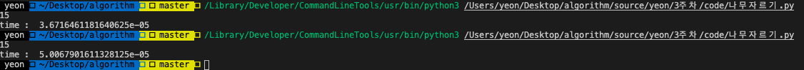

# 백준 문제
  - [1018: 체스판 다시 칠하기](https://www.acmicpc.net/problem/1018)
  - [2805 :나무 자르기](https://www.acmicpc.net/problem/2805) 
  - [1874 : 스택수열](https://www.acmicpc.net/problem/1874)

## 1018 : 체스판 다시 칠하기
### 접근 방법 
#### Python
입력의 최대가 50x50이므로 **brute-force** 로 해결해도 되는 문제이므로 brute-force방법을 사용하였다. <br>
처음에는 2가지의 답을 가지고 미리 배열로 만들어 놓고 numpy를 이용하여 배열을 비교하려고 했는데 numpy의 경우에는 코딩테스트에 사용되는 표준 모듈이 <br>
아니기도 하고, 공간적인 측면에서도 8x8배열을 2개 더 사용하는 것 같아서 다른 방법을 택하게 되었다. <br>

1. 사용자로부터 받은 입력을 2차원 리스트의 형태로 저장 e.g. [['B','W',...],['W','B',...]]<br>
2. 다음은 for문 4개를 중첩하여 2가지 answer의 형태와 비교하고, 다른 숫자들을 카운트해서 하나의 리스트에 넣는다. <br>
3. 사용자가 입력한 row, col까지 비교를 수행하여 카운트한 숫자들 중에서 가장 작은 숫자를 정답으로 제출한다. <br>
여기서의 중요한 점은 2가지 answer과 비교를 해야하는 것이며 또한 answer내에서의 규칙을 찾는 것이 중요한 부분이다. <br>
예를 들면 Black이 먼저 나오는 경우 2차원 리스트의 행과 열의 인덱스의 합이 짝수이면 항상 B가 정답, 홀수이면 W가 정답이라는 것이다. 

#### C++
접근하는 방법은 Python과 동일하게 접근하면 된다. 하지만 입력을 받는 부분에서 좀 애를 먹었다. <br>
처음에는 vector<string> v로 입력을 받으려고 했는데, 그냥 string 형태의 배열 **string a[50]** 로 받아서 a[][]로 하나의 문자씩 비교가 <br>
가능하다는 것을 알게 되었고 그래서 string 배열을 사용하여 해결하였다.

## python code
```python
#백준 1018번 체스판 다시 칠하기
row, col = map(int, input().split())
arr = [list(input()) for _ in range(row)]
min_cnt = []

# 정답이 2가지 경우이기 때문에 2가지 경우에 대해서 비교시작
# 처음 위에 2개의 for문은 입력 받은 체스판에서 8x8을 비교해야하는 이동거리
for a in range(row - 7):
	for i in range(col - 7):
		b_cnt = 0 # 맨 처음이 BLACK인 경우와 비교했을 때 다른 것을 카운트
		w_cnt = 0 # 맨 처음이 WHITE인 경우와 비교했을 때 다른 것을 카운트
    # 안에 2개의 for문은 해당 원소부터 8x8을 비교하는 부분
		for b in range(a, a + 8):
			for j in range (i, i + 8):
        # 8x8의 정답 체스판을 보면 행과 열의 합이 홀수일때와 짝수일때의 값으로 비교가 가능
				if (b + j) % 2 == 0 :
					if arr[b][j] == 'W' : b_cnt += 1
					if arr[b][j] == 'B' : w_cnt += 1
				else :
					if arr[b][j] == 'B' : b_cnt += 1
					if arr[b][j] == 'W' : w_cnt += 1
		min_cnt.append(b_cnt)
		min_cnt.append(w_cnt)
		
print(min(min_cnt))
``` 
### 메모리 및 수행 속도
메모리 : 29380 KB <br>
시간 : 108ms

## c++ code
```c++
#include <iostream>
#include <vector>
#include <string.h>
#include <algorithm>
using namespace std;

int main(void) {
	string arr[50];
	vector<int> min_cnt;
	int row = 0, col = 0;
	scanf("%d %d", &row, &col);
	
	for(int i = 0; i < row; i++){
		string str;
		cin >> str;
		arr[i] = str;
	}
	
	for (int a = 0; a < row - 7; a++){
		for(int i = 0 ; i < col - 7; i++){
			int b_cnt = 0;
			int w_cnt = 0;
			for (int b = a; b < a + 8; b++){
				for (int j = i; j < i + 8; j++){
					if ((b+j)%2 == 0){
						if(arr[b][j] == 'W') b_cnt ++;
						if(arr[b][j] == 'B') w_cnt ++;
					}
					else{
						if(arr[b][j] == 'B') b_cnt ++;
						if(arr[b][j] == 'W') w_cnt ++;
					}
				}
			}
			min_cnt.push_back(b_cnt);
			min_cnt.push_back(w_cnt);
		}
	}
	sort(min_cnt.begin(),min_cnt.end());
	printf("%d",min_cnt[0]);
	return 0;
}
```
### 메모리 및 수행 속도
메모리 : 1988 KB <br>
시간 : 0ms

## 2805 :나무 자르기

### 접근 방법 
#### Python
처음에 문제의 **입력범위**를 보고 적어도 **O(nlog n)이나 O(n)의 복잡도** 로 풀어야한다는 것을 알았다. <br>
그래서 처음에는 이진탐색이 아닌, n개의 나무를 h의 길이만큼 맞춰서 자른다면 평균적으로 잘라야하는 길이를 <br>
mid로 생각하고 mid를 기준으로 +1, -1을 하는 알고리즘을 사용했지만 시간초과로 인해서 이진탐색을 사용하게 되었다. <br>
내가 사용한 알고리즘의 경우에는 극단적인 경우에도 시간초과가 발생하지만, mid의 값이 결국 +1, -1씩 변경되므로 <br>
이진탐색보다는 훨씬 느리다는 것을 알게되었다. <br>

1. 사용자로부터 나무의 개수, 구해야하는 길이, 나무들의 높이를 입력받는다. <br>
2. 이진 탐색 알고리즘을 사용하기 위해서 left = 0, right = max(tree) 즉 최솟값과 최댓값을 기준으로 한다. <br>
3. mid = (left+right) // 2를 시작으로 하여 구해야하는 height 값에 도달할 때까지 left, right의 값을 mid+1, mid-1로 변경하여 반복 수행한다. <br> 
 <br>
이유는 모르겠으나 while문안에 for문을 돌리는 경우와 for문이 들어간 부분만 함수로 따로 빼서 계산을 한것의 수행속도 차이가 발생하여 시간초과가 발생하였다. <br>
위의 사진처럼 첫번째 3초대가 for문을 함수로 뺀 경우, 두번째 5초대가 while문안에 for문이 들어가 있는 경우의 수행속도 차이이다. <br>

#### C++
알고리즘은 python과 동일한 이분탐색으로 문제를 풀었는데, 처음에는 int로 선언하여서 틀렸다. <br>
그 이유가 입력 범위가 크다보니까 sum을 계산할 때 overflow가 발생할 수 있기 때문이다. 따라서 int가 아닌 Long long을 사용하여 해결하였다. <br>
**입력 범위가 큰 문제** 들의 경우에는 **자료형의 크기와 범위** 에 좀 더 주의해야할 것 같다. 

## python code
```python
#백준 나무자르기 문제 
import time
start = time.time()

# 기존에 while문 안에서 그냥 계산을 했는데 시간초과가 나와서
# 따로 함수로 빼서 계산을 하였음 (실제로 시간초를 제보니 함수로 따로 빼서하는 것이 더 빨랐음)
def calSum(tree, mid):
    sum = 0
    for i in tree:
        if i - mid > 0:
            sum += i - mid  
    return sum 

n, height = map(int,(input().split()))
tree = list(map(int,input().split()))
left, right = 0, max(tree)
ans = 0
while left <= right :
    mid = (left + right) // 2
    sum = calSum(tree, mid)

    if sum < height:
        right = mid -1
    if sum >= height : 
        ans = mid
        left = mid + 1
print(ans)

print("time : ",time.time()-start) #단위는 초 
``` 
### 메모리 및 수행 속도
메모리 : 146860 KB <br>
시간 : 3632 ms

## c++ code
```c++
#include<iostream>
#include<string>
#include<vector>
#include<algorithm>
using namespace std;
//파이썬과 같은 이분탐색 로직으로 문제를 풀었는데
//int로 선언하여서 통과를 못했는데 
//그 이유가 범위가 크다보니까 sum을 계산할때 overflow가 발생할 수 있음
//따라서 int가 아닌 Long long을 사용하여 해결 
long long cal_sum(vector<long long> arr, long long size, long long mid){
    long long sum = 0;
    for (long long i = 0; i < size; i++){
        if (arr[i] - mid > 0)
            sum += arr[i] - mid;
    }
    return sum;
}
void solution (vector<long long> arr, long long size, long long height){
    long long left = 0, right = *max_element(arr.begin(),arr.end());
    long long mid = 0, sum = 0, ans = 0;
    while(left <= right){
        mid = (left + right)/2;
        sum = cal_sum(arr, size, mid);

        if(sum < height)
            right = mid -1;
        if(sum >= height){
            ans = mid;
            left = mid + 1;
        }
    }
    printf("%lld",ans);
}

int main(void){
    long long num, height = 0;
    scanf("%lld %lld", &num, &height);
    vector<long long> arr ;
    for(long long i = 0; i < num; i++){
        long long n = 0;
        cin >> n;
        arr.push_back(n);
    }
    solution(arr, num, height);
    return 0;
}   

```
### 메모리 및 수행 속도
메모리 : 25816 KB <br>
시간 : 716 ms<br>

## 1874 : 스택수열

### 접근 방법 
#### Python
이 문제를 풀 때 가장 중요했던 점은 index(즉 한번 스택에 들어왔던 숫자들중 가장 큰 수)와 max(현 스택에서 남아있는 가장 큰 수)를 <br>
잘 관리하면 쉽게 풀 수 있는 문제이다. <br>

1. 먼저 사용자로부터 개수, 리스트를 입력 받는다. <br>
2. stack이 비어있는 경우, 원소가 stack에 있는 경우로 나눠 코드를 작성하였다. <br>
3. stack이 비어있는 경우, 해당 원소까지 채워주고 마지막 원소를 pop하여 배열에 저장한다. 이때 max의 값은 stack이 pop이후에 size가 0이냐 0이 아니냐에 따라서<br>
0 혹은 stack[-1](즉 현재 리스트 안에 가장 마지막 원소=최대값)을 max로 가진다.<br>
4. stack의 max가 배열의 원소보다 큰 경우 index부터 배열 원소까지 채우고 pop, max 값 변경을 해준다. <br>
5. stack의 max가 배열의 원소보다 작거나 같은 경우, pop을 하여 comp 리스트에 저장한다. <br.
6. comp와 처음에 사용자로부터 입력 받은 리스트와 비교해서 같으면 answer을 출력 아니면 NO를 출력 <br>

#### C++
기존의 python과 같은 방법으로 풀었지만, python에서는 함수에서 return 값으로 max, cnt, stack, answer를 해주었지만 c++에서는 불가능하였기 때문에 <br>
python에서는 배열을 미리 다 입력 받은 반면에, c++에서는 사용자로부터 입력을 받는 즉시 하나씩 그에 따라서 알고리즘을 수행해주었다.<br>
또한 python에서는 리스트를 stack처럼 사용한 반면에 c++코드에서는 **STL라이브러리인 stack을 사용** 하여 **top, push, pop함수**를 활용하였다.<br>
코드를 짜고나서 보니 로직을 이미 python으로 짜고나서인지 c++로 작성한 것이 더 깔끔하였다.

## python code
```python
def push(stack, i, index, max, answer):
    for j in range(index + 1, i + 1):
        stack.append(j)
        answer += "+\n"
    index = i
    comp.append(stack.pop())
    answer += "-\n"

    if len(stack) == 0: max = 0
    else : max = stack[-1]
    return stack, index, max, answer 

if __name__ == "__main__":
    arr = [] # 처음에 입력받는 배열
    comp = [] # pop에서 나오는 숫자들을 저장했다가 나중에 arr와 비교하기 위한 배열 
    stack = [] # 입력받은 배열을 순차적으로 넣었다가 빼보면서 가능한지 해보는 배열 
    answer = "" # +, - 를 저장하여 출력하기 위한 변수 
    max = 0 # 현재 stack 리스트에서의 가장 마지막에 있는 변수
    index = 0 # stack 리스트에 들어왔던 숫자들 중 가장 큰 수를 기억하기 위한 변수 
    
    num = int(input())
    for i in range (0, num):
        n = int(input())
        arr.append(n)
    
    # 사용자로부터 입력 받은 배열의 값을 가지고 for문을 돌림
    for i in arr:
        # stack의 길이가 0 인 경우 
        # 1. 아예 맨 처음에 비어있는 상태인 경우 
        # 2. 원소들이 들어왔다가 pop으로 인해서 빠져나가는 경우
        if i > max :
            stack, index, max, answer = push(stack,i,index,max,answer)
        # 현재 stack 안에 있는 max 값이 arr의 해당 원소보다 큰 경우 
        # 즉, stack 리스트 안에 i 값이 있는 경우  
        elif i <= max:
                comp.append(stack.pop())
                answer = answer + "-\n"
                if len(stack) == 0: max = 0
                else : max = stack[-1]

    if comp != arr:
        print("NO")
    else : 
        print(answer)
``` 
### 메모리 및 수행 속도
메모리 : 37512 KB <br>
시간 : 7744 ms

## c++ code
```c++
#include<iostream>
#include<string>
#include<vector>
#include<stack>

using namespace std;

int main(void){
    int len, n =0;
    scanf("%d", &len);
    
    vector<int> v;
    vector<int> comp;
    stack<int> stack;
    string answer = "";
    int max = 0, index = 0;
    
    for(int i = 0; i < len; i++){
        cin >> n;
        v.push_back(n);
        if (v[i] > max){
            for (int j = index + 1; j <= v[i]; j++ ){
                stack.push(j);
                answer += "+\n";
            }
            index = v[i];
            comp.push_back(stack.top());
            stack.pop();
            answer += "-\n";

            if(stack.size()!= 0) max = stack.top();
            else max = 0;
        }
        else{
            comp.push_back(stack.top());
            stack.pop();
            answer += "-\n";
            if(stack.size()!= 0) max = stack.top();
            else max = 0;
        }
    }
    if(v == comp) cout<<answer;
    else printf("NO");

    return 0;
}
```
### 메모리 및 수행 속도
메모리 : 4016 KB <br>
시간 : 48 ms<br>

### 참조
[이정개 블로그](https://leejunggae.tistory.com/14) <br>
[python 입력 받기](https://velog.io/@dlrmwl15/%ED%8C%8C%EC%9D%B4%EC%8D%AC-%EC%9E%85%EB%A0%A5%EB%B0%9B%EA%B8%B0)
