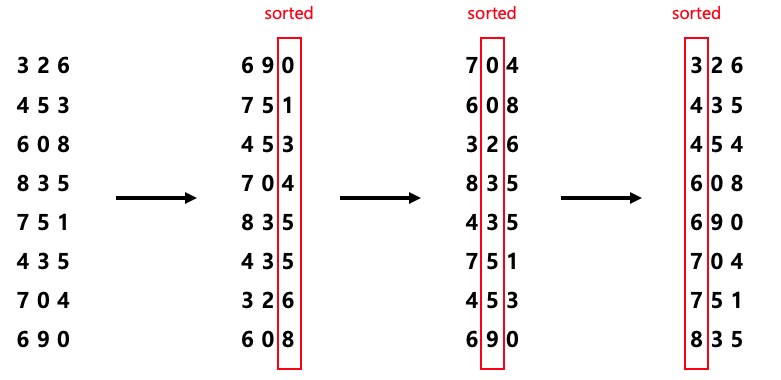

# 기수정렬(RadixSort)


## 목차

- [기수 정렬 개념](#개념)

- [기수 정렬 동작 방식](#동작-방식)

- [기수 정렬 특징](#특징)

- [기수 정렬 시간복잡도와 공간복잡도](#시간복잡도)

- [기수 정렬 python code](#python-code)

- [기수 정렬 c++ code](#c-code)

- [참조](#참조)


## 개념

기수정렬은 계수정렬과 비슷하다고 생각할 수 있는데 **기수정렬은 Radix**, **계수정렬은 Counting **정렬이다. <br>

계수정렬은 원소들의 개수를 파악하는 정렬인 반면 기수정렬은 **자리수를 비교해서 정렬**하는 방식이다. <br>

따라서 자리수가 없는 원소들은 정렬을 할 수가 없다. 예를 들면 부동소수점은 기수정렬을 사용하지 못한다. <br>

계수 정렬도 선형시간 정렬 알고리즘인데, 기수정렬은 내부에 counting sort를 이용하는데 과연 언제 기수 정렬을 사용해야할까? <br>

계수 정렬의 경우 원소의 범위가 큰 경우 빈도수를 저장할 임시 메모리가 많이 필요하기 때문에 이러한 경우에 숫자 0 - 9 범위에 있는 <br>

것만 단계적으로 정렬하는 기수 정렬을 사용하면 된다. <br>

기수정렬을 하는 방법은 두 가지가 있으며 **큰 자리수부터 비교하는 MSD**(Most Significant Digit), <br>

**작은 자리수부터 비교하는 LSD**(Least Significant Digit) 방법이다. <br>

이번에 포스팅하는 내용은 LSD 방법으로 1의 자리수, 10의 자리수, 100의 자리수 이런식으로 정렬해나가는 방법이다. <br>


## 동작 방식

다음과 같이 8개의 원소를 가지는 배열 A를 정렬해야하는 상황이라고 해보자.<br>

그렇다면 기수 정렬은 어떠한 과정을 거치는 지 한 번 알아보자.<br>

**각각의 단계가 진행될 때 반드시 stable 해야한다.** <br>

1. 1의 자리수를 정렬 <br>

2. 10의 자리수를 정렬 

3. 100의 자리수를 정렬 
4. 이러한 식으로 배열에서 가장 큰 원소의 자리수까지 정렬을 해주면 된다.  

 아래의 그림을 보고 이해해보자.




## 특징

- **안정(stable) 정렬** 알고리즘이다. <br>

- **비제자리(Not-in-place) 정렬** 알고리즘이다.  <br>

- 비교 정렬이 아니며 또한 원소에 부동소수점이 포함된다면 사용이 불가능 하다 . 


## 시간복잡도

기수정렬의 시간복잡도는 **O(d(N+k))**이다.  counting sort는 O(N+k)이고 10진수를 예로 들면 k 는 9에 불과하므로, <br>

특정 하나의 자리수를 기준으로 counting sort하는데 드는 비용은 O(N)이다. 여기서 자릿수가 d라면 이를 d번 수행하여야 한다. <br>

따라서 전체적인 시간복잡도는 **d*O(N)**이 된다. 예를 들어 1조(=10<sup>12</sup>)가 넘는 큰 숫자가 원소로 있어도 d는 12밖에 안되므로 <br>

선형시간에  가깝게 정렬을 수행할 수 있다.


## python code

```python
def countingSort(arr, digit):
    n = len(arr)

    #arr that will contain sorted arr
    sorted = [0]*n
    #arr that count the number of how many elements are in digit
    count = [0]*10

    #counting how many elements are in each digit 
    for i in range(0,n):
        index = int(arr[i] / digit)
        count[index % 10] += 1
    
    #cumulative count element at count arr
    for i in range(1,10):
        count[i] += count[i-1]
    
    i = n -1
    while i >= 0:
        index = int(arr[i]/digit)
        sorted[count[index%10]-1] = arr[i]
        count[index%10] -= 1
        i -= 1

    for i in range(0,len(arr)):
        arr[i] = sorted[i]

def radixSort(arr):
    #find the max value at arr
    max_v = max(arr)
    #digit is value, dividing the max value with multiply 10 each cycle
    digit = 1
    # repeat until the max value's quotient is bigger than 0 
    while int(max_v/digit) > 0 :
        countingSort(arr,digit)
        digit *= 10

from random import randint
arr = [randint(1,101) for i in range(8)] # 1부터 101사이의 랜덤 값을 8개의 list 안에 초기화
print("정렬 전 : ", arr, end=" ") 
radixSort(arr)
print ("-> 정렬 후 : ",arr) 


```

## c++ code

```c++
#include <iostream>
#include <string>
#include <random>
#include <algorithm>
#define LEN 8 
using namespace std;

void countingSort(int arr[], int digit){
    int sorted[LEN];
    int count[10] = {0,};

    for(int i = 0; i < LEN; i++){
        int index = arr[i]/digit;
        count[index%10] += 1;
    }

    for(int i = 1; i < 10 ; i ++){
        count[i] += count[i-1];
    }
    
    int a = LEN -1;
    while(a >= 0){
        int index = arr[a] / digit;
        sorted[count[index % 10] - 1] = arr[a];
        count[index % 10] -= 1;
        a--;
    }
    for(int i = 0; i < LEN ; i++){
        arr[i] = sorted[i];
    }
}

void radixSort(int arr[], int len){
    int digit = 1;
    int max_value = *max_element(arr,arr+len);

    while(max_value/digit > 0){
        countingSort(arr,digit);
        digit *= 10;
    }
}

int main(void){
    srand(time(NULL));
    int arr[LEN];
    printf("정렬 전 : ");
    for(int i = 0 ; i < LEN; i++){
        arr[i] = rand()%100+1;
        printf("%d ", arr[i]);
    }
    printf("-> 정렬 후 : ");
    radixSort(arr, LEN);
    for(int i = 0; i< LEN; i++)
        printf("%d ", arr[i]);

    return 0;
}
```

## 참조


아래의 링크를 참조하여 작성하였습니다. <br>

[ratsgo's blog](https://ratsgo.github.io/data structure&algorithm/2017/10/16/countingsort/)<br>

[잭팟53](https://jackpot53.tistory.com/44?category=715471)<br>

[ZeroCho](https://www.zerocho.com/category/Algorithm/post/58007c338475ed00152d6c4c)<br>