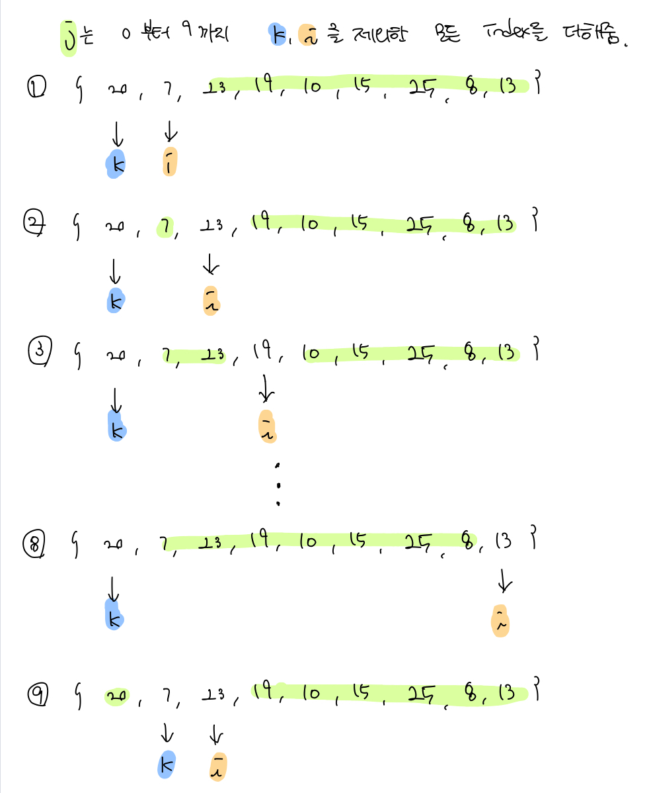
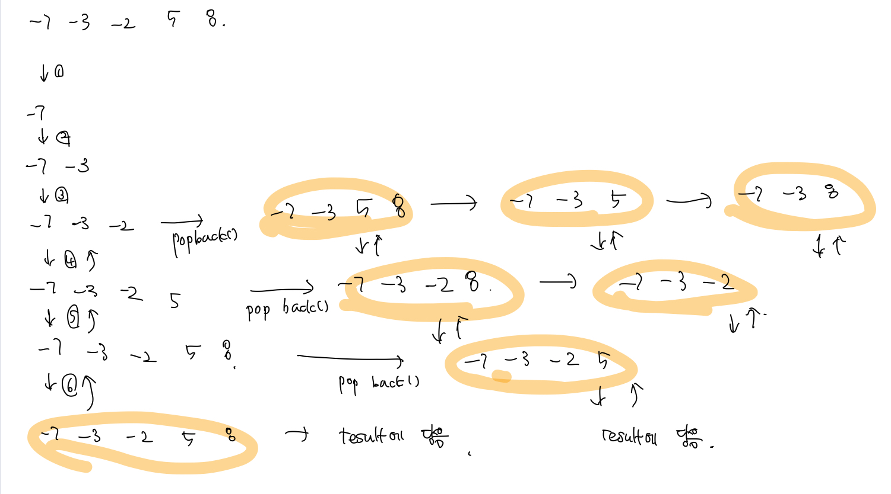
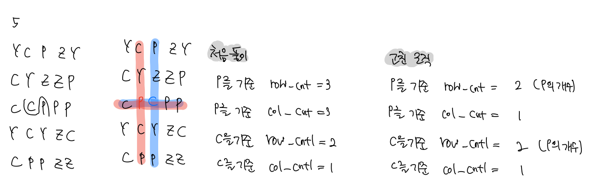

# 백준 문제

  - [2309 : 일곱 난쟁이](#2309-일곱-난쟁이)
  - [2503 : 숫자야구](#2503-숫자야구)
  - [1182 : 부분 수열의 합](#1182-부분-수열의-합)

- [3085 : 사탕 게임](#3085-사탕-게임)


## 2309 일곱 난쟁이 

[문제로 이동](https://www.acmicpc.net/problem/2309)

### 접근 방법 

#### Python

주어진 9명의 난쟁이들의 키들 중에서 합이 100이 되는 7명의 난쟁이가 되는 경우를 아무거나 하나 출력하면 된다. <br>

python은 순열과 조합을 매우 쉽게 사용할 수 있기 때문에 조합을 사용하기로 하였다. <br>

**조합(Combinations)과 순열(permutations)의 차이점**은 다음과 같다. <br>

**순열**은 **순서가 있는 조합**으로, 즉 원소의 **순서가 의미가 있는 것**인 반면 **조합**은 **원소의 순서가 상관이 없다**. <br>

1. 사용자로부터 키를 입력받아서 list에 넣어준다. <br>

2. 이 문제의 경우 합만 100이면 되는 것이지 **순서에는 의미가 없기 때문에 <sub>9</sub>C<sub>7</sub>  의 조합**을 구해서 list 에 저장한다.<br>

   이때 조합이 배열에 저장될 때는 **tuple 형태로 저장됨**을 유의해야한다. 

3. 조합을 구한 list의 경우들 중에서 합이 100되는 경우를 반복문을 통해서 찾는다. <br>

4. 100이 되는 경우를 찾으면 해당 경우를 **tuple에서 list로 변경**하고 sort를 진행한 뒤 정답 형태에 맞게 출력한다.<br>


#### C++

python과 동일하게 c++에도 조합과 순열을 사용할 수 있지만 이번에는 라이브러리를 사용하지 않고 풀기로 하였다. <br>

 <br>

위의 그림과 같이 입력 받은 원소들 중에서 2개씩 빼고 더해서 합이 100이 되는 경우를 찾아서 정렬 후 출력한다.<br>

1. 사용자로부터 받은 입력을 배열 형태로 저장한다. <br>
2. 2개의 원소를 제외하고 더해서 100이 되는 경우가 나올 때 까지 반복해서 진행한다.<br>
3. 100이 되는 경우 index k, i 번째의 원소 값을 0으로 바꿔준 뒤 sort를 진행한다.<br>
4. 따라서 k, i는 0,1 번째에 위치하게 되고 2번째 원소부터 마지막 원소까지 출력해주면 된다.<br>


## python code

```python
# 백준 2309 일곱 난쟁이
# python solved by combinations + brute-force
from itertools import combinations
# combinations(조합)과 permutations(순열)의 차이
# 순열은 순서가 있는 조합 즉, 순열은 원소의 순서가 상관이 있음 
# 조합은 순서가 상관 없다

height = []
for i in range(9):
    n = int(input())
    height.append(n)

# make combinations with height list having 7 elements
a = list(combinations(height,7))

for i in a:
    sum = 0
    for j in range(7):
        sum += i[j]
    if sum == 100:
        ans = list(i)
        ans.sort()
        for i in ans:
            print(i,end="\n")
        exit()
```

### 메모리 및 수행 속도

메모리 : 29380 KB <br>

시간 : 60ms <br>


## c++ code

```c++
// 백준 2309 일곱 난쟁이
// cpp solved by brute-force 
#include <iostream>
#include <algorithm>

int main(void){
    // get height from user
    int arr[9], num = 0;
    for (int i = 0; i < 9; i++){
        scanf("%d", &num);
        arr[i] = num;
    }
    
    int sum = 0, cnt = 0, k = 0;
    while (1){
        int i, j;
        for (i = k + 1; i < 9; i++){
            sum = 0, cnt = 0;
            for (j = 0; j < 9; j++){
                if (j == k);
                else if (j == i);
                else{
                    sum += arr[j];
                    cnt++;
                }
            }

            if (sum == 100 && cnt == 7){
                // make k's, i's value zero and sort
                // and print sum from 2nd element which means
                // sum arr except k, i's index
                arr[k] = 0, arr[i] = 0;
                std::sort(arr, arr + 9);
                for (int i = 2; i < 9; i++){
                    printf("%d\n", arr[i]);
                }
                exit(0);
            }
        }
        k++;
    }
    return 0;
}
```

### 메모리 및 수행 속도

메모리 : 1984 KB <br>

시간 : 0 ms


## 2503 숫자야구

[문제로 이동](https://www.acmicpc.net/problem/2503)

### 접근 방법 

가능한 야구 숫자를 모두 생성하고 입력받는 야구 숫자를 하나씩 비교하여 가능한 정답의 수를 출력한다.

#### Python

처음에는 python의 순열(permutation)을 사용하여 [1,2,3,4,5,6,7,8,9]에서 3개를 뽑아서 모든 경우의 수를 만들고 하나씩 비교를 하였다. <br>

하지만 **순열의 결과가 tuple**이기도 하고, 결과 list에서 remove를 하게되면 원소의 index가 하나씩 밀리는 문제를 해결하지 못해서 <br>

결국 다른 방법을 선택하였다. 개념은 역시나 위에서 적용한 것처럼 가능한 야구 숫자를 모두 생성하고 비교를 하는 방법이다.<br>

야구 숫자는 **세자리의 숫자가 각각 달라야하며, 0은 들어가지 못하므로 123-987까지의 범위에서 겹치지 않고 0을 가지지 않는 숫자**들을 <br>

저장하게 되면 모든 경우의 야구 숫자를 저장할 수 있다. <br>

1. 가능한 모든 야구 숫자를 리스트에 저장한다.
2. 사용자로부터 야구숫자, 스트라이크, 볼의 개수를 입력받는다.
3. 입력 받은 야구숫자와 가능한 야구숫자의 각각의 자릿수를 비교해서, strike와 ball의 개수가 같은 정답이 될 수 있는 경우를 리스트에 저장한다. <br>
4. 가능한 모든 야구 숫자 리스트에 정답 가능한 리스트를 저장하여 경우의 수를 줄여서 다시 2-3번을 반복한다.
5. 마지막으로 a의 길이를 출력하면 된다.


#### C++

python과 동일한 로직을 이용해서 풀었으며 주의해야할 점은 벡터를 복사하는 방법이다. <br>

Vector를 복사하는 방법은 2가지가 있으며 copy, assign을 사용하는 것이다. <br>

1번. copy를 사용한 방법 => copy(src.begin(), src.end(), dst.begin()) <br>

2번. assign을 사용한 방법 => dst.assign(src.begin(), src.end()); <br>


## python code

```python
# 백준 2503 숫자야구
# python solved by brute-force

N = int(input())
a, c = [], []

# baseball num can only be from 1-9 
# and it can't have same number in each digit
# so put possible baseball num in list[] a from 123 - 987
for i in range(123,988):
    if str(i)[0] == str(i)[1] or str(i)[1] == str(i)[2] or str(i)[0] == str(i)[2] or str(i)[1] == '0' or str(i)[2] == '0' :
        continue
    else : a.append(i)

for i in range(N):
    num, strike, ball = map(int,input().split())
    for result in a :
        s, b = 0, 0
        result_num = str(result)
        input_num = str(num)

        # compare result_num and input_num's digit whether it is strike or not
        if result_num[0] == input_num[0] : s += 1
        if result_num[1] == input_num[1] : s += 1
        if result_num[2] == input_num[2] : s += 1

        # compare result_num and input_num's digit whether it is ball or not
        if result_num[0] != input_num[0] and result_num[0] == input_num[1] or result_num[0] == input_num[2] : b += 1
        if result_num[1] != input_num[1] and result_num[1] == input_num[0] or result_num[1] == input_num[2] : b += 1
        if result_num[2] != input_num[2] and result_num[2] == input_num[0] or result_num[2] == input_num[1] : b += 1

        # if result_num has same strike and ball 
        # put it into list[] c
        if s == strike and b == ball:
            c.append(result)
    
    # by assign c to a
    # it can erase result_num 
    # which doesn't corresspond to input_num
    a = c
    c = []

print(len(a))
```

### 메모리 및 수행 속도

메모리 : 29380 KB <br>

시간 : 72 ms <br>

## c++ code

```c++
// 백준 2503 숫자야구
// cpp solved by brute-force
#include <iostream>
#include <string>
#include <vector>
using namespace std;

int main(void){
    // result save every possible baseball num
    vector<int> result;
    // temp save baseball num that have been compared with result
    // and have possible of being answer 
    vector<int> temp;
    
    int N, num,strike,ball;
    for (int i = 123; i < 988; i++){
        if(to_string(i)[0] == to_string(i)[1] || to_string(i)[1] == to_string(i)[2] || to_string(i)[0] == to_string(i)[2] || to_string(i)[1] == '0' || to_string(i)[2] == '0')
            continue;
        else result.push_back(i);
    }
    scanf("%d",&N);
    for(int i = 0; i < N; i++){
        scanf("%d %d %d", &num, &strike, &ball);
        for (int j = 0; j < result.size(); j++){
            int s = 0, b = 0;
            string result_num = to_string(result[j]);
            string input_num = to_string(num);
            
            if(result_num[0] == input_num[0]) s ++;
            if(result_num[1] == input_num[1]) s ++;
            if(result_num[2] == input_num[2]) s ++;
            if(result_num[0] != input_num[0] && (result_num[0] == input_num[1] || result_num[0] == input_num[2])) b ++;
            if(result_num[1] != input_num[1] && (result_num[1] == input_num[0] || result_num[1] == input_num[2])) b ++;
            if(result_num[2] != input_num[2] && (result_num[2] == input_num[0] || result_num[2] == input_num[1])) b ++;

            if(strike == s && ball == b) temp.push_back(result[j]);
        }
        // to copy vector there 2 way
        // 1 - copy => copy(temp.begin(), temp.end(), result.begin())
        // 2 - assign => result.assign(temp.begin(),temp.end());
        result.assign(temp.begin(),temp.end());
        // to erase all element in vector => clear() 
        temp.clear();
    }
    printf("%d", result.size());
    return 0;
}
```

### 메모리 및 수행 속도

메모리 : 1984 KB <br>

시간 : 0 ms<br>


## 1182 부분 수열의 합 

[문제로 이동](https://www.acmicpc.net/problem/1182)

### 접근 방법 

#### Python

 N개의 정수로 이루어진 수열에서, 크기가 양수인 부분수열 중 부분 수열의 원소를 다 더한 값이 S인 경우의 수를 찾아야 한다.<br>

따라서 python에서는 **조합(Combination)** 을 사용하여 문제를 해결하였다.

1. 사용자로부터 N, S와 수열의 값들을 입력받아서 list의 형태로 저장한다. <br>
2. 조합을 원소의 개수가 1개부터 N개까지 가능한 경우들을 만들어준다. <br>
3. 각각의 개수에서 생성되는 부분수열들의 합을 구하고 합이 S와 일치하는 경우에는 count를 해준다. <br>
4. count의 값을 출력 <br>


#### C++

C++에서도 조합을 사용하여 문제를 풀면된다. 하지만 python과 다르게 Combination STL이 따로 없으므로 재귀로 구현해준다. <br>

 <br>

위의 사진과 같이 index가 0인 원소부터 시작해서 Combination 함수를 반복한다. <br>

1. 사용자로부터 N, S와 수열의 값들을 입력받아서 arr라는 백터에 저장한다. <br>
2. 먼저 N개의 수열에서 만들 수 있는 모든 조합을 생성해서 result라는 2차원 벡터에 넣어준다. <br>
3. 생성된 모든 조합을 저장하고 있는 result 백터에서 각각의 경우에 대해서 sum을 구해서 S와 일치하면 count해준다.<br>
4. count의 값 출력 <br>


## python code

```python
# 백준 1182 부분수열의 합
# python solved by combinations and brute-force
from itertools import combinations

N, S = map(int, input().split())
arr = list(map(int,input().split()))

cnt = 0
# make combinations 1 to N
# and check the sum of each case 
# if there's any answer exist 
for i in range(1,N+1):
    a = list(combinations(arr,i))
    for j in a :
        sum = 0
        for h in range(i):
            sum += j[h]
        if sum == S :
            cnt +=1
print(cnt)
```

### 메모리 및 수행 속도

메모리 : 78548 KB <br>

시간 : 1988 ms <br>


## c++ code

```c++
// 백준 1182 부분수열의 합
// cpp solved by combinations and brute-force
#include <iostream>
#include <algorithm>
#include <vector>
using namespace std;
vector<int> arr; // save input from user
vector<vector<int>> result; // save combination result
vector<int> sub;
int N, S;

void combination(int k){
  	// if index is same as size of arr
    // push it to result[]
    if(k == N){
        result.push_back(sub);
    }else{
        sub.push_back(arr[k]);
        combination(k+1);
        sub.pop_back();
        combination(k+1);
    }
}

int main(void){
    int num, cnt = 0;
    long long sum;
    
    scanf("%d %d",&N, &S);
    for (int i = 0; i < N; i++){
        scanf("%d", &num);
        arr.push_back(num);
    }

    // start recurisve from index 0 
    combination(0);

    // check is value which prevent counting cnt 
    // even though there's nothing to calculate 
    int check;
    for(int i = 0; i <result.size();i++){
        sum = 0, check = 0;
        for(int j = 0; j < result[i].size();j++){
            sum += result[i][j];
            check++;
        }
        if(sum == S && check > 0) cnt++;
    }
    printf("%d", cnt);
    return 0;
}
```

### 메모리 및 수행 속도

메모리 : 81768 KB <br>

시간 : 124 ms<br>


## 3085 사탕 게임 

[문제로 이동](https://www.acmicpc.net/problem/3085)

### 접근 방법 

#### Python

처음에는 사용자로 부터 board를 입력받고 swap을 하고 swap을 한 원소와, 당한 원소를 기준으로 십자가 모양으로 **[0 - N)**까지 **해당 원소와 <br>**

**일치하는 원소의 개수를 카운트** 하였다. 그러나 이렇게 카운트를 하면 실제로 이어진 것만 먹을 수 있는 캔디가 아니므로 잘못됨을 깨달았다.<br>

또한 해당 원소를 기준으로 카운트하는 것이 아닌 해당 원소가 있는 가로, 세로줄에서 이어져 있는 색의 가장 큰 경우를 찾는 것이기 때문에 <br>

로직을 **[0 - N-1)** 까지로 변경하고 board[nx] [a] == board\[nx][a+1]와 일치하는, 즉 전의 원소와 일치하는 경우만 카운트를 하고 <br>

전의 원소와 일치하지 않으면 다시 1부터 카운트하도록 로직을 바꾸었더니 해결하였다.<br>

  <br>


#### C++

python으로 푼 방법이 왜 풀렸는지 잘 모르겠다. 정확한 로직은 cpp로 작성한 것이 맞는 것 같다. <br>

입력받은 board에 대해서 모든 경우를 뒤바꿔보고, 뒤바뀐 상태에서의 board전체를 검사해서 가장 긴 값을 찾아내는 것을 <br>

board 전체에 대해서 진행하여 최종적으로 가장 긴 값을 찾으면 된다. <br>


## python code

```python
# 벡즌 3085 사탕게임
# python solved by bfs
dx = [1,0]
dy = [0,1]

def bfs(x:int, y:int):
    global answer
    # to remove overlap case
    # save [x,y] as set
    q = set([(x,y)])
    while q:
        x, y = q.pop()
        # because checking every element in row, col
        # based on swaped point and swaping point 
        # it doesn't have to check left, down (just check right, up)
        for i in range (2):
            nx, ny = x + dx[i] , y + dy[i]
            if 0 <= nx < N and 0 <= ny < N:
                q.add((nx,ny))
                board[x][y], board[nx][ny] = board[nx][ny], board[x][y]
                col_cnt, row_cnt, col_cnt1, row_cnt1= 1,1,1,1
                # count after change 
                for a in range(N-1):
                    # if the element is continously same
                    if board[nx][a] == board[nx][a+1]:
                        col_cnt += 1
                    # if element is not same as right before element
                    else : col_cnt = 1
                    if board[a][ny] == board[a+1][ny]:
                        row_cnt += 1
                    else : row_cnt = 1
                    if board[x][a] == board[x][a+1]:
                        col_cnt1 += 1
                    else : col_cnt1 = 1
                    if board[a][y] == board[a+1][y]:
                        row_cnt1 += 1
                    else : row_cnt1 = 1
                    answer = max(answer,max(max(col_cnt,row_cnt),max(col_cnt1,row_cnt1)))
                # swap again after check one case
                board[x][y], board[nx][ny] = board[nx][ny], board[x][y]

N = int(input())
board = [list(input()) for _ in range(N)]
answer = 0
bfs(0,0)
print(answer)
```

### 메모리 및 수행 속도

메모리 : 29380 KB <br>

시간 : 3948 ms <br>


## c++ code

```c++
// 벡즌 3085 사탕게임
// cpp solved by brute-force
#include <iostream>
#include <algorithm>
using namespace std;
const int dx[] = { 0,1 };
const int dy[] = { 1,0 };
int N, ans;
char board[50][50];

int check() {
	// answer is act like global variable 
	// it save the final max value from this check function
	// cnt is value that count each case 
	int answer = 1, cnt = 1;
	for (int i = 0; i < N; i++) {
		// check every col in board
		for (int j = 0; j < N ; j++) {
			if (board[i][j] == board[i][j + 1]) cnt++;
			else answer = max(answer, cnt), cnt = 1;
		}
		answer = max(answer, cnt), cnt = 1;
		// check every row in board
		for (int j = 0; j < N ; j++) {
			if (board[j][i] == board[j + 1][i]) cnt++;
			else answer = max(answer, cnt), cnt = 1;
		}
		answer = max(answer, cnt), cnt = 1;
	}
	return answer;
}

int main() {
	scanf("%d", &N);
    for(int i = 0; i < N; i++){
        for(int j = 0; j < N; j++){
            cin >> board[i][j];
        }
    }
	for (int x = 0; x < N; x++) {
		for (int y = 0; y < N; y++) {
			for (int i = 0; i < 2; i++) {
				int nx = x + dx[i], ny = y + dy[i];
				if(nx >= 0 && nx < N && ny >= 0 && ny < N){
				swap(board[x][y], board[nx][ny]);
				ans = max(ans, check());
				swap(board[x][y], board[nx][ny]);
                }
			}
		}
	}
	printf("%d", ans);
	return 0;
}

```

### 메모리 및 수행 속도

메모리 : 1988 KB <br>

시간 : 32 ms<br>


### 참조

[GODOG's blog - 1182번 combination 재귀 함수를 이용하여 구현](https://godog.tistory.com/entry/C-%EC%A1%B0%ED%95%A9Combination-%ED%9A%8C%EA%B7%80%EB%A5%BC-%EC%9D%B4%EC%9A%A9)  <br>


