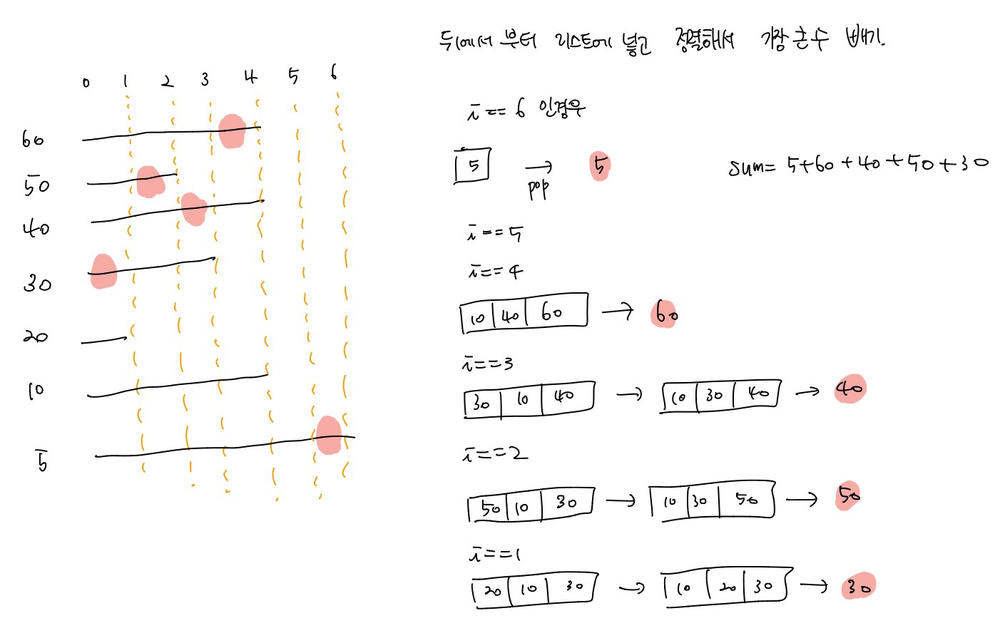

# 백준 문제

  - [13904 : 과제](#13904-과제)
  - [4796 : 캠핑](#4796-캠핑)
  - [1449 : 수리공 항승](#1449-수리공-항승)

- [1520 : 내리막길](1520-내리막길)


## 13904 과제

[문제로 이동](https://www.acmicpc.net/problem/13904)

### 접근 방법 

#### Python

과제 문제를 풀 때 한가지 헷갈린 점이 있는데 바로 N과 d의 관계이다. 실제로는 N은 과제의 개수이고 d는 마감일인데 <br>

d같은 경우는 1-1000까지 검사를 해야하는데 이를 예시를 보고 N으로 생각해서 계속 틀렸다. <br>

1. 먼저 사용자로 부터 N, d, w를 입력받고 d,w는 리스트의 형태로 저장한다. <br>
2. 밑의 그림을 보듯이 주어진 d일 중 가장 마지막 d일을 기준으로 하여 1일까지 역순으로 풀었다. <br>
3. d일에 해당하는 과제들의 점수를 result라는 리스트에 넣고 그중에서 제일 큰 점수를 하나씩 pop() 해주었다. <br>
4. 그렇게 1일까지 pop()한 값들을 더해주면 최대값을 구할 수 있다. 




#### C++

python과 동일한 로직으로 풀었으며 vector<pair<int,int>>를 사용하여 값을 저장하였다. 


## python code

```python
# 백준 13904 과제
# python solved by Greedy algorithm + sort

N = int(input())
arr = [list(map(int,input().split())) for _ in range(N)]
result = []
sum,ans = 0,0
# range should be from 1-1000
for i in range(1000,0,-1):
	for j in range(N):
		if arr[j][0] == i:
			result.append(arr[j][1])
	result.sort()
	if result :
		ans = result.pop()
		sum += ans

print(sum)
```

### 메모리 및 수행 속도

메모리 : 29380 KB <br>

시간 : 200ms <br>


## c++ code

```c++
// 백준 13904 과제
// cpp solved by Greedy algorithm + sort
#include <iostream>
#include <vector>
#include <algorithm>
using namespace std;

int main(void){
	int N, d, w, sum = 0;
	vector<pair<int,int>> pv;
	vector<int> result;
	scanf("%d",&N);
	for (int i = 0 ; i < N; i++){
		scanf("%d %d", &d, &w);
		pv.push_back(make_pair(d,w));
	}
	// range shold be 1-1000
	for(int i = 1000; i > 0; i--){
		for(int j = 0; j< N; j++){
			if(pv[j].first == i){
				result.push_back(pv[j].second);
			}
		}
		sort(result.begin(),result.end());
		if(!result.empty()){
			int max = result.back();
			sum += max;
			result.pop_back();
		}
	}
	printf("%d", sum);
	return 0;
}
```

### 메모리 및 수행 속도

메모리 : 1984 KB <br>

시간 : 0 ms <br>


## 4796 캠핑

[문제로 이동](https://www.acmicpc.net/problem/4796)

### 접근 방법 

#### Python

1. 사용자로부터 L, P, V가 0,0,0일때 까지 입력받아서 list에 저장한다. <br>

2. 경우를 2가지로 나눠서 출력 형태에 맞추어 출력해준다. <br>

   2-1 만약 V일 짜리 휴가를 P 연속할 수 있는 캠핑장 날수로 V % P 연산한 것이 L(사용가능한 날)보다 큰 경우는 L을 더해주면 되고 <br>

   2-2  V일 짜리 휴가를 P 연속할 수 있는 캠핑장 날수로 V % P 연산한 것이 L(사용가능한 날)보다 작은 경우는 V % P를 더해주면 된다. <br>


#### C++

python과 동일한 로직을 이용해서 풀었으나 L, P, V의 입력을 받아서 배열에 저장하지 않고 해당 케이스에 대한 출력을 바로 해주었다. <br>


## python code

```python
# 백준 4796 캠핑
# python sovled by Greedy algorithm
arr = []
L,P,V = 1,1,1

# get input from user
while True:
    L,P,V = map(int,input().split())
    arr.append([L,P,V])
    if L == 0 and P == 0 and V == 0 : break

for i in range(len(arr)-1):
    # V % P < L
    if arr[i][2] % arr[i][1] < arr[i][0] : 
        print("Case {}: {}".format(i+1, int(arr[i][2]/arr[i][1])*arr[i][0] + arr[i][2] % arr[i][1]))
    # V % P > L 
    else :
        print("Case {}: {}".format(i+1, int(arr[i][2]/arr[i][1])*arr[i][0] + arr[i][0]))

```

### 메모리 및 수행 속도

메모리 : 29380 KB <br>

시간 : 88 ms <br>

## c++ code

```c++
// 백준 4796 캠핑
// cpp sovled by Greedy algorithm

#include <iostream>
int main(void){
    int L,P,V, cnt =1;
    do{
        scanf("%d %d %d", &L, &P, &V);
        if(L == 0 && P == 0 && V == 0) break;
        else{
            if(V % P < L)
                printf("Case %d: %d\n", cnt, (V/P)*L + V%P);
            else
                printf("Case %d: %d\n", cnt, (V/P)*L + L);
            cnt ++;
        }
    }while(L != 0 && P != 0 && V != 0);
    return 0;
}
```

### 메모리 및 수행 속도

메모리 : 1984 KB <br>

시간 : 0 ms<br>


## 1449 수리공 항승 

[문제로 이동](https://www.acmicpc.net/problem/1449)

### 접근 방법 

#### Python

 물이 새는곳의 개수 N과 테이프의 길이 L이 주어졌을 때, 총 필요한 테이프의 개수를 구하면 된다. <br>

이때 물이 새는 곳은 오름차순으로 준다는 말이 없으므로 입력을 받은 후에 정렬을 진행해 주어야 한다. <br>

처음에는 for문을 돌리면서 현재 원소보다 다음원소가 만약 테이프의 길이 안에 포함이 되는 경우를 count하고 삭제하려고 했지만 <br>

삭제한 후에는 Index out of list 오류로 인해서 다른 방법을 생각하게 되었다. <br>

1. 먼저 사용자로부터 N, L, 위치를 입력받아 list에 저장한다.
2. 물이 새는 위치는 오름차순으로 준다는 얘기가 없었으므로 정렬을 통해 오름차순으로 만들어준다.
3. tape_range보다 작다면 하나의 테이프로 커버가 가능하므로 가만히 두고
4. tape_range보다 크다면 테이프를 하나 카운트하고 새로운 tape_range를 설정해준다.


#### C++

python과 동일한 알고리즘으로 문제를 해결하였다. <br>


## python code

```python
# 백준 1449 수리공 항승
# python solved by Greedy algorithm
N,L = map(int,input().split())
arr = list(map(int,input().split()))

cnt, tape_range = 0, 0
arr.sort()

# put tape first and set tape_range 
# and check arr element if its in range 
# if they are out of range, put another tape and set again
for i in range(0, len(arr)):
    if arr[i] + 0.5 > tape_range :
        cnt += 1
        tape_range = arr[i] - 0.5 + L

print(cnt)
```

### 메모리 및 수행 속도

메모리 : 29380 KB <br>

시간 : 64 ms <br>


## c++ code

```c++
// 백준 1449 수리공 항승
// cpp solved by Greedy algorithm
#include <iostream>
#include <algorithm>
#define MAX 1000

int main(void){
    int N, L, ans = 0;
    int arr[MAX];
    scanf("%d %d",&N,&L);
    for(int i = 0; i < N; i++){
        scanf("%d",&arr[i]);
    }
    std::sort(arr, arr+N);
    float tape_range = 0;
    for(int i = 0; i < N; i++){
        if(arr[i] + 0.5 > tape_range){
            ans ++;
            tape_range = arr[i] - 0.5 + L;
        }
    }
    printf("%d",ans);
    return 0;
}
```

### 메모리 및 수행 속도

메모리 : 1984 KB <br>

시간 : 0 ms<br>


## 1520 내리막길

[문제로 이동](https://www.acmicpc.net/problem/1520)

### 접근 방법 

#### Python

처음에는 dfs로만 접근을 하여 목적지에 도착하는 경우 답을 +1 해주는 식으로 풀었는데, 시간초과가 발생하였다. <br>

따라서 dynamic programming을 사용하여 문제를 해결하였다. <br>

DP란 동적 계획법으로 **전체문제를 여러개의 하위 문제로 나누어 풀고, 하위 문제들의 해결 방법들을 결합하여 최종 문제를 해결하는 방식**이다. <br>

쉽게 말하면, **기존에 풀었던 문제들을 어딘가에 저장해두어서 다음번에 반복을 하지않도록 하는 것**이다. <br>

너무 추상적인 이야기이므로 이 문제에 맞춰 설명을 해보면, 기존에 풀었던 dfs의 경우에는 왔던 길도 계속해서 반복하여 탐색을 하게 된다. <br>

이때 dp라는 2차원 리스트를 -1로 초기화하여, 방문을 할 때 0으로 설정을 해준다. 최종 목적지에 도착하는 경우는 dp의 값이 1이 반환된다. <br>

따라서 경우가 여러가지인 경우에는 1이상의 값이 저장된다. -1인 경우 아직 방문하지 않은 곳이니까 dfs와 dp를 이용하여 탐색하게된다. <br>

1. 사용자로부터 M,N, 리스트를 입력받는다.  <br>
2. 리스트의 크기만큼 dp 리스트를 -1로 초기화한다.  <br>
3. 초기 출발지부터 목적지까지의 과정을 dfs와 dp를 사용하여 탐색하고 결과를 출력한다.  <br>

**Python3**로 제출하는 경우 runtime error가 발생하길래 찾아보니 재귀를 사용하는 경우 **재귀의 깊이를 설정해주어야 한다**고 한다. <br>

**PyPy3**로 제출하는 경우 **재귀의 깊이를 설정하지 않아도 제출은 가능**하지만 공간적으로나 시간적으로 더 많은 시간이 소요된다. <br>


#### C++

python과 같은 로직으로 풀었으며, memset을 이용해 초기화해주었는데 string.h를 include 하지 않아서 런타임 에러 발생 <br>


## python code

```python
# 백준 1520 내리막길 
# python solved by dfs + dp 
# make python recursive depth as 10^9 if not runtime error occur
from sys import setrecursionlimit 
setrecursionlimit(10**9)

dx = [1,0,-1,0]
dy = [0,1,0,-1]

def dfs(x, y):
    # if x,y get to the dst return 1
    if x == M-1 and y == N-1 : return 1
    # if x,y out of bound return 0
    if x<0 or x>M or y<0 or y>N : return 0
    # if x,y had been to the place before return dp[x][y]
    if dp[x][y] != -1 : return dp[x][y]

    dp[x][y] = 0
    for i in range(4):
        nx, ny = x + dx[i], y + dy[i]
        if 0 <= nx < M and 0 <= ny < N : 
            if arr[nx][ny] < arr[x][y] :
                dp[x][y] += dfs(nx,ny)
    return dp[x][y]

M, N = map(int,input().split())
arr = [list(map(int,input().split())) for _ in range(M)]
dp = [[-1] * N for _ in range(M)]
print(dfs(0,0))
```

### 메모리 및 수행 속도

Python3로 채점 (재귀의 깊이 설정)		PyPy3로 채점 (재귀 깊이 설정 불가능) <br>

메모리 : 41500 KB 								메모리 : 130200KB	<br>

시간 : 192 ms 									   시간 : 268ms	<br>


## c++ code

```c++
// 백준 1520 내리막길 
// cpp solved by dfs + dp 

#include <iostream>
#include <string.h>
#define MAX 500
int N,M;
int map[MAX][MAX];
int dp[MAX][MAX];
int dx[] ={1,0,-1,0};
int dy[] ={0,1,0,-1};

int dfs(int x, int y){
    if(x == M-1 && y == N-1) return 1;
    if(dp[x][y] != -1) return dp[x][y];

    dp[x][y] = 0;
    for(int i = 0; i < 4; i++){
        int nx = x + dx[i];
        int ny = y + dy[i];

        if(nx>=0 && nx <M && ny>=0 && ny<N){
            if(map[x][y] > map[nx][ny]){
                dp[x][y] += dfs(nx,ny);
            }
        }
    }
    return dp[x][y];
}

int main(void){
    scanf("%d %d",&M,&N);
    for(int i = 0; i < M; i++){
        for (int j = 0; j <N; j++){
            scanf("%d", &map[i][j]);
        }
    }
    for(int i = 0; i< M; i++)    
        memset(dp[i],-1,sizeof(int)*N);
    
    printf("%d" ,dfs(0,0));
    return 0;
}
```

### 메모리 및 수행 속도

메모리 : 3936 KB <br>

시간 : 36 ms<br>


### 참조

[1520 내리막길 동적계획법](https://velog.io/@cyranocoding/%EB%8F%99%EC%A0%81-%EA%B3%84%ED%9A%8D%EB%B2%95Dynamic-Programming%EA%B3%BC-%ED%83%90%EC%9A%95%EB%B2%95Greedy-Algorithm-3yjyoohia5)  <br>


