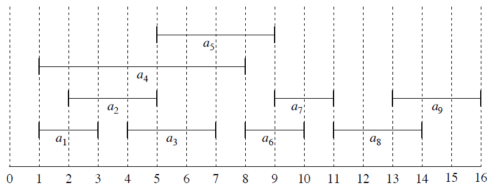
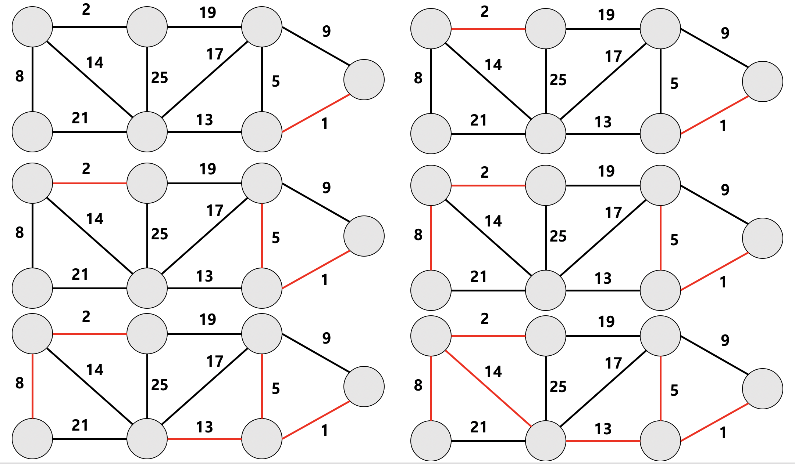
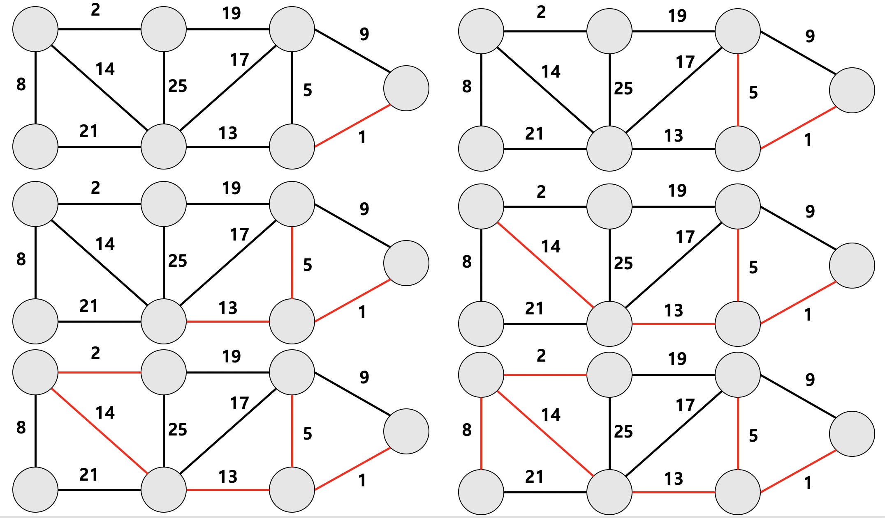
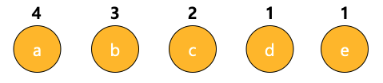
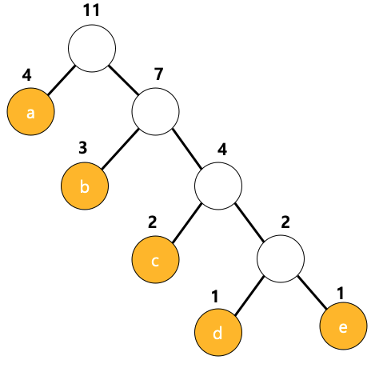

# 알고리즘 기법 Greedy Algorithm 

### 탐욕 알고리즘 (Greedy)

탐욕 알고리즘이란 **매 순간 최적이라고 생각되는 것을 선택**해 나가는 방식으로 진행하여 최종적인 최적해에 도달하는 기법을  

말한다. 동적 계획법(DP)와 마찬가지로 **최적화 문제를 푸는데 사용**하며 해를 구할 당시에 가장 최적인 해를 구하기 때문에  

동적 계획법과는 다르게 **반드시 최적의 해를 구해준다는 보장은 하지 못한다.**  

  

위의 사진에서 보다시피 Greedy algorithm의 결과 선택된 가장 큰 값과, 실제 가장 큰 값은 다른 것을 확인할 수 있다.  

탐욕 알고리즘이 잘 작동하는 문제는 **greedy choice property **와 **optimal substructure** 속성을 만족한다.  

전자는 앞의 선택이 이후 선택에 영향을 주지 않는다는 것을 의미하며, 후자는 문제 전체에 대한 최적해가 부분문제에  

대해서도 역시 최적화가 된다는 걸 뜻한다.  

예를 들면 **분할가능 배낭문제(Fractional knapsack problem)**이 가장 대표적인 탐욕 알고리즘이다.  

배낭문제는 한 여행가가 가지고 가는 배낭에 담을 수 있는 무게의 최대값이 정해져 있고, 일정 가치와 무게가 있는 짐들을  

배낭에 넣을 때 합이 최대가 되도록 짐을 고르는 방법을 찾는 문제이다.  

문제의 해결방법은 단위 무게당 가치가 가장 큰 짐을 먼저 넣으면 된다. 탐욕 알고리즘의 2가지 성질에 위배되지 않기 때문에  

분할가능 배낭문제는 그리디 알고리즘을 통해서 풀 수 있다.  

위에서도 언급하였듯이 그리디 알고리즘은 항상 최적의 해를 구해주지 못하기 때문에 **보통 "근사치 추정"을 위해서 사용**한다.  

따라서 최적이 아닌 "되는가" 또는 "적당히 괜찮은 방법"을 찾을 때에 사용가능하며, 계산속도가 최적해를 구해주는 알고리즘보다 

빠른 경우가 많기 때문에 실용적으로 사용이 가능하다.  

### 장점

1. 구현이 비교적 쉽다.
2. 계속 속도가 정확한 알고리즘보다 빠른 경우가 많다. 

### 단점

1. 항상 최적해를 구하지 못한다. 

## 탐욕(Greedy) 알고리즘이 사용되는 예시 

1. AI에 있어서 결정 트리 학습법(Decision Tree Learning)
2. 활동 선택 문제 (Activity selection Problem)
3. 거스름돈 문제
4. 최소 신장 트리 (Minimum spanning tree) - **크루스컬(Kruskal)** 알고리즘, **프림(Prim)** 알고리즘 
5. 다익스트라 알고리즘
6. 허프만 코딩

### 활동 선택 문제 (Activity-Selection Problem)

교실 할당(classroom assignment)로도 불린다. 한정된 교실 공간에 최대 수업을 배정하는 문제이다.  

예를 들어 9개의 수업이 있고, 시작시간 s와 종료시간 f가 다음과 같이 주어졌다고 한다. (종료시간 기준 오름차순 정렬) 

|       i       |  1   |  2   |  3   |  4   |  5   |  6   |  7   |  8   |  9   |
| :-----------: | :--: | :--: | :--: | :--: | :--: | :--: | :--: | :--: | :--: |
| si |  1   |  2   |  4   |  1   |  5   |  8   |  9   |  11  |  13  |
| fi |  3   |  5   |  7   |  8   |  9   |  10  |  11  |  14  |  16  |

종료 가장 빠른 수업을 배치하게 되면 교실의 가용시간은 항상 최대가 된다. 종료시간이 빠른 수업부터 차례로 배정하기 때문에 앞의 선택이 

이후의 선택에 변화를 주지 않고, 매 순간 선택이 항상 최적이 된다. 이를 그림으로 나타내면 다음과 같아진다. 

  

따라서 한 교실에 배정할 수 있는 최대 수업의 조합은 a1, a3, a6 ,a8 인것을 확인할 수 있다.  

### 거스름돈 문제 

물건을 사고 나서 돈을 거슬러 줄 때에는 최소한의 동전 개수로 돈을 거슬러 주는 것이 좋다. 예를 들어 550원을 50원자리 11개로 거슬러 준다면  

돈을 받는 손님은 기분이 불쾌할 것이다. 따라서 이 문제는 거슬러 줄 총액에 해당하는 동전의 집합이며, 최적해는 동전의 개수의 최소 집합이다.  

따라서 문제를 해결하기 위해서는 가장 가치가 큰 동전을 우선으로 거스름돈을 구성하면 동전의 개수가 줄어들테니, 가장 가치가 높은 동전부터  

부분해 집합에 추가한다. 다음에는 부분해 집합이 거슬러 줄 금액을 초과한다면, 최근 추가한 동전을 제거하고 가치가 한 단계 낮은 동전을 추가한다.  

이를 통해 거스름돈 문제는 해결 된것 같지만 예를 들어 물건의 금액이 3800원이고 손님이 낸 금액이 5000원이라면 위의 알고리즘은 

500원,100원, 50원, 10원이 있는 경우 500x2 100x2를 거슬러주게 된다. 하지만 만약 400원 짜리 동전이 있다면 400x3이므로 최적의 방법을   

찾지 못하게 된다. 따라서 **그리디는 항상 최적의 결과를 보장하지는 못한다.** 

### 최소비용 신장트리 (Minimum Spanning Tree)

최소비용 신장트리는 그래프 내의 모든 정점을 최소의 비용으로 연결하는 트리를 의미한다.   

최소비용 신장트리를 만드는 알고리즘에는 크루스칼 알고리즘과 프림 알고리즘이 있다.  

##### 크루스칼 알고리즘(Kruskal Algorithm)  

크루스칼 알고리즘은 위의 그림과 같이 그래프의 모든 간선(edge) 중에서 **가중치가 가장 작은 것부터 차례대로 선택**한다.  

이때 Cycle을 만드는 경우를 제외하고 간선들을 선택하다 보면 최소비용 신장트리를 만들 수 있다.  

##### 프림 알고리즘(Prim Algorithm)  

**임의의 정점(vertex)에서 가중치가 가장 작은 간선(edge)을 선택**한다. 선택된 정점(vertex)와 연결된 간선(edge)들 중에서 가장 가중치가  

작은 것들을 선택하여 최소비용 신장트리를 만든다. (단, 이때도 Cycle을 만드는 경우는 제외한다.)  

### 다익스트라 알고리즘 (Dijkstra's Algorithm)

다익스트라 알고리즘은 **그래프 내의 한 정점에서 다른 정점으로 가는 최단 경로를 구하는 알고리즘**이다.   

예를 들어 아래의 그림에서 a에서 출발하여 b까지의 최소한의 비용으로 가는 방법을 찾는 것이 바로 다익스트라 알고리즘이다.  

알고리즘은 다음과 같은 재귀를 따른다.  

1. 각 정점 위에 시작점으로부터 자신에게 이르는 경로의 길이를 저장할 곳을 정의하고 모든 정점위의 있는 경로의 길이를 무한대로 초기화한다.  

2. 시작 정점의 길이를 0으로 초기화하고 최단 경로에 추가한다. 

3. 최단 경로에 새로 추가된 정점의 인접 정점들에 대해 경로 길이를 갱신하고 이들을 최단 경로에 추가한다. 만약 추가하려는 인점 정점이 이미 최단 

   경로위에 있는 정점이라면 갱신하려는 경로의 길이가 더 짧은 경우에만 기존의 경로를 현재 정점을 경유하도록 수정한다. 

4. 해당 정점으로 부터 갈 수 있는 인접 정점들로의 경로 길이를 마친 정점의 경우에는 out이라고 해준다. 

5. 그래프 내의 모든 정점이 최단 경로에 속할 때까지 3-4번의 반복한다.  

### 허프만 코딩 (Huffman Coding)

허프만 코딩이란 탐욕 알고리즘을 사용해서 **데이터를 압축하는 기법**이다. 허프만 코딩을 알기위해서는 고정 길이 코드와 접두어 코드를 알아야 한다.  

**고정 길이 코드와 (Fixed Length Code)는** 모든 코드의 길이가 똑같은 코드의 체계를 의미한다. 예를 들면 AscII가 그 대표적인 예로  

모든 코드가 8 bit이다. 코드의 길이가 같아서 다루기 쉽지만 저장 공간의 낭비가 발생하기 때문에 **가변 길이 코드(Variable Length Code)**   

를 사용하게 되고, **접두어 코드는(Prefix Code)는** 가변 길이 코드 중에 하나이다.  

 **접두어 코드**란 코드 집합의 **어느 한 코드도 다른 코드의 접두어가 되지 않는 코드**를 의미한다. {"0", "1", "01", "11"}은 0과 1이 접두어가  

되기 때문에 접두어 코드가 아니다. {"00", "01", "11", "101"} 과 어느 코드도 다른 코드의 접두어가 되지 않는 것이 접두어 코드이다.  

따라서 ASCII와 같은 고정 길이 코드를 접두어 코드로 변환시켜 데이터를 압축시키는 것이 바로 허프만 코딩이다.  

허프만 코딩에서 제일 중요한 것은 바로 **기호의 빈도**와 **이진트리**이다. **기호의 빈도**란 한 기호가 데이터 안에어 얼마나 자주 나오는가를 의미한다.  

따라서 **길이가 짧은 접두어 코드를 빈도가 높은 기호에 부여하기 위해서 사용**된다. 예를 들어 'x'가 15개와 'y'가 4개로 이루어진 데이터가 있다할 때  

'x' 라는 코드에 111을, 'y' 라는 코드에 10을 부여한다면 변환된 데이터의 크기는 3(111의 비트 길이) x 15 + 2 x 4 = 53비트이다.  

반대로 'x' 라는 코드에 10을, 'y' 라는 코드에 111을 부여한다면 변환된 데이터의 크기는 2 x 15 + 3 x 4 = 42 비트가 되는 것을 확인할 수 있다.  

**이진트리**는 접두어 코드를 표현하는데 사용된다. 트리의 왼쪽 자식 노드는 0 오른쪽 자식 노드는 1을 나타내며, 모든 기호는 잎 노드에만 저장된다.  

따라서 **루트노드에서 잎 노드까지 이르는 경로가 바로 기호의 접두어 코드**가 된다. 이러한 이진트리를 **허프만 트리**라고 한다.  

예를 들어 'aabaabbccde'라는 문자열을 압축시켜보자. a의 빈도는 4, b의 빈도는 3, c의 빈도는 2, d와 e의 빈도는 1이다.  

다음과 같은 노드들은 끝까지 잎 노드로 남아야 함으로 노드들 위에 부모 노드를 생성해 나가면서 이어 붙인다.  

먼저 가장 빈도수가 작은 d, e 노드를 선택하고 부모노드 하나를 만들어서 연결한다. 부모노드의 빈도는 자식 노드들의 합인 2가 된다.  

이와 같이 반복하다 보면 다음과 같은 허프만 트리가 생성되고, 이 허프만 트리의 접두어 코드로 데이터를 표현하면 데이터가 압축되는 것이다.  

|  a   |  a   |  b   |  a   |  a   |  b   |  b   |  c   |  c   |  d   |  e   |
| :--: | :--: | :--: | :--: | :--: | :--: | :--: | :--: | :--: | :--: | :--: |
|  0   |  0   |  10  |  0   |  0   |  10  |  10  | 110  | 110  | 1110 | 1111 |

압축결과는 001000101011011011101111이 되고 ASCII로 표현했을 때는 88비트였다면 23비트로 압축이 된 것을 확인할 수 있다.  

압축해제는 위의 결과를 반대로 진행하면 된다. 압축데이터로를 한 비트씩 읽어서 0이면 왼쪽으로 1이면 오른쪽으로 이동하여 압축을 해제하면된다.  

## 참조 

아래의 블로그를 참고하여 작성하였습니다.  

[그리디 알고리즘 - 나무위키](https://namu.wiki/w/%EA%B7%B8%EB%A6%AC%EB%94%94%20%EC%95%8C%EA%B3%A0%EB%A6%AC%EC%A6%98)  

[탐욕 알고리즘 위키피디아](https://ko.wikipedia.org/wiki/%ED%83%90%EC%9A%95_%EC%95%8C%EA%B3%A0%EB%A6%AC%EC%A6%98)  

[i.m_ujin 그리디 알고리즘](https://ujink.tistory.com/10) 

[좡 그리디 알고리즘](https://janghw.tistory.com/entry/%EC%95%8C%EA%B3%A0%EB%A6%AC%EC%A6%98-Greedy-Algorithm-%ED%83%90%EC%9A%95-%EC%95%8C%EA%B3%A0%EB%A6%AC%EC%A6%98)  

[ratsgo's blog](https://ratsgo.github.io/data%20structure&algorithm/2017/11/22/greedy/) 
