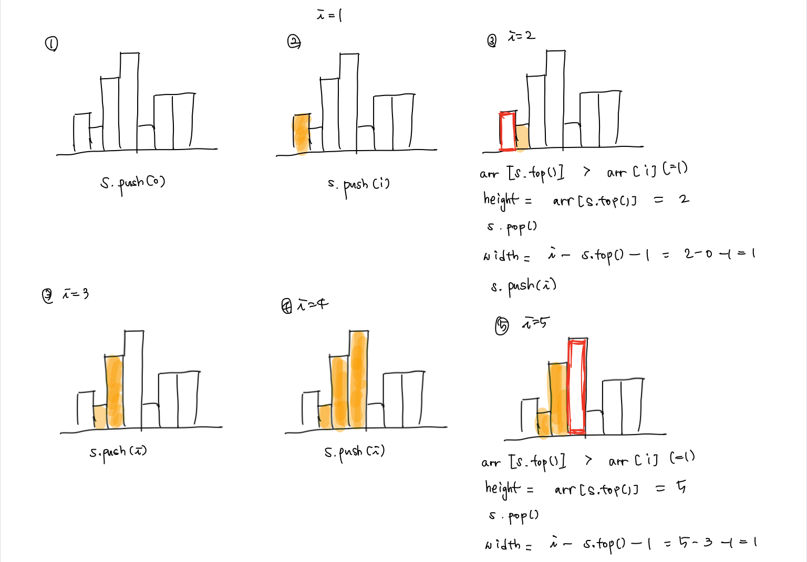
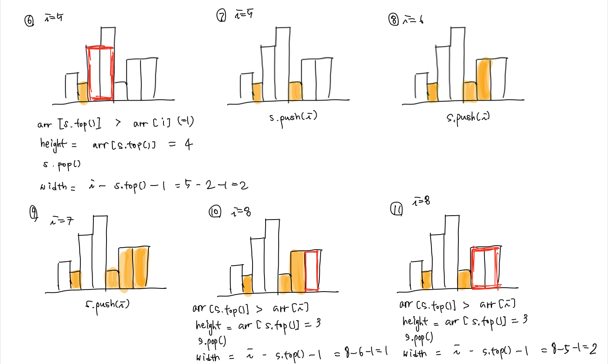
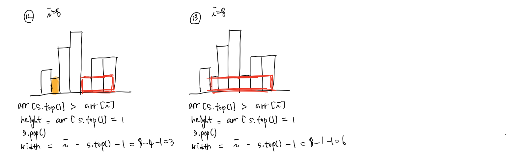

# 백준 문제

- [2104 : 부분배열 고르기](#2104-부분배열-고르기)
- [1725 : 히스토그램](#1725-히스토그램)
- [1992 : 쿼드트리](#1992-쿼드트리)
- [1074 : Z](#1074-Z)


## 2104 부분배열 고르기

[문제로 이동](https://www.acmicpc.net/problem/2104)

### 접근 방법 

#### Python

처음에는 Greedy algorithm으로 풀어보았는데 당연히 시간초과가 발생하였다. <br>

그래서 분할 정복 알고리즘과 재귀를 사용해서 문제를 해결하였다. 부분 배열이 가능한 범위는 크게 3가지 경우이다. <br>

1. 분할한 쪽에서 작은 쪽에 있는 경우 즉, start - mid 사이에 있는 경우<br>
2. 분할한 쪽에서 큰 쪽에 있는 경우 즉, mid+1 - end 사이에 있는 경우<br>
3. mid를 포함하여 start와 end 사이에 있는 경우<br>

1,2 번은 계속 분할하면 금방 해결할 수 있지만 3번의 경우가 어렵기 때문에 3번은 다음과 같은 greedy algorithm을 따른다. <br>

먼저 mid를 기준으로 left = mid, right = mid +1 로 정해준다. left가 start보다 크거나 같고, right가 end보다 작거나 같아질때까지 <br>

배열의 left-1, right+1의 크기를 비교하여 큰쪽을 우선적으로 포함하면서 sum, min을 구해주고 이를 토대로 max를 구해서 갱신한다. <br>


#### C++

python과 동일한 로직으로 풀었지만, 계산을 해주는 부분이 값이 int의 범위값을 넘어가는 경우가 있으므로 **long long** 으로 해주어야한다. <br>


## python code

```python
# 백준 2014 부분배열 고르기 
# python solved by divide and conquer

def solution(start, end):
    # if arr divided into last piece 
    if start == end:
        return arr[start]*arr[start]
    
    mid = (start+end) // 2
    # divide into half recursively and get max value
    _max = max(solution(start,mid),solution(mid+1,end))

    left, right = mid, mid+1
    _sum = arr[left] + arr[right]
    _min = min(arr[left],arr[right])
    _max = max(_max, _sum * _min)
    
    # check right, left side from the mid 
    # and put the bigger element in _sum, _min and calculate the _max
    while left > start or right < end :
        if right < end and (left == start or arr[left-1] < arr[right+1]):
            right += 1
            _sum += arr[right]
            _min = min(_min, arr[right])
        else:
            left -= 1
            _sum += arr[left]
            _min = min(_min, arr[left])
        _max = max(_max, _min * _sum)
    
    return _max 

N = int(input())
arr = list(map(int,input().split()))
print(solution(0,N-1))

```

### 메모리 및 수행 속도

메모리 : 40256 KB <br>

시간 : 1104ms <br>


## c++ code

```c++
// 백준 2104 부분배열 고르기
// cpp solved by divide and conquer
#include<iostream>
#define max(a,b) (a > b ? a : b)
#define min(a,b) (a < b ? a : b)
int N, arr[100000];

long long solution(int start, int end){
    // if there's only one element left 
    if (start == end) return (long long)arr[start]*arr[start];

    int mid = (start + end)/2;
    // divide into half recursively and get max value 
    long long _max = max(solution(start,mid),solution(mid+1,end));

    int left = mid, right = mid+1;
    long long _sum = arr[left] + arr[right];
    long long _min = min(arr[left],arr[right]);
    _max = max(_max, (long long)_sum * _min);

    // chek right, left side from the mid
    // and put the bigger element in _sum, _min and caculate the _max
    while((left > start) || (right < end)){
        if((right < end) && ((left == start) || (arr[left-1] < arr[right+1]))){
            right += 1;
            _sum += arr[right];
            _min = min(_min, arr[right]);
        }else{
            left -= 1;
            _sum += arr[left];
            _min = min(_min, arr[left]);
        }
        _max = max(_max, (long long)_sum * _min);
    }
    return _max;
}

int main(void){
    scanf("%d", &N);
    for(int i = 0; i < N; i++) 
        scanf("%d",&arr[i]);

    printf("%lld",solution(0,N-1));
    return 0;
}
```

### 메모리 및 수행 속도

메모리 : 2376 KB <br>

시간 : 24 ms <br>


## 1725 히스토그램

[문제로 이동](https://www.acmicpc.net/problem/1725)

### 접근 방법 

#### Python

이 문제는 부분배열 고르기 문제와 아주 유사하여 쉽게 풀 수 있었다. <br>

분할 정복을 사용하여 풀었으며, cnt의 값만 잘 설정해주면 쉽게 풀 수 있는 문제 였다. <br>

#### C++

다른 방법을 찾아보니 sweeping line algorithm이라고 O(N)의 시간복잡도로 해결할 수 있는 알고리즘이 있어서 사용해보았다. <br>

이 알고리즘을 사용하기 위해서는 stack을 사용해야 한다. 스택에 집어넣는 경우는 현재 스택의 top보다 arr[i]의 값이 큰 경우에만 스택에 넣어준다. <br>








## python code

```python
# 백준 1725 히스토그램
# python solved by divide and conquer
def solution(start:int, end:int):
    # if there's only one element left
    if start == end : return arr[start]
    
    mid = (start+end)//2
    _max = max(solution(start,mid),solution(mid+1,end))

    # cnt is set as 2 because it start from adding left and right
    left, right, cnt = mid, mid+1, 2
    _min = min(arr[left], arr[right])
    _max = max(_max, _min * cnt)

    # check right, left side from the mid 
    # renew the _min value after add new element and add cnt
    # renew the _max each cycle
    while left > start or right < end:
        if right < end and (left == start or arr[left-1] < arr[right+1]):
            right += 1
            _min = min(_min,arr[right])
            cnt += 1
        else :
            left -= 1
            _min = min(_min,arr[left])
            cnt += 1
        _max = max(_max, _min * cnt)
    return _max

N = int(input())
arr = []
for i in range(N):
    height = int(input())
    arr.append(height)

print(solution(0,N-1))
```

### 메모리 및 수행 속도

메모리 : 32232 KB <br>

시간 : 5032 ms <br>

## c++ code

```c++
// 백준 1725 히스토그램 
// cpp solved by sweeping line using stack
#include<iostream>
#include<stack>
#define max(a,b) (a > b ? a : b)
std::stack<long long> s;
long long N, arr[100001];

long long solution(){
    long long _max = 0;
    //to consider start part push(0) in stack 
    s.push(0);
    // set ragne 1-N+1 and last N+1 consider terminate part
    for (int i = 1; i <= N + 1; i++){ 
        while(!s.empty() && arr[i] < arr[s.top()]){
            int height = arr[s.top()];
            s.pop();
            int width = i - s.top() -1;
            
            _max = max(_max, (long long)(width * height));
        }
    s.push(i);
    }
    return _max;
}

int main(void){
    scanf("%lld", &N);
    for(int i = 1; i <= N; i++){
        scanf("%lld", &arr[i]);
    }
    printf("%lld",solution());
    return 0;
}
```

### 메모리 및 수행 속도

메모리 : 3556 KB <br>

시간 : 20 ms<br>


## 1992 쿼드트리 

[문제로 이동](https://www.acmicpc.net/problem/1992)

### 접근 방법 

#### Python

 문제를 해결하는 방법은 크게 2가지가 있다. 먼저 완전히 분할을 한 뒤에 합쳐오는 방식과 **검사를 통해 다른 값이 있을 때만 분할하는 방법**이다. <br>

나는 후자의 방법으로 문제를 풀었으며, 순서는 다음과 같다. <br>

1. 사용자로부터 입력을 받는다. 

2. for문을 돌면서 첫번째 원소와 다른 원소가 발견되면 분할을 진행한다. 

   2 - 1. 분할은 1/4의 크기로 진행하면 된다. 

   2 - 2. 만약 해당 범위에서 다른 원소가 발견되지 않으면 첫번째 원소를 반환해준다.

3. 분할을 반복하다가 원소의 개수가 1개인 경우에는 그 원소들의 값을 반환해주면 된다. 


#### C++

python과 동일한 알고리즘으로 문제를 해결하였다. <br>


## python code

```python
# 백준 1992 쿼드트리
# python solved by recursive + divide and conquer
N = int(input())
arr = list(input() for _ in range(N))

def quadTree(x,y,n):
	# if there's only one elemnet to see 
	if n == 1: 
		return arr[x][y]
	
	result = []
	for i in range(x,x+n):
		for j in range(y,y+n):
			# if it has different element in range
			if arr[i][j] != arr[x][y]:
				# difference between append and extend
				# append just put itself as an element 
				# extend put most outside part of iterable in tuple, dic, list 
				result.append('(')
				result.extend(quadTree(x,y,n//2))
				result.extend(quadTree(x,y+n//2,n//2))
				result.extend(quadTree(x+n//2,y,n//2))
				result.extend(quadTree(x+n//2,y+n//2,n//2))
				result.append(')')
				
				return result
	
	return arr[x][y]
	
print(''.join(quadTree(0,0,N)))
```

### 메모리 및 수행 속도

메모리 : 29380 KB <br>

시간 : 64 ms <br>


## c++ code

```c++
// 백준 1992 쿼드트리
// cpp solved by recursive + divide and conquer
#include <iostream>
using namespace std;
int N, arr[64][64];

void quadTree(int x, int y, int n){
    // if there's only one element left
    // print the element 
	if (n==1){
		cout << arr[y][x];
		return;
	}
	bool same = true;
    // by adding check condition in for statement
    // don't have to break when find there's other element in range 
	for(int i = y; i < (y + n) && same; i++)
		for(int j = x; j < (x + n) && same; j++)
			if(arr[i][j] != arr[y][x])
				same = false;

	if(same) cout << arr[y][x] ;
	else {
			cout << "(" ;
			quadTree(x,y,n/2);
			quadTree(x+n/2,y,n/2);
			quadTree(x,y+n/2,n/2);
			quadTree(x+n/2,y+n/2,n/2);
			cout << ")" ;
	}
}


int main(void) {
	scanf("%d",&N);
	for(int i = 0; i < N; i++){
		for (int j = 0; j < N; j++){
			scanf("%1d", &arr[i][j]);
		}
	}
	quadTree(0,0,N);
	return 0;
}
```

### 메모리 및 수행 속도

메모리 : 2000 KB <br>

시간 : 0 ms<br>


## 1074 Z

[문제로 이동](https://www.acmicpc.net/problem/1074)

### 접근 방법 

#### Python

이 문제는 위에서 풀었던 쿼드트리와 유사하며 중요한 점은 **주어진 점이 어디 사분면에 위치하는지를 알면** 쉽게 구할 수 있다. <br>

1. 사용자로부터 N,r,c 를 입력받는다.

2. r,c가 어느 사분면에 있는지 확인한다.

   2 - 1 r, c가 범위 안에 있다면 4개의 사분면으로 분할한 뒤 다시 2번을 수행한다. <br>

   2 - 2 r, c가 범위 안에 없다면 해당 사분면은 본 것으로 간주하고 n*n 만큼을 ans에 더해준다. <br>

3. 최종적으로 r, c과 일치하는 점에서의 ans를 반환하면 된다.

#### C++

python과 같은 로직으로 해결하였다.  <br>


## python code

```python
# 백준 1074번 Z
# python solved by divide and conquer
N, r, c = map(int,input().split())
ans = 0

def solution(y:int, x:int, n: int):
    global ans
    if y == r and x == c : 
        print(ans) 
        return 
    
    # find the location of r,c 
    # if they are in boundary divide 
    # not in booundary just add n*n 
    if y <= r < y + n and x <= c < x + n :
        solution(y, x, n // 2)
        solution(y, x+n//2, n//2)
        solution(y+n//2, x, n//2)
        solution(y+n//2, x+n//2, n//2)
    else :
        ans += n * n 
        
solution(0,0,1<<N)

```

### 메모리 및 수행 속도

메모리 : 31488 KB <br>

시간 : 68 ms <br>


## c++ code

```c++
// 백준 1072 Z 
// cpp solved by divide and conquer
#include<iostream>
int N, r, c;
long long ans = 0;
void solution(int y, int x, int n){
    if (y == r && x == c) {
        printf("%lld\n", ans);
        return;
    }

    // find the location of r,c 
    // if they are in boundary divide 
    // not in booundary just add n*n 
    if (c>= x && c< x+n && r>=y && r< y+n){
        solution(y,x,n/2);
        solution(y,x+n/2,n/2);
        solution(y+n/2,x,n/2);
        solution(y+n/2,x+n/2,n/2);
    }else{
        ans += n * n;
    }
}
int main(void){
    scanf("%d %d %d", &N, &r, &c);
    // 1<<N => 2^N
    solution(0,0,1<<N);
    return 0;
}
```

### 메모리 및 수행 속도

메모리 : 1984 KB <br>

시간 : 0 ms<br>


---

### 참조

[2104 부분배열 고르기 참고](http://blog.naver.com/PostView.nhn?blogId=hongjg3229&logNo=221731014713)  <br>

[1725 히스토그램 sweep algorithm](https://j2wooooo.tistory.com/74) <br> 

