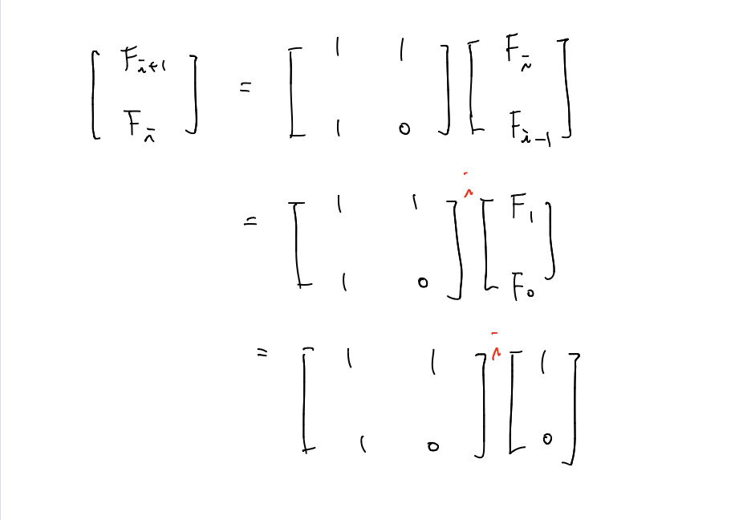

# 분할 정복 알고리즘 (Divide and Conquer Algorithm)

### 분할 정복 알고리즘 (Divide and Conquer)

대표적인 **알고리즘 설계 기법** 중에 하나이다. 알고리즘 설계 기법에는 분할정복, 동적프로그래밍, 그리디 방법이 있다.  

분할 정복의 원리는 순환적으로 푸는 문제를 하향식으로 접근하는 것이다.  

분할 정복 알고리즘은 **문제를 나눌 수 없을 때까지 나누어서** 각각을 풀면서 문제에 대한 **답을 재귀 호출을 이용해 계산**,  

**각 부분 문제의 해로부터 전체 문제의 답을 계산**하는 알고리즘이다. 우리가 흔히 사용하는 일반적인 재귀호출과는 어떤 점이 다른가?  

**일반적인 재귀 호출**의 경우에는 문제를 **한 조각과 나머지**로 쪼개는 방식인 반면, **분할정복**은 문제를 **절반씩 나누는 것**이 차이점이다.  

분할 정복 알고리즘의 수행 순서

1. **Divide** : 문제가 분할이 가능한 경우 2개 이상의 문제로 분할한다.

2. **Conquer** : 나누어진 문제가 여전히 분할이 가능하다면, 또 다시 분할하고 그렇지 않다면 문제를 푼다.

   기저 조건(Base Case)를 설정하는 것이 문제를 푸는 것이라고 할 수 있다.  

3. **Combine** : Conquer한 문제들을 통합하여 문제의 답을 얻는다.

### 장점

1. 분할하여 처리하므로 같은 작업을 더 빠르게 처리한다.

### 단점

1. 재귀적으로 분할 후 계산을 마치고 돌아오는 것을 잘못 구현하면 오히려 효율이 안 좋아질 수 있다. 

## 분할 정복(Divide and Conquer) 알고리즘이 사용되는 예시 

1. 병합정렬
2. 퀵정렬
3. 거듭제곱
4. 피보나치수열
5. 이진 탐색
6. 선택 문제

여기서 **이진 탐색, 병합 정렬**의 경우에는 **일정하게 절반씩 분할**하지만, **퀵정렬과 선택문제**는 분할의 **크기가 일정하지 않다**.  

### 병합 정렬 (mergeSort), 퀵 정렬 (quickSort)

병합정렬과 퀵정렬은 이미 학습하였으므로 넘어간다. 해당 정렬에 대한 설명은 아래의 링크를 따라가면 볼 수 있다.  

[병합정렬](https://github.com/BreakAlgorithm/algorithm-study/blob/master/source/yeon/sort/mergeSort.md)  

[퀵정렬](https://github.com/BreakAlgorithm/algorithm-study/blob/master/source/yeon/sort/quickSort.md)  

### 거듭제곱 (Exponentiation)

n 거듭 제곱은 자신을 n 번 곱해야 하므로 O(n)이라는 시간복잡도를 가지게된다. 하지만 이를 분할정복 알고리즘을 통해 단축시킬 수 있다.  

C8 은 다음과 같이 정의될 것이다.  

C8 = CxCxCxCxCxCxCxC  

그러나 다음과 같이 정의될 수도 있다.  

C8 = C4 x C4 = (C4)2 = ((C2)2)2  

즉 C8을 구할때 C를 8번 곱하는 것이 아니라 C2을 구한뒤 두 번 더 반복하면 세번의 연산으로 같은 결과가 나오는 것을 볼 수 있다.  

이 거듭 제곱의 경우에는 다음과 같이 2가지의 경우로 나누면 된다.  

1. 지수가 짝수인 경우 

   Cn = Cn/2 x Cn/2 (n이 짝수)

2. 지수가 홀수인 경우

   Cn = C(n-1)/2 x C(n-1)/2 x C (n이 홀수)

이 경우 시간복잡도는 O(n)이 아닌 **O(log2 n) **이다.  

### 피보나치 수열(Fibonacci Sequence)

피보나치 수열 Fn 은 다음과 같이 정의된다.  

Fn = 0 (n = 0)  

​	    1 (n = 1)  

​	    Fn-1 + Fn-2 (n > 1)  

이 문제를 기존의 방법대로 모든 연산을 통해 풀게되면 O(2n)의 시간복잡도가 나오지만 이를 행렬을 통해 풀면 거듭제곱과 같이 풀 수 있다.  

Fi+1 = Fi + Fi-1  

Fi = Fi + 0  

위의 식을 상수와 F로 나눠서 보면 다음과 같은 2차원 행렬의 곱으로 나타낼 수 있다.  

이처럼 피보나치 수열을 행렬의 식으로 바꾸고 오른쪽 끝 항을 1,0까지 내리면 결국 위와 같은 행렬의 곱이 된다.  

이제 오른쪽 행렬을 n번 제곱하여 [1,0]을 곱해준 값이 바로 Fi+1 이고 [0,1]을 곱해준 값이 바로 Fi 가 된다.  

### 이진 탐색(binary Search)

정렬된 데이터에 대한 효율적인 탐색 방법이다. (이진탐색은 정렬이 되어있는 상태에서만 적용가능)  

데이터의 삽입이나 삭제시에도 정렬상태를 유지해야하며 이때 평균 n/2개의 데이터 이동이 발생한다.  

**이진 탐색 과정**  

1. 배열의 가운데 원소와 탐색하고자 하는 x를 비교

2. 가운데 원소 == x (탐색 성공)

   가운데 원소 > x → '이진 탐색 (크기 1/2의 왼쪽 부분의 배열)' 순환 호출

   가운데 원소 < x → '이진 탐색 (크기 1/2의 오른쪽 부분의 배열)' 순환 호출

즉, 탐색을 반복할 때마다 비교 대상의 개수가 1/2개씩 감소하게 된다.  

## 참조 

아래의 블로그를 참고하여 작성하였습니다.  

[janghw 분할 정복 알고리즘](https://janghw.tistory.com/entry/%EC%95%8C%EA%B3%A0%EB%A6%AC%EC%A6%98-Divide-and-Conquer-%EB%B6%84%ED%95%A0%EC%A0%95%EB%B3%B5)  

[Cristoval 분할 정복 알고리즘](https://data-make.tistory.com/232) 

