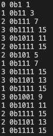
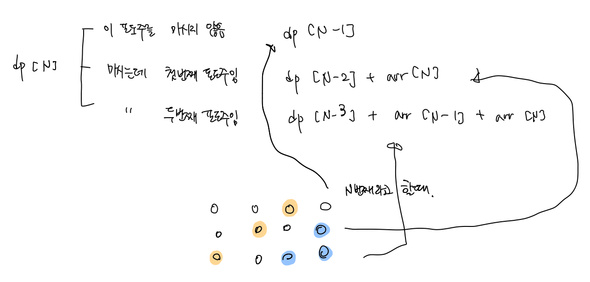
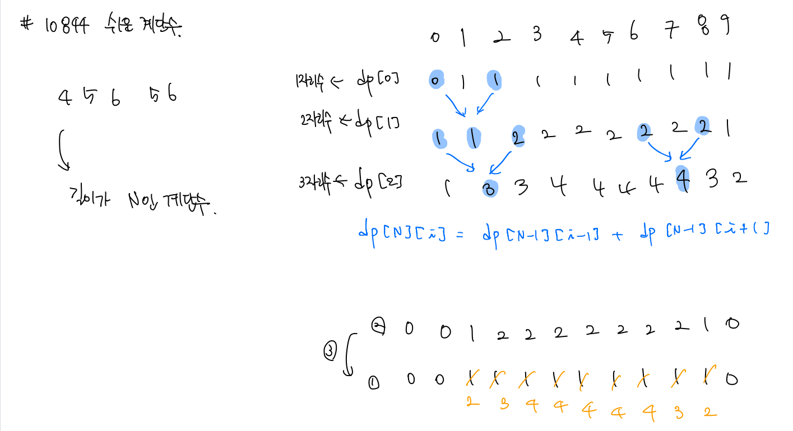

# 백준 문제

- [2098 : 외판원 순회](#2098-외판원-순회)
- [2156 : 포도주 시식](#2156-포도주-시식)
- [10942 : 팰린드롬](#10942-팰린드롬)
- [10844 : 쉬운 계단수](#10844-쉬운-계단수)


## 2098 외판원 순회

[문제로 이동](https://www.acmicpc.net/problem/2098)

### 접근 방법 

#### Python

이 문제를 풀기 위해서는 bitmask를 사용하는 것이 좋다. <br>

비트 마스크에서 bit란 컴퓨터에서 다루는 **최소 단위**이다. 정수를 **이진수로 표현**, 비트연산을 통해 문제를 해결하는 것을 비트마스크 라고 한다. <br>

그렇다면 어떤 경우에 비트마스크를 사용하는 것이 좋을까? <br>

1. 비트 연산을 통해 삽입, 삭제, 조회 등이 간단해질 때
2. 더 간결하게 코드 작성가능, 더 빠른 연산 가능
3. 비트마스크를 이용한 정수 표현으로 인해 동적프로그래밍이 가능하다.

**dfs** 에서 N이 작다면 내가 **방문한 곳들의 상태를 저장하기 까다로울 때** 비트마스크를 사용하면 쉽게 저장할 수 있다. <br>

``` python
기본 비트마스크 연산

AND연산
bin(0b1010011010 & 0b1101101100)  # 0b1000001000

OR연산
bin(0b1010011010 | 0b1101101100)  # 0b1111111110

XOR연산
bin(0b1010011010 ^ 0b1101101100)  # 0b111110110

SHIFT연산
bin(0b0010 << 2)  # 0b1000
bin(0b1100 >> 2)  # 0b11

~NOT연산
bin(~0b0010 << 2)  # 0b1101
```

```python
중요한 스킬들

# 원소 추가
n = 3
print(bin(0b0010 | (1 << n)))  #  0b1010

# 원소 제거
n = 3
print(bin(0b1010 & ~(1 << n)))  #  0b10

# 원소 조회
n = 3
print(bin(0b1010 & (1 << n)))  #  0b1000

# 원소 토글 (XOR)
n = 3
print(bin(0b1010 ^ (1 << n)))  #  0b10
```

이러한 비트마스크 사용법을 염두하고 나서 이 문제에 접근하면 된다. <br>

1. 모든 경로를 DFS를 이용하여 탐색한다. 이때 탐색을 한 곳은 visit를 비트마스크로 표현하여 간단하게 표현한다.

2. 순회하는 경로를 찾아야 하므로 1에서 N으로 가는 모든경로를 찾고 마지막에 다시 1로 돌아오게 되는 경로까지 더한것의 최솟값을 찾아야한다 

   **(이때 어짜피 순환하므로 시작점을 어디로 잡아도 상관없다)**

3. DP에서 memorization을 사용하여 **dp[현재노드]\[방문여부] = 비용** 으로 나타내도록 하자.

4. 이때 점화식은 현재 있는 도시와 방문했던 곳을 기반으로 방문하지 않은 곳들 경로 합의 min값을 구해서 저장해 나간다.

5. 모든 구간을 방문했을때는 다시 돌아가는 값을 리턴해줘야한다. 

   또한 이미 방문한 곳일 때는 dp 값을 그대로 리턴해준다. <br>

이 문제에서의 재귀는 다음과 같이 발생한다. 처음에 0에서 출발한다고 하고 하나의 도시를 방문했다고 치기 때문에 dfs(0,1)을 해준다. <br>

**[처음에 0 에서 1로 가는 경우]** <br>

[0 → 1 → 2 → 3] 의 순서로 방문하는 경우에는 visit 가 1, 11, 111, 1111로 방문하게 되고 <br>

[0 → 1 → 3 → 2] 의 순서로 방문하는 경우에는 visit 가 1, 11, 1011, 1111로 방문하게 된다. <br>

**[처음에 0 에서 2로 가는 경우]** <br>

[0 → 2 → 1 → 3] 의 순서로 방문하는 경우에는 visit가 1, 101, 111, 1111로 방문하게 되고 <br>

[0 → 2 → 3 → 1]의 순서로 방문하는 경우에는 visit가 1, 101, 1011, 1111로 방문하게 된다. <br>

**[처음에 0 에서 3로 가는 경우]** <br>

[0 → 3 → 1 → 2] 의 순서로 방문하는 경우에는 visit가 1, 1001, 1011, 1111로 방문하게 되고 <br>

[0 → 3 → 2 → 1]의 순서로 방문하는 경우에는 visit가 1, 1001, 1101, 1111로 방문하게 된다. <br>



이제 모두 방문한 상태가 되었기 때문에 마지막 방문 노드에서 출발점 0 으로 돌아가는 경로를 더해주고 그 중 최소값을 찾아주면 된다. <br>

#### C++

python과 동일한 로직으로 해결하였다. <br>


## python code

```python
# 백준 2098 외판원 순회
# python solved by dp & bitmask & dfs
import sys
sys.setrecursionlimit(10000)
# set INFINITE VALUE
INF = sys.maxsize
N = int(input())
arr = [list(map(int,input().split())) for _ in range(N)]
dp = [[INF] * (1 << N) for _ in range(N)]

def dfs(cur, visit):
    # if it has visited every case
    if visit == (1 << N) -1 :
        # if there's no way to 0 return INF
        if arr[cur][0] == 0 :
            return INF
        # if there's way to 0 return cur-> 0 cost
        else :
            return arr[cur][0]
    
    # if dp already has calculated value
    # use saved value 
    if dp[cur][visit] != INF:
        return dp[cur][visit]
    
    for i in range(1, N):
        # 앞의 조건은 지금까지 방문한 것과 도시중에서 방문하지 않은 곳이 있다면 0
        # 그리고 그 도시가 0이 아니라면 방문을 하는 것이다 (cur -> i 로 가는 길이 있다면)
        if visit&(1 << i) == 0 and arr[cur][i] != 0:
            dp[cur][visit] = min(dp[cur][visit], dfs(i,visit|(1 << i)) + arr[cur][i])
    return dp[cur][visit]

print(dfs(0,1))
```

### 메모리 및 수행 속도

메모리 : 44288 KB <br>

시간 : 2096 ms <br>


## c++ code

```c++
// 백준 2098 외판원 순회
// cpp solved by dp & bitmask & dfs
#include<iostream>
#include<algorithm>
#define MAX 987654321
#define MIN(a,b) {a < b ? a : b}

int N, arr[20][20];
int dp[20][1<<17];

int dfs(int cur, int visit){
    if(visit == (1<<N) - 1){
        if(arr[cur][0] == 0)
            return MAX;
        else  return arr[cur][0];
    }
    
    if(dp[cur][visit] != MAX)
        return dp[cur][visit];
    
    for(int i = 1; i < N; i++){
        if((visit&(1<<i)) == 0 && arr[cur][i] != 0){
            dp[cur][visit] = MIN(dp[cur][visit], dfs(i,(visit|(1<<i))) + arr[cur][i]);
        }
    }
    return dp[cur][visit];
}

int main(void){
    scanf("%d", &N);
    std::fill(&dp[0][0], &dp[N][1<<N], MAX);
    for(int i = 0; i < N; i++){
        for(int j = 0; j < N; j++){
            scanf("%d", &arr[i][j]);
        }
    }

    printf("%d", dfs(0,1));
    return 0;
}
```

### 메모리 및 수행 속도

메모리 : 12224 KB <br>

시간 : 40 ms <br>


## 2156 포도주 시식

[문제로 이동](https://www.acmicpc.net/problem/2156)

### 접근 방법 

#### Python

dp 문제들을 접근해서 푸는 방법은 규칙을 찾거나 dp[N] 번째의 경우에는 어떠한 경우가 가능한지를 찾아보면 되는 것같다. <br>

따라서 이 문제의 경우에는 N번째 와인잔을 마셨을 때의 양을 dp[N]이라고 할 때 다음과 같은 경우들이 있을 수 있다. <br>



1. 먼저 해당 잔을 마시지 않는 경우 **dp[N] = dp[N-1]** <br>

   이 경우에는 해당 잔을 마시지 않으므로 마신 포도주의 양은 그 전의 양과 같다. <br>

2. 해당 잔을 마시는데, 이 잔이 첫 번째 잔인 경우 **dp[N] = dp[N-2] + arr[N]** <br>

   이 경우에는 해당 잔을 마시므로, arr[N]을 더해주고 그 전에 마실 수 있는 양의 dp[N-2]의 값을 더 해준 것이 dp[N]의 값이다. <br>

3. 해당 잔을 마시는데, 이 잔이 두 번째 잔인 경우 **dp[N] = dp[N-3] + arr[N-1] + arr[N]** <br>

   이 경우에는 해당 잔을 마시는데, 두 번째 잔이므로 arr[N]과 arr[N-1]을 더해주고 그 전에 마실 수 있는 양의 dp[N-3]을 더해준다. <br>

이러한 **3가지 경우 중에서 가장 큰 값을 dp[N]로 설정**하면 된다.  <br>


#### C++

pythonr과 동일한 방법으로 문제를 해결하였다. <br>


## python code

```python
# 백준 2156 포도주 시식
# python solved by dp
N = int(input())
dp = [0]*(N+2)
arr = [0]+[int(input()) for _ in range(N)] + [0]
dp[1], dp[2] = arr[1], arr[1] + arr[2]

# there can be 3 cases
# 1. if not drink N's wine => dp[n] = dp[n-1]
# 2. if drink N's wine and it's first wine => dp[n] = dp[n-2] + arr[n]
# 3. if drink N's wine and it's second wine => dp[n] = dp[n-3] + arr[n-1] + arr[n]
# So find the max value from those three case and save dp[n]
for i in range(3,N+1):
    dp[i] = max(dp[i-1],max(dp[i-3] + arr[i-1] + arr[i], dp[i-2] + arr[i]))
    
print(dp[N])
```

### 메모리 및 수행 속도

메모리 : 29516 KB <br>

시간 : 484 ms <br>

## c++ code

```c++
// 백준 2156 포도주 시식
// cpp solved by dp
#include<iostream>
#define max(a,b) {a > b ? a : b}
int main(void){
    int N, arr[10003], dp[10003]={0,};
    scanf("%d", &N);
    for(int i = 1; i < N+1;i++){
        scanf("%d",&arr[i]);
    }
    dp[1] = arr[1], dp[2] = arr[1] + arr[2];
    
    // there can be 3 cases
    // 1. if not drink N's wine => dp[n] = dp[n-1]
    // 2. if drink N's wine and it's first wine => dp[n] = dp[n-2] + arr[n]
    // 3. if drink N's wine and it's second wine => dp[n] = dp[n-3] + arr[n-1] + arr[n]
    // So find the max value from those three case and save dp[n]
    for(int i = 3; i < N + 3; i++){
        dp[i] = max(dp[i-3]+arr[i-1]+arr[i],dp[i-2]+arr[i]);
        dp[i] = max(dp[i], dp[i-1]);
    }
    printf("%d",dp[N]);
    return 0;
}
```

### 메모리 및 수행 속도

메모리 : 1984 KB <br>

시간 : 0 ms<br>


## 10942 팰린드롬 

[문제로 이동](https://www.acmicpc.net/problem/10942)

### 접근 방법 

#### Python

``` python
# 시간초과 발생 코드 solved by greedy 
N = int(input())
arr = list(map(int, input().split()))
M = int(input())

for _ in range(M):
	S, E = map(int,input().split())
	splitedArr = arr[S-1:E]
	if splitedArr == splitedArr[::-1]:
		print(1)
	else: print(0)
```

처음에는 S,E의 범위만큼 잘라서 해당 범위 만큼 기존의 arr에서 자른 뒤 팰린드롬인지 검사를 수행해서 맞으면 1, 아니면 0을 출력하도록 했는데 <br>

시간 초과로 인해서 시간을 단축할 수 있는 dp를 사용해야만 했다. 또한 이 문제는 dp를 사용하더라도 입력에서 기존의 입력처럼 받으면 시간초과가 <br>

발생하여 sys.stdin.readlin()을 사용하여 입력을 받아왔다. <br>

문제를 푸는 방법은 다음과 같다. 범위가 S,E 라고 할 때 팰린드롬인 경우는 크게 3가지이다. <br>

1. S == E, 즉 범위안에 **원소가 1개인 경우**에는 무조건 팰린드롬이다.
2. **범위안에  원소가 2개**이고 이 두개의 원소가 같은 경우 무조건 팰린드롬이다.
3. 범위안에 원소가 3개 이상인 경우에는 맨앞과 맨뒤의 원소의 값이 같은지만 비교하고 안에 있는 것은 계산했던 dp값이 1이면 팰린드롬이다. 


#### C++

python과 같은 로직으로 풀었다.


## python code

```python
# 백준 10942 팰린드롬
# python solved by dynamic programming
import sys

N = int(input())
arr = [int(i) for i in sys.stdin.readline().split()]
dp = [[0 for _ in range(N)] for _ in range(N)]

# if s and e is same it's always be palindrome 
# this is case of just one element
for i in range(N):
    dp[i][i] = 1

# if the range of s and e is 2 
# and if element of s and e are same then it's palindrome
for i in range(N-1):
    if arr[i] == arr[i+1]:
        dp[i][i+1] = 1

# if the range of s and e is over than 2 (3~)
# we can just compare the first and last element and see
# if there's palidrome between the range from dp[][] 
for l in range(2,N):
    for i in range(N-l):
        if arr[i] == arr[i+l] and dp[i+1][i+l-1] == 1 :
            dp[i][i+l] = 1


M = int(input())
for _ in range(M):
    s, e = [int(i) for i in sys.stdin.readline().split()]
    print(dp[s-1][e-1])
```

### 메모리 및 수행 속도

메모리 : 61644 KB <br>

시간 : 2620 ms <br>


## c++ code

```c++
// 백준 10942 팰린드롬
// cpp solved by dynamic programming
#include<iostream>
#include<vector>
int N, M, s, e;
int arr[2000];
std::vector<std::vector<int>> dp;

int main(void){
    scanf("%d", &N);
    for(int i = 0; i < N; i++){
        scanf("%d", &arr[i]);
    }
    // assign nxn size of vector 
    for(int i = 0; i < N; i++){
        std::vector<int>element(N);
        dp.push_back(element);
    }

    // one element must be the palindrome
    for(int i = 0; i < N; i++) 
        dp[i][i] = 1;

    // two element gonna be palindrome 
    // if first and second element is same
    for(int i = 0; i < N-1; i++){
        if(arr[i]==arr[i+1]) 
            dp[i][i+1] = 1;
    }
    
    // if range is more than 3 
    // just check the first and last element are same
    // and check dp[first+1][last-1] == 1 
    for(int l = 2; l < N; l++){
        for(int i = 0; i < N-l; i++){
            if(arr[i]==arr[i+l] && dp[i+1][i+l-1]==1){
                dp[i][i+l] = 1;
            }
        }
    }
    scanf("%d", &M);
    for(int i = 0; i < M; i++){
        scanf("%d %d", &s, &e);
        printf("%d\n",dp[s-1][e-1]);
    }
}

```

### 메모리 및 수행 속도

메모리 : 17704 KB <br>

시간 : 336 ms<br>


## 10844 쉬운 계단수

[문제로 이동](https://www.acmicpc.net/problem/10844)

### 접근 방법 

#### Python

처음에 이 문제를 접근 할 때는 1-9까지의 숫자중 가장 큰 자리수를 기준으로해서 -1, +1 한 숫자들만 가능하므로 N자리 수일 때, <br>

작→작→작→...→작아지는 것이 N-1번이 불가능하거나, 커→커→커...→커지는 것이 N-1번이 불가능 한 수들의 경우 직접 개수를 카운트 해주고 <br>

위의 두 가지 조건을 만족하는 경우의 숫자는 2<sup>N-1</sup> 을 한 것이 그 숫자에서의 가능한 계단 수이므로 계산을 하려고했으나, 이 방법은 <br>

결국 dp를 사용하는 것이 아니므로 시간초과일 것 같고, 구현에 복잡함이 있어서 다른 방법을 찾아보았다. <br>

결국에는 N자리수의 경우에는 0-9 까지 맨 앞자리 수에 대해서 아래의 그림과 같은 결과를 가진다. <br>

이를 점화식으로 표현하면 **dp[N]\[i] = dp[N-1]\[i-1] + dp[N-1]\[i+1]** 이라고 할 수 있다. (N은 자리수, i는 0부터 9까지의 숫자를 의미) <br>

이때 d[N]\[0]번째 원소는 0 + d[N]\[1]인데 0의 값은 위에 점화식에서 index 에러가 발생하므로 d[N]\[0] = 0 + d[N]\[1] 이라고 해주자.<br>

또한 마지막 d[N]\[10]도 0으로 초기화하여 index에러가 발생하지 않게 해주어야한다. <br>




#### C++

python과 같은 로직이지만 공간복잡도에서 훨씬 절약할 수 있는 방법을 찾아내었다.  <br>

python에서는 dp[N]\[11] 개를 모두 할당하였지만 c++에서는 dp[2]\[12]만 선언하여 계산을 **위, 아래로 왔다갔다하는 방법**을 사용하였다. <br>

이 방법은 **슬라이딩 윈도우 기법**이라고 불리며 코드를 통해서 확인해 볼 수 있다. 또한 위의 그림에서 아래부분에 나와있는 것이다. <br>

즉, N이 1일때의 경우를 dp[1]\[]에 저장해놓고 N이 2일 때의 경우를 dp[0]\[]에다 계산하여 저장, N=3일때 dp[1]\[]에 저장하는 방식이다. <br>


## python code

```python
# 백준 10844 쉬운계단수
# python solved by dp
N = int(input())
MOD, _sum = 1000000000, 0

# assign 11x101 dp arr 
dp = [[0 for _ in range(11)]for _ in range(101)]

# in case of one digit
for i in range(1,10):
    dp[0][i] = 1

# we can find out that 
# dp[i][j] = dp[i-1][j-1] + dp[i-1][j+1]
for i in range(1,N+1):
    dp[i][0] = dp[i-1][1]
    dp[i][10] = 0
    for j in range(10):
        dp[i][j] = (dp[i-1][j-1] + dp[i-1][j+1]) % MOD

for i in range(10):
    _sum = (_sum + dp[N-1][i]) % MOD 
print(_sum)
```

### 메모리 및 수행 속도

메모리 : 29380 KB <br>

시간 : 72 ms <br>


## c++ code

```c++
// 백준 10844 쉬운계단수
// cpp solved by dp 
#include<iostream>
#define MOD 1000000000
int main(void){
    // just assign 2x12 arr 
    int N, arr[2][12]={0,};
    scanf("%d", &N);
    int sum = 9;
    
    for(int i = 2; i <11; i++){
        arr[1][i] = 1;
    }

    for(int i = 2; i <= N; i++){
        sum = 0;
        // by using modular calculation, don't have to assign 11x102 size of arr
        // moving up & down so that decrease use of space complexity
        for(int j = 1; j < 11; j++){
            arr[i%2][j] = (arr[(i-1)%2][j-1]+arr[(i-1)%2][j+1]) % MOD;
            sum = (sum + arr[i%2][j]) % MOD;
        }
    }
    printf("%d",sum);
    return 0;
}
```

### 메모리 및 수행 속도

메모리 : 1984 KB <br>

시간 : 0 ms<br>


---

### 참조

[개발 일기's 2098 외판원 순회](https://developmentdiary.tistory.com/406) <br>

[코딩 못하는 사람's 2098 외판원 순회](https://cantcoding.tistory.com/1)<br>

[10844 쉬운 계단수 슬라이딩 윈도우 기법](https://sihyungyou.github.io/baekjoon-10844/) <br> 

