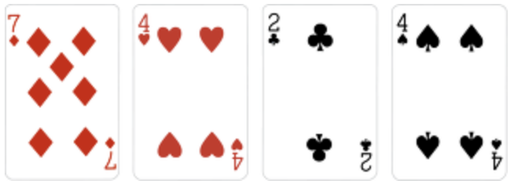
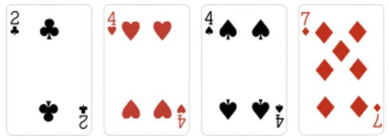
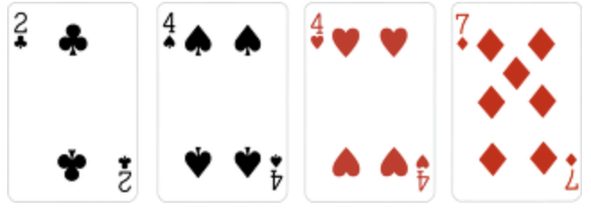

 목차

- [안정 정렬(Stable)](#1-안정-정렬stable) 
- [불안정 정렬(Unstable)](#2-불안정-정렬unstable) 
- [대표적인 안정, 불안정 정렬 알고리즘 예시](#3-정렬-알고리즘-분류classify) 
- [In-place Algorithm](#3-in-place-algorithm) 

먼저 정렬을 들어가기 전에 2가지 개념에 대해 이해를 하고 가자.  
첫 번째는 **Stable**이고 두 번째는 **In-place**이다.

#### 1) 안정 정렬(Stable)과 불안정 정렬(Unstable)

정렬의 안정적 특성이란 정렬되지 않은 상태에서 같은 키 값을 가진 원소의 순서가 정렬 후에도 유지되는가를 의미한다.
이러한 정렬의 안정적 특성에 따라서 정렬 알고리즘은 안정 정렬과 불안정 정렬로 구분 할 수 있습니다.

예를 들어, 위의 그림과 같은 포커 카드에 대해서 번호를 키값으로 하여 오름차순으로 정렬하고자 합니다
이때, 아래 그림의 경우 정렬 후에도 하트4 뒤쪽에 스페이스4가 위치하게 하고 싶고 싶은 것이 바로 안정적 정렬이다.
"당연히 위치가 유지되는게 정상 아니야?" 라고 생각 할 수 있지만, 정렬 알고리즘에 따라서 정렬 후에 이 순서가 바뀔 수도 있다.

#### 
- 안정 정렬  

안정 정렬의 경우에는 정렬 후에도 원래의 순서가 유지되며, 결과는 위의 사진과 같다. 
정렬된 결과에서 하트4와 스페이스4의 순서가 그대로 유지되고 있음을 확인 할 수 있다. 

#### 
- 불안정 정렬  

불안정 정렬의 경우에는 정렬 후에도 원래의 순서가 유지된다는 보장을 할 수 없으며, 결과는 위의 그림과 같을 수 있다. 
안정 정렬의 결과와는 달리 스페이스4와 하트4의 순서가 바뀐 모습을 확인 할 수 있다. 

#### 
대표적인 알고리즘들 
Stable Sorting 알고리즘은 다음과 같다:

- Insertion Sort
- Merge Sort
- Bubble Sort
- Countin Sort

Unstable Soring 알고리즘:

- Selection sort
- Heap Sort
- Shell Sort
- Quick Sort

#### 

#### 2) In-place Algorithm

In-place 알고리즘이란 추가적인 메모리 공간을 많이 필요로 하지 않는 혹은 전혀 필요하지 않는 알고리즘을 뜻한다. 아마 학교에서는 제자리성과 같은 이름으로 들어봤을 수도 있겠다. 

헷갈리면 정렬들을 공부하다보면 이해가 될 것이니 일단은 추가적인 메모리 공간이 거의(아예가 아니다) 안 드는 정렬이라고만 알고 있자.

In-place Sorting 알고리즘

- Insertion Sort
- Selection Sort
- Bubble Sort
- Shell Sort
- Heap Sort
- Quick Sort([정렬 알고리즘-4.2](https://ko.wikipedia.org/wiki/%EC%A0%95%EB%A0%AC_%EC%95%8C%EA%B3%A0%EB%A6%AC%EC%A6%98): 정의에 따라서 Not in place sorting으로 볼 수도 있으나 흔히 In-place로 본다.)

Not in place Sorting 알고리즘

- Merge Sort
- Counting Sort
- Radix Sort
- Bucket Sort

## 출처 
https://godgod732.tistory.com/10

